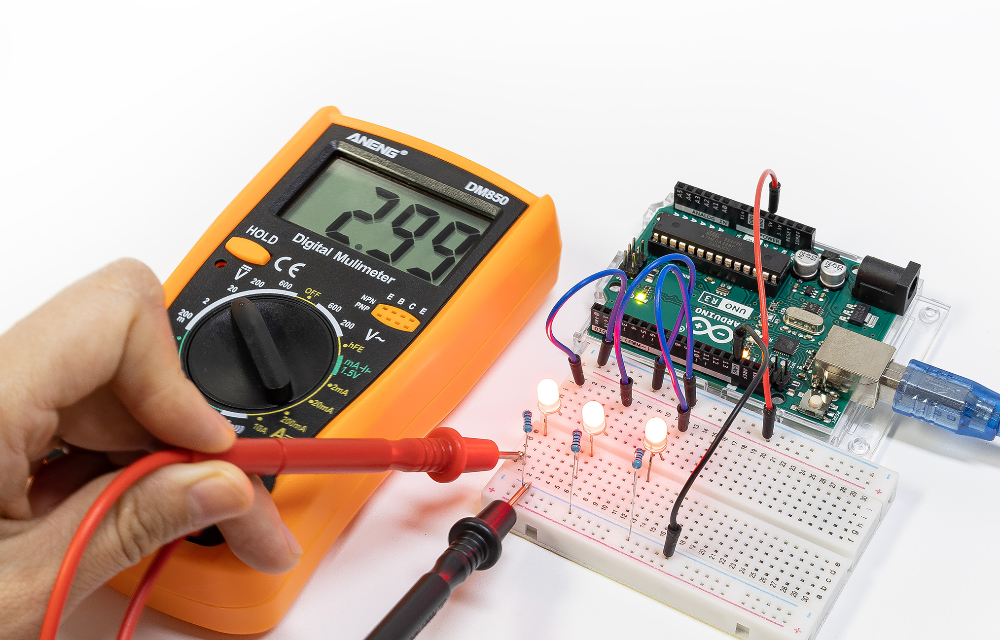

.. note::

    こんにちは、SunFounderのRaspberry Pi & Arduino & ESP32愛好者コミュニティへようこそ！Facebookで仲間と一緒にRaspberry Pi、Arduino、ESP32の世界をもっと深く探求しましょう。

    **参加する理由**

    - **専門サポート**: コミュニティとチームの支援を受けて、購入後の問題や技術的な課題を解決しましょう。
    - **学びと共有**: スキルを向上させるためのヒントやチュートリアルを交換しましょう。
    - **限定プレビュー**: 新製品の発表や先行情報を早期に入手できます。
    - **特別割引**: 最新製品に対する限定割引をお楽しみください。
    - **イベントやプレゼント企画**: プレゼント企画やホリデープロモーションに参加しましょう。

    👉 一緒に探求し創造する準備はできましたか？[|link_sf_facebook|]をクリックして、今日から参加しましょう！

|link_beginner_lab_kit| with Original Arduino Uno R3
======================================================

|link_beginner_lab_kit| を選んでいただき、ありがとうございます。

.. note::
    このドキュメントは以下の言語で利用できます。

        * |link_jp_tutorials|
        * |link_en_tutorials|
    
    ご希望の言語のリンクをクリックして、ドキュメントにアクセスしてください。

* :download:`Beginner's Lab Kit ハンドブック（解答付き） </_static/pdf/Beginner's Lab Kit ハンドブック（解答付き）.pdf>`

|link_beginner_lab_kit| へようこそ。このキットは、電子工作とプログラミングの世界に初めて触れる方々
のために設計された、包括的なスターターパックです。LED、抵抗器、ブザー、ポテンショメータ、フォト
レジスタ、サーミスタ、プッシュボタン、デジタルチューブ、超音波モジュールなど、基本的な部品が多数
含まれています。このキットの目玉の一つは、電流、電圧、抵抗を測定できるマルチメーターの追加です。
このツールは、各部品の機能をより深く理解するのに非常に役立ちます。

このキットに付属するコースは、Arduinoのプログラミング構文に基づいて構成されており、論理的かつ教
育的な進行を保証します。この構造により、回路を一歩ずつ構築し、それを制御するプログラムを書く方法
を学ぶことができます。コース全体を通じて、トラブルシューティングの課題に直面することで、教材の理
解を深めることができます。

お問い合わせやサポートが必要な場合は、service@sunfounder.comまでご連絡ください。ビギナーズラボ
キットを使って学びの旅に出発し、電子工作のエキサイティングな世界を探求しましょう！

.. toctree::
    :maxdepth: 1

    About this Kit <self>
    lessons/lessons
    videos/videos
    faq

**著作権通知**

このマニュアルに含まれるテキスト、画像、コードなどのすべての内容は、SunFounder社の所有物です。個人の学習、調査、楽しみ、または非営利目的でのみ使用してください。関連する規制および著作権法に基づき、著者および関連する権利者の法的権利を侵害することなく使用してください。許可なく商業的利益のためにこれらを使用する個人または組織に対して、同社は法的措置を取る権利を留保します。
