.. note::

    ¡Hola! Bienvenido a la comunidad de entusiastas de SunFounder Raspberry Pi, Arduino y ESP32 en Facebook. Sumérgete más en Raspberry Pi, Arduino y ESP32 junto a otros apasionados.

    **¿Por qué unirte?**

    - **Soporte experto**: Resuelve problemas postventa y desafíos técnicos con la ayuda de nuestra comunidad y equipo.
    - **Aprende y comparte**: Intercambia consejos y tutoriales para mejorar tus habilidades.
    - **Preestrenos exclusivos**: Obtén acceso anticipado a anuncios de nuevos productos y adelantos.
    - **Descuentos especiales**: Disfruta de descuentos exclusivos en nuestros productos más recientes.
    - **Promociones festivas y sorteos**: Participa en sorteos y promociones especiales durante las festividades.

    👉 ¿Listo para explorar y crear con nosotros? Haz clic en [|link_sf_facebook|] y únete hoy mismo.

.. _include_in_kit:

1.2 ¿Qué contiene tu kit?
======================================

Dentro de nuestro kit, encontrarás una variedad de componentes y piezas que utilizarás a lo largo de este curso para construir circuitos. Aquí tienes una guía rápida de lo que está incluido.

**1 x Arduino Uno R3 Original**

Una placa de microcontrolador que es el cerebro de tus circuitos. Tiene todo lo necesario para soportar el microcontrolador; simplemente conéctalo a tu computadora con un cable USB o aliméntalo con un adaptador de CA a CC o una batería para comenzar.

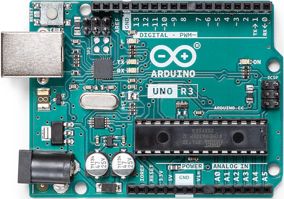

**1 x Protoboard de 400 orificios**

Una placa sin soldadura que te permite construir circuitos electrónicos fácilmente. Está llena de filas de orificios para conectar cables y componentes.

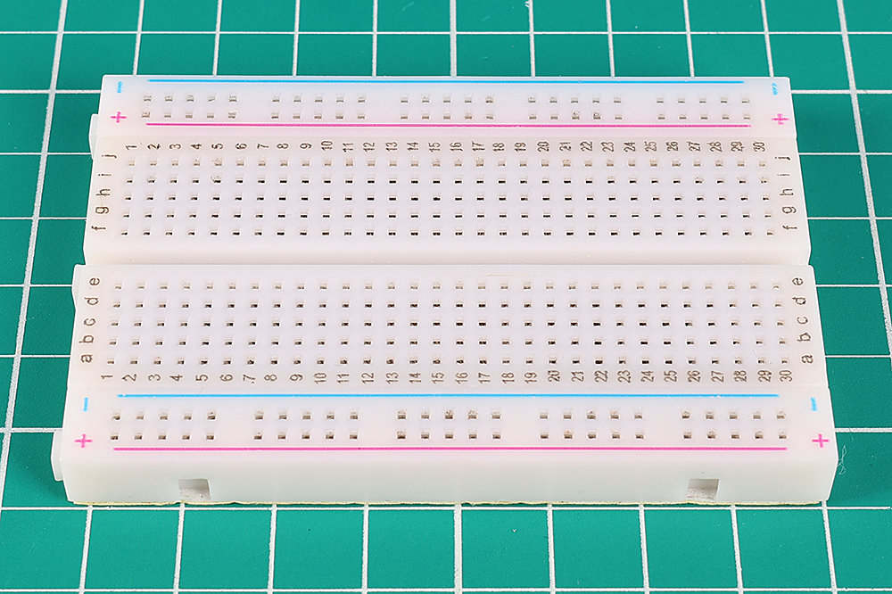

**120 x Resistencias (10 de cada tipo, 30 de 220Ω)**

Una resistencia es un componente que obstruye el flujo de corriente eléctrica, alterando el voltaje y la corriente dentro de un circuito. El valor de una resistencia se mide en ohmios, simbolizados por la letra griega omega (Ω). Las franjas de colores en una resistencia indican su valor de resistencia y tolerancia.

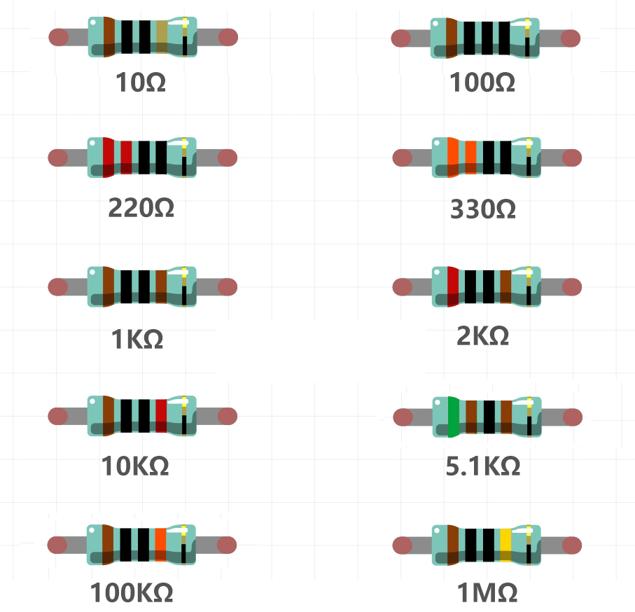

**25 x LEDs (5 de cada color)**

Esta selección de LEDs coloridos incluye cinco colores: rojo, verde, azul, amarillo y blanco, para satisfacer diversas necesidades de iluminación y señalización. Adecuados para aplicaciones que van desde simples indicadores de estado hasta proyectos complejos de iluminación decorativa, estos LEDs ofrecen una rica variedad de colores para mejorar el atractivo visual de cualquier proyecto electrónico.

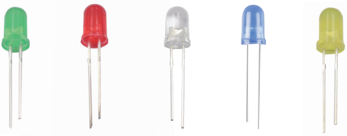

**2 x LEDs RGB**

Combinan LEDs rojos, verdes y azules en un solo encapsulado. Pueden mostrar varios colores ajustando el voltaje de entrada, creando millones de combinaciones de colores.

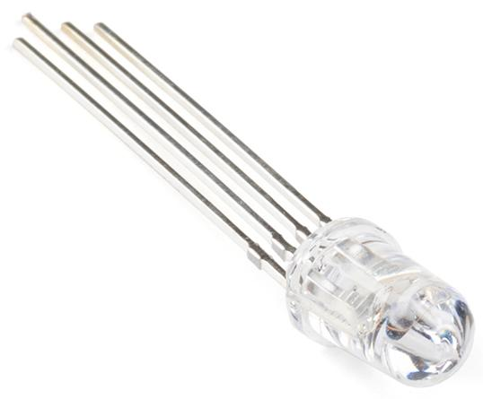

**1 x Fotorresistor**

Un fotorresistor es un componente sensible a la luz que cambia su resistencia según la intensidad de la luz a la que está expuesto, ideal para crear controles y sensores activados por luz en proyectos electrónicos.

.. image:: img/17_photoresistor.png
    :width: 100
    :align: center

**1 x Termistor NTC**

Un termistor es una resistencia sensible a los cambios de temperatura. Los termistores NTC disminuyen su resistencia a medida que la temperatura aumenta, mientras que los termistores PTC aumentan su resistencia con la temperatura.

.. image:: img/1_thermistor.png
    :width: 100
    :align: center

**1 x Zumbador Activo y 1 x Zumbador Pasivo**

Un zumbador, disponible en tipos activos y pasivos, es un dispositivo de señalización sonora que emite un sonido cuando se le aplica corriente eléctrica. Se utiliza comúnmente en alarmas, temporizadores y sistemas de notificación.

.. image:: img/7_beep_2.png
    :align: center

**1 x Potenciómetro**

Un potenciómetro es una resistencia variable con tres pines. Dos pines se conectan a los extremos de una resistencia, mientras que el pin central se une a un deslizador móvil, dividiendo la resistencia en dos partes. Los potenciómetros, que a menudo se utilizan para ajustar el voltaje en circuitos, son como los botones de volumen en las radios.

.. image:: img/9_dimmer_pot.png
    :width: 200
    :align: center

**10 x Botones Pequeños**

Un pequeño pulsador se utiliza para proporcionar una respuesta física al ser presionado, comúnmente usado en dispositivos electrónicos para iniciar acciones o ingresar comandos.

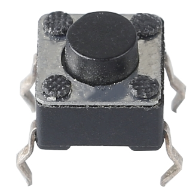

**1 x Chip 74HC595**

El 74HC595 es un registro de desplazamiento que se utiliza para expandir los puertos de entrada/salida de los circuitos digitales al convertir la entrada serial en salida paralela, reduciendo así el número de pines de conexión necesarios. Este chip es adecuado para controlar un gran número de dispositivos de salida, como una pantalla de 7 segmentos, sin ocupar demasiados pines del microcontrolador.

.. image:: img/24_74hc595.png
    :width: 300
    :align: center

**1 x Pantalla de 7 segmentos**

Una pantalla de 7 segmentos es un componente en forma de 8 que agrupa 7 LEDs. Cada LED se llama un segmento y, al energizarse, un segmento forma parte de un número que se mostrará.

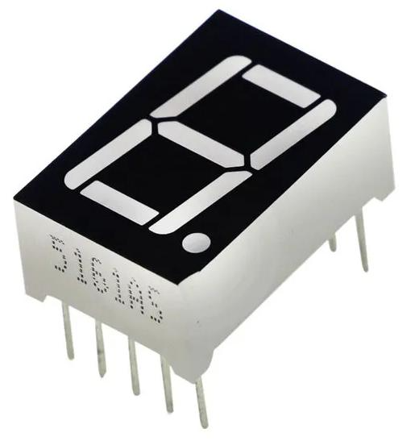

**1 x Módulo Ultrasónico**

Este es un módulo ultrasónico que utiliza ondas ultrasónicas para medir distancias, detectando y midiendo con precisión la posición y distancia de los objetos. Ampliamente utilizado en robótica, sistemas de evasión de obstáculos y campos de control automático, es un componente clave para la percepción del entorno y la navegación espacial.

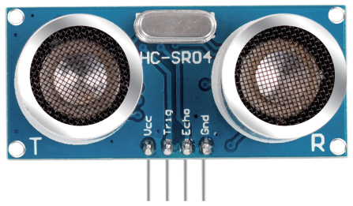

**65 x Cables Jumper**

Conectan componentes en la protoboard entre sí y con la placa Arduino.

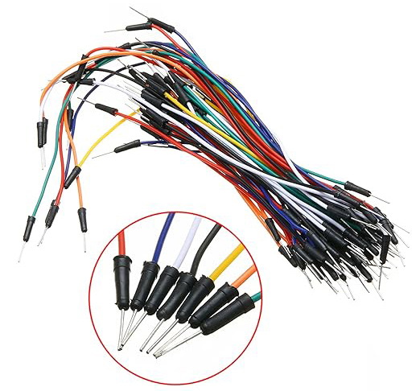

**10 x Cables DuPont Macho-Hembra**

Los cables DuPont macho-hembra están diseñados específicamente para conectar módulos con pines macho, como el módulo ultrasónico, a la protoboard. Estos cables son esenciales para interconectar diferentes componentes en proyectos electrónicos que requieren conexiones macho-hembra compatibles con la protoboard.

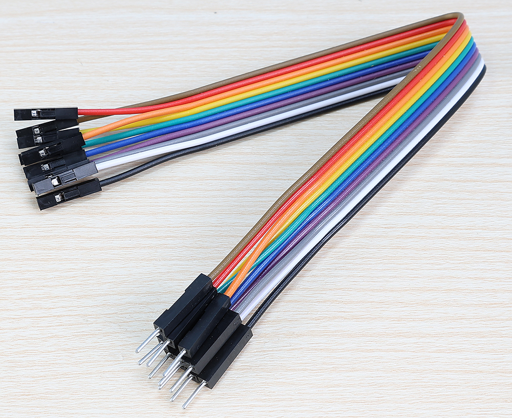

**1 x Cable USB**

Conecta la placa Arduino a una computadora. Te permite escribir, compilar y transferir programas a la placa Arduino. También alimenta la placa.

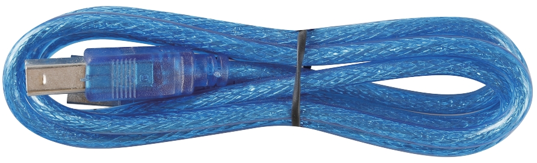

**1 x Batería de 9V**

Esta es una batería alcalina de 9V no recargable. Debes instalarla en el multímetro.

.. image:: img/1_9v_battery.png
    :width: 200
    :align: center

**1 x Multímetro con Cables Rojo y Negro**

Este es un multímetro versátil capaz de medir voltaje, corriente y resistencia, así como realizar otras pruebas eléctricas, lo que lo convierte en una herramienta indispensable para trabajos de electrónica y electricidad.

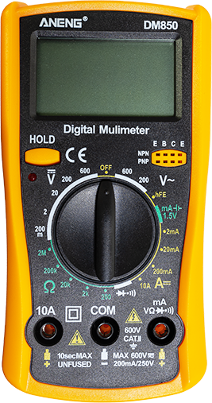
