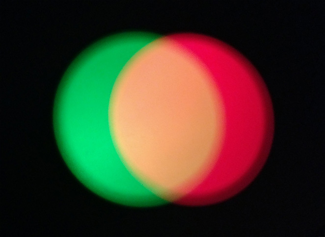
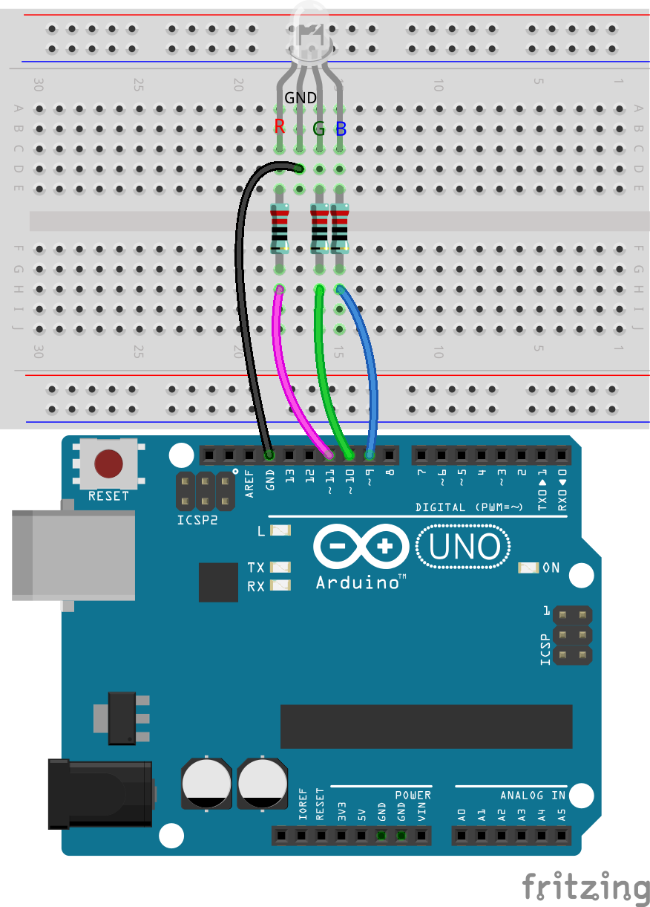

.. note::

    ¡Hola! Bienvenido a la comunidad de entusiastas de SunFounder Raspberry Pi, Arduino y ESP32 en Facebook. Sumérgete en el mundo de Raspberry Pi, Arduino y ESP32 junto a otros entusiastas.

    **¿Por qué unirte?**

    - **Soporte de expertos**: Resuelve problemas post-venta y desafíos técnicos con la ayuda de nuestra comunidad y equipo.
    - **Aprende y comparte**: Intercambia consejos y tutoriales para mejorar tus habilidades.
    - **Vistas previas exclusivas**: Obtén acceso anticipado a anuncios y adelantos de nuevos productos.
    - **Descuentos especiales**: Disfruta de descuentos exclusivos en nuestros productos más recientes.
    - **Promociones y sorteos festivos**: Participa en sorteos y promociones especiales durante las festividades.

    👉 ¿Listo para explorar y crear con nosotros? Haz clic en [|link_sf_facebook|] y únete hoy mismo.

13. El Espectro de la Visión
================================================================================
Bienvenido a esta lección, donde desentrañamos el misterio de la percepción del color humano y lo replicamos utilizando tecnología. En esta lección, profundizaremos en cómo nuestros ojos distinguen millones de colores y cómo esta increíble capacidad puede ser simulada digitalmente con LEDs RGB. Explorando la interacción entre los fotorreceptores en nuestros ojos y el modelo de color RGB, aprenderás a recrear la viveza del mundo en forma digital.

.. raw:: html

    <video muted controls style = "max-width:90%">
        <source src="../_static/video/13_human_perception_color.mp4" type="video/mp4">
        Your browser does not support the video tag.
    </video>

**Visión General**

El sistema visual humano puede percibir aproximadamente diez millones de colores 
diferentes, una capacidad lograda gracias a las células fotorreceptoras en la retina: 
conos y bastones. La percepción del color no es lineal; nuestro sistema visual es más 
sensible a los cambios en ciertos colores que en otros. Los conos, que son sensibles 
al color, vienen principalmente en tres tipos, cada uno más sensible a la luz roja, 
verde o azul.

El modelo de color RGB es un modelo de color aditivo en el que los colores se crean 
mezclando diferentes intensidades de luz roja, verde y azul. En este modelo, el rojo, 
verde y azul se consideran típicamente los canales de color primarios. Al ajustar la 
intensidad de cada canal (de 0 a un valor máximo, generalmente 255 que corresponde a 
una profundidad de color de 8 bits), es posible producir un espectro visible de más de 
16 millones de colores diferentes. Por ejemplo, se puede lograr un color naranja mezclando 
más rojo con menos verde.

En esta lección interactiva, aplicarás estos principios para controlar un LED RGB, permitiéndole mostrar los colores que elijas mediante comandos electrónicos precisos.

**Objetivos de Aprendizaje**

* Comprender cómo este modelo imita la percepción del color humano y su aplicación en pantallas digitales.
* Aprender a usar la Modulación por Ancho de Pulso (PWM) para lograr una mezcla de colores precisa con un LED RGB.
* Mejorar la eficiencia y claridad de tu código creando funciones que tomen parámetros en Arduino.
* Experimentar con diferentes valores RGB para personalizar los colores en tu LED, reflejando la complejidad de la visión del color humano.

Construcción del Circuito
------------------------------

**Componentes Necesarios**

.. list-table:: 
   :widths: 25 25 25 25
   :header-rows: 0

   * - 1 * Arduino Uno R3
     - 1 * LED RGB
     - 3 * Resistencias de 220Ω
     - Cables jumper
   * - |list_uno_r3| 
     - |list_rgb_led| 
     - |list_220ohm| 
     - |list_wire| 
   * - 1 * Cable USB
     - 1 * Protoboard
     - 
     - 
   * - |list_usb_cable| 
     - |list_breadboard| 
     - 
     - 

Esta lección utiliza el mismo circuito que la Lección 12.

Creación de Código - Mostrando Colores
------------------------------------------

En nuestro camino para dominar el control de los LEDs RGB, hemos visto cómo usando ``digitalWrite()`` podemos iluminar el LED en colores básicos. Para explorar más a fondo y desbloquear todo el espectro de colores que un LED RGB puede producir, ahora profundizaremos en el uso de ``analogWrite()`` para enviar señales PWM (Modulación por Ancho de Pulso), lo que nos permitirá lograr una amplia gama de tonos.

Veamos cómo podemos implementar esto con código.

1. Abre el IDE de Arduino y comienza un nuevo proyecto seleccionando "Nuevo Sketch" en el menú "Archivo".
2. Guarda tu sketch como ``Lesson13_PWM_Color_Mixing`` usando ``Ctrl + S`` o haciendo clic en "Guardar".

3. Primero, configura los tres pines del LED RGB como salidas:

.. code-block:: Arduino
    :emphasize-lines: 3-5

    void setup() {
        // Código de configuración que se ejecuta una vez:
        pinMode(9, OUTPUT);   // Configurar el pin Azul del LED RGB como salida
        pinMode(10, OUTPUT);  // Configurar el pin Verde del LED RGB como salida
        pinMode(11, OUTPUT);  // Configurar el pin Rojo del LED RGB como salida
    }

4. Usa ``analogWrite()`` para enviar valores PWM al LED RGB. Desde la Lección 9, sabemos que los valores PWM pueden cambiar el brillo de un LED, y el rango de PWM es de 0 a 255. Para mostrar rojo, configuramos el valor PWM del pin rojo del LED RGB en 255, y los otros dos pines en 0.

.. code-block:: Arduino
    :emphasize-lines: 10-12

    void setup() {
        // Código de configuración que se ejecuta una vez:
        pinMode(9, OUTPUT);   // Configurar el pin Azul del LED RGB como salida
        pinMode(10, OUTPUT);  // Configurar el pin Verde del LED RGB como salida
        pinMode(11, OUTPUT);  // Configurar el pin Rojo del LED RGB como salida
    }

    void loop() {
        // Código principal que se ejecuta repetidamente:
        analogWrite(9, 0);    // Establecer el valor PWM del pin Azul en 0
        analogWrite(10, 0);   // Establecer el valor PWM del pin Verde en 0
        analogWrite(11, 255); // Establecer el valor PWM del pin Rojo en 255
    }

5. Con esta configuración, después de subir el código al Arduino Uno R3, verás que el LED RGB muestra el color rojo.

6. La función ``analogWrite()`` permite que el LED RGB muestre no solo los siete colores básicos, sino también muchos otros tonos diferentes. Ahora puedes ajustar los valores de los pines 9, 10 y 11 por separado y registrar los colores observados en tu cuaderno.

.. list-table::
    :widths: 20 20 20 40
    :header-rows: 1

    *   - Pin Rojo    
        - Pin Verde  
        - Pin Azul
        - Color
    *   - 0
        - 128
        - 128
        - 
    *   - 128
        - 0
        - 255
        - 
    *   - 128
        - 128
        - 255
        - 
    *   - 255
        - 128
        - 0
        -     

Creación de Código - Funciones Parametrizadas
------------------------------------------------

Usar la función ``analogWrite()`` para mostrar diferentes colores puede hacer que tu código sea largo si deseas mostrar muchos colores al mismo tiempo. Por lo tanto, necesitamos crear funciones.

A diferencia de la lección anterior, nos estamos preparando para crear una función con parámetros.

Una función parametrizada te permite pasar valores específicos a la función, que luego puede usar para realizar sus tareas. Esto es muy útil para ajustar propiedades como la intensidad del color de manera dinámica. Hace que tu código sea más flexible y fácil de leer.

Al definir una función parametrizada, especificas qué valores necesita para operar a través de parámetros listados entre paréntesis justo después del nombre de la función. Estos parámetros actúan como marcadores de posición que se reemplazan por valores reales cuando se llama a la función.

Aquí te mostramos cómo definir una función parametrizada para configurar el color de un LED RGB:

1. Abre el sketch que guardaste anteriormente, ``Lesson13_PWM_Color_Mixing``.

2. Haz clic en “Guardar como...” en el menú “Archivo” y renómbralo a ``Lesson13_PWM_Color_Mixing_Function``. Haz clic en "Guardar".

3. Comienza declarando la función después de ``void loop()`` con la palabra clave ``void``, seguida del nombre de la función y los parámetros entre paréntesis. Para nuestra función ``setColor``, utilizaremos tres parámetros: ``red``, ``green`` y ``blue``, cada uno representando la intensidad del componente de color correspondiente del LED RGB.

.. code-block:: Arduino
    :emphasize-lines: 5,6

    void loop() {
        // Escribe aquí el código principal que se ejecutará repetidamente:
    }

    void setColor(int red, int green, int blue) {
    }

   
4. Dentro del cuerpo de la función, usa el comando ``analogWrite()`` para enviar señales PWM a los pines del LED RGB. Los valores pasados a ``setColor`` determinarán el brillo de cada color. Los parámetros ``red``, ``green`` y ``blue`` se usan aquí para controlar directamente la intensidad de cada pin del LED.

.. code-block:: Arduino

    // Función para configurar el color del LED RGB
    void setColor(int red, int green, int blue) {
        // Escribir valor PWM para rojo, verde y azul en el LED RGB
        analogWrite(11, red);
        analogWrite(10, green);
        analogWrite(9, blue);
    }

5. Ahora puedes llamar a la función que acabas de crear ``setColor()`` dentro de ``void loop()``. Dado que creaste una función con parámetros, debes completar los argumentos en los paréntesis como ``(255, 0, 0)``. Recuerda añadir comentarios.

.. code-block:: Arduino
    :emphasize-lines: 3

    void loop() {
        // Escribe aquí el código principal que se ejecutará repetidamente:
        setColor(255, 0, 0); // Mostrar color rojo
    }

    // Función para configurar el color del LED RGB
    void setColor(int red, int green, int blue) {
        // Escribir valor PWM para rojo, verde y azul en el LED RGB
        analogWrite(11, red);
        analogWrite(10, green);
        analogWrite(9, blue);
    }

6. Ya sabemos que al proporcionar diferentes valores a los tres pines del LED RGB, podemos encender diferentes colores de luz. Entonces, ¿cómo logramos que el LED RGB emita exactamente el color que queremos? Esto requiere la ayuda de una paleta de colores. Abre **Paint** (este software viene con Windows) o cualquier software de dibujo en tu computadora personal.

.. image:: img/13_mix_color_paint.png

7. Elige un color que te guste y registra sus valores RGB.

.. note::

    Ten en cuenta que antes de seleccionar un color, ajusta los lúmenes a la posición adecuada.

.. image:: img/13_mix_color_paint_2.png

8. Inserta el color que seleccionaste en la función ``setColor()`` dentro de ``void loop()``, y usa la función ``delay()`` para especificar el tiempo de visualización de cada color.

.. code-block:: Arduino

    void loop() {
        // Código principal que se ejecutará repetidamente:
        setColor(255, 0, 0);      // Mostrar color rojo
        delay(1000);              // Esperar 1 segundo
        setColor(0, 128, 128);    // Mostrar color aguamarina
        delay(1000);              // Esperar 1 segundo
        setColor(128, 0, 255);    // Mostrar color púrpura
        delay(1000);              // Esperar 1 segundo
        setColor(128, 128, 255);  // Mostrar color azul claro
        delay(1000);              // Esperar 1 segundo
        setColor(255, 128, 0);    // Mostrar color naranja
        delay(1000);              // Esperar 1 segundo
    }

9. A continuación se muestra el código completo; puedes hacer clic en "Subir" para cargar el código en el Arduino Uno R3 y ver los efectos.

.. code-block:: Arduino

    void setup() {
        // Código de configuración que se ejecuta una vez:
        pinMode(9, OUTPUT);   // Configurar el pin azul del LED RGB como salida
        pinMode(10, OUTPUT);  // Configurar el pin verde del LED RGB como salida
        pinMode(11, OUTPUT);  // Configurar el pin rojo del LED RGB como salida
    }

    void loop() {
        // Código principal que se ejecutará repetidamente:
        setColor(255, 0, 0);      // Mostrar color rojo
        delay(1000);              // Esperar 1 segundo
        setColor(0, 128, 128);    // Mostrar color aguamarina
        delay(1000);              // Esperar 1 segundo
        setColor(128, 0, 255);    // Mostrar color púrpura
        delay(1000);              // Esperar 1 segundo
        setColor(128, 128, 255);  // Mostrar color azul claro
        delay(1000);              // Esperar 1 segundo
        setColor(255, 128, 0);    // Mostrar color naranja
        delay(1000);              // Esperar 1 segundo
    }

    // Función para configurar el color del LED RGB
    void setColor(int red, int green, int blue) {
        // Escribir valor PWM para rojo, verde y azul en el LED RGB
        analogWrite(11, red);
        analogWrite(10, green);
        analogWrite(9, blue);
    }

10. Finalmente, recuerda guardar tu código y organizar tu espacio de trabajo.

**Resumen**

La exploración de hoy sobre la percepción del color conecta la biología con su aplicación electrónica, destacando el poder de la programación para dar vida a conceptos abstractos. Ajustando los valores RGB en un LED, has imitado el método que utiliza el ojo para percibir colores, ganando tanto una mayor apreciación por la biología humana como habilidades avanzadas en el control electrónico.
