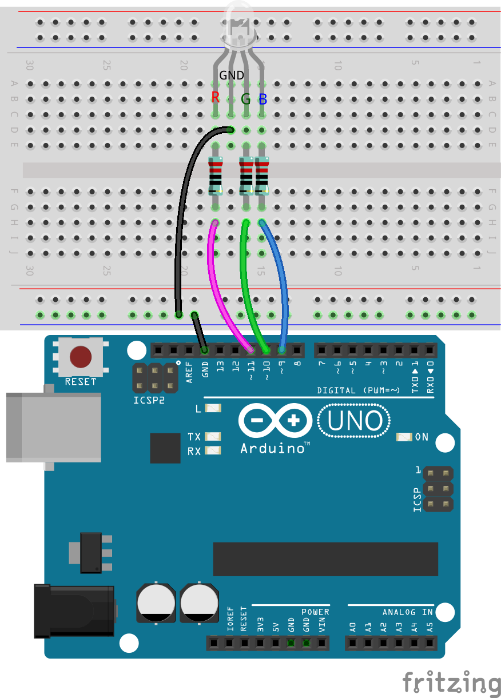
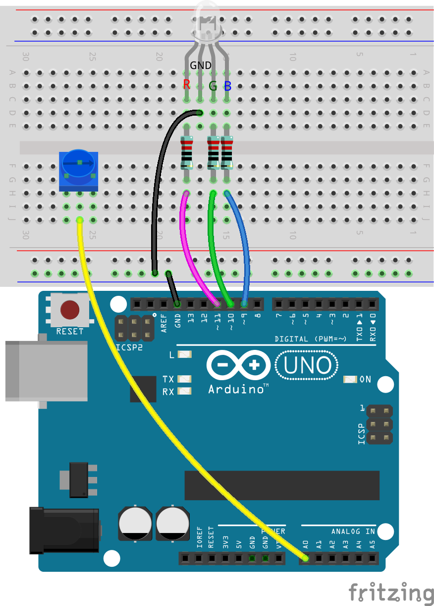
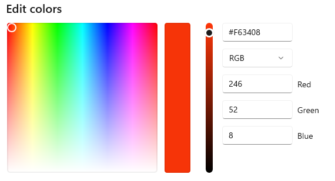
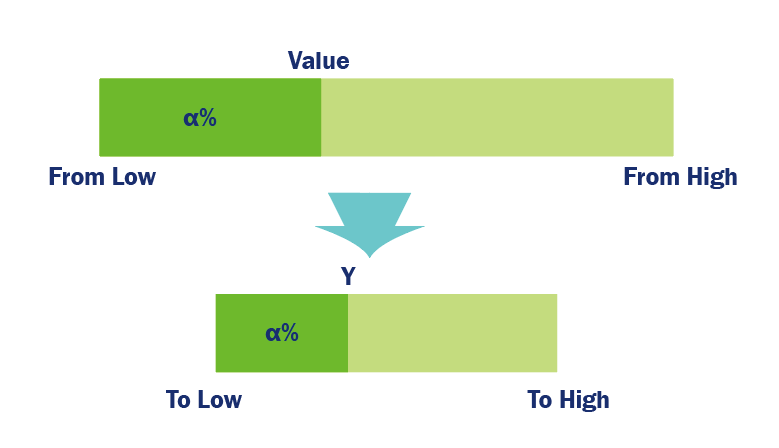

.. note::

    ¡Hola! Bienvenido a la comunidad de entusiastas de SunFounder Raspberry Pi & Arduino & ESP32 en Facebook. Profundiza en Raspberry Pi, Arduino y ESP32 con otros entusiastas.

    **¿Por qué unirte?**

    - **Soporte experto**: Resuelve problemas post-venta y desafíos técnicos con la ayuda de nuestra comunidad y equipo.
    - **Aprende y comparte**: Intercambia consejos y tutoriales para mejorar tus habilidades.
    - **Preestrenos exclusivos**: Obtén acceso anticipado a nuevos anuncios de productos y adelantos.
    - **Descuentos especiales**: Disfruta de descuentos exclusivos en nuestros productos más recientes.
    - **Promociones festivas y sorteos**: Participa en sorteos y promociones navideñas.

    👉 ¿Listo para explorar y crear con nosotros? Haz clic en [|link_sf_facebook|] y únete hoy mismo.

15. Colores fríos o cálidos
================================

Los colores no son solo parte de nuestra experiencia visual; también influyen en nuestras emociones y sentimientos. En esta lección, profundizaremos en los impactos psicológicos de los colores y aprenderemos a manipular un LED RGB para alternar entre colores cálidos y fríos, imitando los efectos de los cambios en las temperaturas de la luz.

.. raw:: html

    <video muted controls style = "max-width:90%">
        <source src="../_static/video/15_cool_warm_color.mp4" type="video/mp4">
        Your browser does not support the video tag.
    </video>

**Descripción general**

El concepto de colores fríos y cálidos está relacionado con los efectos psicológicos que los colores tienen en nuestra percepción. Los rojos, naranjas, amarillos y marrones suelen evocar sensaciones de calidez y emoción, lo que los clasifica como colores cálidos. Por otro lado, los verdes, azules y púrpuras suelen impartir sensaciones de calma, frescura y amplitud, clasificándolos como colores fríos. El naranja y el azul están en extremos opuestos de este espectro cálido-frío.

En el hogar o en entornos de ocio, las personas prefieren iluminación en tonos de amarillo claro o blanco cálido, creando una atmósfera acogedora similar a estar bajo la luz de un atardecer o una vela.

.. image:: img/15_mix_color_warm_room.png
    :width: 400
    :align: center

En bibliotecas, aulas, oficinas y hospitales, se prefieren tonos de luz más fríos, ya que promueven la concentración y la frescura, lo que facilita el trabajo y el aprendizaje.

.. image:: img/15_mix_color_cool_room.png
    :width: 400
    :align: center

La calidez o frialdad de la luz es una experiencia visceral que afecta nuestra respuesta psicológica y nuestro confort visual. Los diseñadores y los ingenieros de iluminación seleccionan cuidadosamente las temperaturas de color adecuadas a la función del espacio y al ambiente deseado, creando entornos de iluminación tanto estéticamente agradables como prácticos. Al aplicar estos principios de manera científica, podemos mejorar la calidad de nuestros entornos de vida y trabajo, fomentando una atmósfera más saludable y cómoda.

En esta lección, asumiremos el rol de ingenieros de iluminación para crear un sistema de iluminación que pueda alternar entre temperaturas de color.

**Objetivos de aprendizaje**

- Comprender los efectos psicológicos de los colores cálidos y fríos.
- Explorar cómo las temperaturas de la luz afectan el estado de ánimo y el entorno.
- Aprender a ajustar los colores del LED RGB para simular diferentes temperaturas utilizando Arduino.
- Desarrollar habilidades prácticas en el uso de la función ``map()`` para transicionar entre temperaturas de color.

Construcción del circuito
------------------------------

**Componentes necesarios**

.. list-table:: 
   :widths: 25 25 25 25
   :header-rows: 0

   * - 1 * Arduino Uno R3
     - 1 * LED RGB
     - 3 * Resistor de 220Ω
     - 1 * Potenciómetro
   * - |list_uno_r3| 
     - |list_rgb_led| 
     - |list_220ohm| 
     - |list_potentiometer| 
   * - 1 * Cable USB
     - 1 * Protoboard
     - Cables de conexión
     - 
   * - |list_usb_cable| 
     - |list_breadboard| 
     - |list_wire| 
     - 
     
**Pasos de construcción**

Este circuito se basa en el de la Lección 12, añadiendo un potenciómetro.

.. image:: img/15_cool_warm_color.png
    :width: 500
    :align: center

1. Retira el cable de conexión que une el pin GND del Arduino Uno R3 al pin GND del LED RGB y luego insértalo en el terminal negativo del protoboard. Después, conecta un cable de conexión desde el terminal negativo al pin GND del LED RGB.

2. Inserta el potenciómetro en los orificios 25G, 26F y 27G.

.. image:: img/15_cool_warm_color_pot.png
    :width: 500
    :align: center

3. Conecta el pin central del potenciómetro al pin A0 del Arduino Uno R3.

4. Finalmente, conecta el pin izquierdo del potenciómetro al pin 5V del Arduino Uno R3 y el pin derecho al terminal negativo del protoboard.

.. image:: img/15_cool_warm_color.png
    :width: 500
    :align: center

Creación del código
-----------------------

**Comprensión de los colores cálidos y fríos**

Antes de ajustar la temperatura de color, necesitamos entender las diferencias entre los valores RGB de los colores fríos y cálidos.

La percepción de calidez en la iluminación es algo subjetiva, pero indiscutiblemente, los colores cálidos tienden hacia el rojo-naranja, mientras que los colores fríos tienden hacia el azul.

1. Abre **Paint** o cualquier herramienta de selección de colores, encuentra lo que consideres los colores más cálidos y fríos, y registra sus valores RGB en tu cuaderno.

.. note::

    Antes de seleccionar un color, ajusta los lúmenes a la posición adecuada.

.. list-table::
   :widths: 25 25 50 25
   :header-rows: 1

   * - Tipo de color
     - Rojo
     - Verde
     - Azul
   * - Color cálido
     - 
     - 
     - 
   * - Color frío
     - 
     - 
     - 

2. Aquí tienes algunos ejemplos de tonos cálidos y fríos junto con sus valores RGB:

* Rojo (Rojo: 246, Verde: 52, Azul: 8)

* Azul Claro (Rojo: 100, Verde: 150, Azul: 255)

.. image:: img/15_mix_color_tone_cool.png

La principal diferencia entre los colores cálidos y fríos es la proporción de las tres intensidades de color primarias. A continuación, almacenaremos estos valores RGB cálidos y fríos en nuestro sketch.

3. Abre el sketch que guardaste anteriormente, ``Lesson13_PWM_Color_Mixing``.

4. Haz clic en "Guardar como..." en el menú "Archivo" y renómbralo a ``Lesson15_Cool_Warm_Color``. Haz clic en "Guardar".

5. Antes de ``void setup()``, declara seis variables para almacenar los valores RGB de estos dos colores. Usa los colores que seleccionaste.

.. code-block:: Arduino
    :emphasize-lines: 1-4,6-9

    // Valores RGB para un color cálido
    int warm_r = 246;
    int warm_g = 52;
    int warm_b = 8;

    // Valores RGB para un color frío
    int cool_r = 100;
    int cool_g = 150;
    int cool_b = 255;

    void setup() {
        // Configuración inicial del código:
        pinMode(9, OUTPUT);   // Configurar el pin Azul del LED RGB como salida
        pinMode(10, OUTPUT);  // Configurar el pin Verde del LED RGB como salida
        pinMode(11, OUTPUT);  // Configurar el pin Rojo del LED RGB como salida
    }

**Uso de la función map()**

Para transicionar de una iluminación cálida a una fría, solo necesitas reducir la intensidad de la luz roja, aumentar la luz azul y ajustar finamente la intensidad de la luz verde.

En proyectos anteriores, hemos aprendido a variar el brillo de un LED en respuesta a la rotación de un potenciómetro.

Sin embargo, en este proyecto, la rotación del potenciómetro hace que las intensidades de los pines RGB cambien dentro de un rango específico, por lo que la simple división no es adecuada. Por ello, utilizaremos una nueva función: ``map()``.

En la programación de Arduino, la función ``map()`` es extremadamente útil porque permite mapear (o convertir) un rango numérico a otro.

Aquí te mostramos cómo usarla:

* ``map(value, fromLow, fromHigh, toLow, toHigh)``: Remapea un número de un rango a otro. Es decir, un valor de ``fromLow`` se mapeará a ``toLow``, un valor de ``fromHigh`` a ``toHigh``, y los valores intermedios se mapearán proporcionalmente.

    **Parámetros**
        * ``value``: el número que se va a mapear.
        * ``fromLow``: el límite inferior del rango actual del valor.
        * ``fromHigh``: el límite superior del rango actual del valor.
        * ``toLow``: el límite inferior del rango objetivo.
        * ``toHigh``: el límite superior del rango objetivo.

    **Devuelve**
        El valor mapeado. Tipo de dato: long.

La función ``map()`` escala un valor de su rango original (fromLow a fromHigh) a un nuevo rango (toLow a toHigh). Primero, calcula la posición del ``value`` dentro de su rango original y luego aplica la misma proporción para escalar esa posición al nuevo rango.

Se puede escribir en la siguiente fórmula:

.. code-block::

    (value-fromLow)/(fromHigh-fromLow) = (y-toLow)/(toHigh-toLow)

Usando álgebra, puedes reorganizar esta ecuación para resolver ``y``:

.. code-block::

    y = (value-fromLow) * (toHigh-toLow) / (fromHigh-fromLow) + toLow

.. image:: img/15_map_format.png

Por ejemplo, usando ``y = map(value, 0, 1023, 246, 100);``, si ``value`` es igual a 434, entonces ``y = (434-0) * (100 - 246) / (1023-0) + 246``, lo que aproximadamente da 152.

6. Elimina el código original en ``void loop()``, luego escribe el código para leer el valor del potenciómetro y almacenarlo en la variable ``potValue``.

.. code-block:: Arduino

    void loop() {
        // Código principal para ejecutar repetidamente:
        int potValue = analogRead(A0);                         // Leer el valor del potenciómetro
    }

7. Luego, usa la función ``map()`` para mapear el valor del potenciómetro del rango 0~1023 al rango 255 (``warm_r``) ~ 100 (``cool_r``).

.. code-block:: Arduino

    void loop() {
        // Código principal para ejecutar repetidamente:
        int potValue = analogRead(A0);                         // Leer el valor del potenciómetro
        int value_r = map(potValue, 0, 1023, warm_r, cool_r);  // Mapear el valor del potenciómetro a la intensidad del rojo
    }

8. Puedes usar el monitor serie para ver el ``potValue`` y el valor mapeado ``value_r`` para comprender mejor la función ``map()``. Ahora, inicia el monitor serie en ``void setup()``.

.. code-block:: Arduino
    :emphasize-lines: 6

    void setup() {
        // Configuración inicial del código:
        pinMode(9, OUTPUT);   // Configurar el pin Azul del LED RGB como salida
        pinMode(10, OUTPUT);  // Configurar el pin Verde del LED RGB como salida
        pinMode(11, OUTPUT);  // Configurar el pin Rojo del LED RGB como salida
        Serial.begin(9600);        // Configurar la comunicación serial a 9600 baudios
    }

9. Imprime las variables ``potValue`` y ``value_r`` en la misma línea, separadas por "|".

.. code-block:: Arduino
    :emphasize-lines: 23-26

    // Valores RGB para un color cálido
    int warm_r = 246;
    int warm_g = 52;
    int warm_b = 8;

    // Valores RGB para un color frío
    int cool_r = 100;
    int cool_g = 150;
    int cool_b = 255;

    void setup() {
        // Configuración inicial del código:
        pinMode(9, OUTPUT);   // Configurar el pin Azul del LED RGB como salida
        pinMode(10, OUTPUT);  // Configurar el pin Verde del LED RGB como salida
        pinMode(11, OUTPUT);  // Configurar el pin Rojo del LED RGB como salida
        Serial.begin(9600);        // Configurar la comunicación serial a 9600 baudios
    }

    void loop() {
        // Código principal para ejecutar repetidamente:
        int potValue = analogRead(A0);                         // Leer el valor del potenciómetro
        int value_r = map(potValue, 0, 1023, warm_r, cool_r);  // Mapear el valor del potenciómetro a la intensidad del rojo
        Serial.print(potValue);
        Serial.print(" | ");
        Serial.println(value_r);
        delay(500);  // Esperar 500ms
    }

    // Función para establecer el color del LED RGB
    void setColor(int red, int green, int blue) {
        analogWrite(11, red);    // Escribir PWM en el pin rojo
        analogWrite(10, green);  // Escribir PWM en el pin verde
        analogWrite(9, blue);    // Escribir PWM en el pin azul
    }

10. Ahora puedes verificar y cargar tu código, abrir el monitor serie y verás dos columnas de datos impresos.

.. code-block::

    434 | 152
    435 | 152
    434 | 152
    434 | 152
    434 | 152
    434 | 152

A partir de los datos, es evidente que la posición del valor 434 dentro del rango 0~1023 corresponde a la posición de 152 dentro del rango 246~100.

**Ajustando la Temperatura de Color**

Aquí usamos la función ``map()`` para hacer que la intensidad de los tres pines del LED RGB cambie con la rotación del potenciómetro, desplazándose de los tonos más cálidos a los más fríos.
Más específicamente, con los valores de referencia proporcionados, a medida que se rota el potenciómetro, el valor R del LED RGB cambiará gradualmente de 246 a 100, el valor G de 8 a 150 (aunque el cambio en el valor G no es muy notable), y el valor B gradualmente de 8 a 255.

11. A continuación, no necesitaremos imprimir en serie temporalmente, ya que la impresión en serie puede afectar el proceso completo del código, por lo que usa ``Ctrl + /`` para comentar el código relacionado.

    .. note::

        La razón de no eliminar directamente es que, si más adelante necesitas imprimir, no será necesario reescribir el código; solo selecciona estas líneas y presiona ``Ctrl+/`` para descomentarlas.

.. code-block:: Arduino
    :emphasize-lines: 3,4

    void loop() {
        // Código principal para ejecutar repetidamente:
        int potValue = analogRead(A0);                         // Leer el valor del potenciómetro
        int value_r = map(potValue, 0, 1023, warm_r, cool_r);  // Mapear valor del potenciómetro a la intensidad del rojo
        // Serial.print(potValue);
        // Serial.print(" | ");
        // Serial.println(value_r);
        // delay(500);  // Esperar 500ms
    }

12. Continúa llamando a la función ``map()`` para obtener los valores mapeados ``value_g`` y ``value_b`` basados en el valor del potenciómetro.

.. code-block:: Arduino
    :emphasize-lines: 9,10

    void loop() {
        // Código principal para ejecutar repetidamente:
        int potValue = analogRead(A0);                         // Leer el valor del potenciómetro
        int value_r = map(potValue, 0, 1023, warm_r, cool_r);  // Mapear valor del potenciómetro a la intensidad del rojo
        // Serial.print(potValue);
        // Serial.print(" | ");
        // Serial.println(value_r);
        // delay(500);  // Esperar 500ms
        int value_g = map(potValue, 0, 1023, warm_g, cool_g);  // Mapear valor del potenciómetro a la intensidad del verde
        int value_b = map(potValue, 0, 1023, warm_b, cool_b);  // Mapear valor del potenciómetro a la intensidad del azul
    }

13. Finalmente, llama a la función ``setColor()`` para mostrar los valores RGB mapeados en el LED RGB.

.. code-block:: Arduino
    :emphasize-lines: 11,12

    void loop() {
        // Código principal para ejecutar repetidamente:
        int potValue = analogRead(A0);                         // Leer el valor del potenciómetro
        int value_r = map(potValue, 0, 1023, warm_r, cool_r);  // Mapear valor del potenciómetro a la intensidad del rojo
        // Serial.print(potValue);
        // Serial.print(" | ");
        // Serial.println(value_r);
        // delay(500);  // Esperar 500ms
        int value_g = map(potValue, 0, 1023, warm_g, cool_g);  // Mapear valor del potenciómetro a la intensidad del verde
        int value_b = map(potValue, 0, 1023, warm_b, cool_b);  // Mapear valor del potenciómetro a la intensidad del azul
        setColor(value_r, value_g, value_b);                   // Configurar el color del LED
        delay(500);
    }

14. El código completo es el siguiente; puedes hacer clic en el botón de cargar para subir el código al Arduino Uno R3. Luego, al girar el potenciómetro, notarás que el LED RGB realiza una transición lenta de un tono frío a un tono cálido, o de un tono cálido a un tono frío.

.. code-block:: Arduino

    // Valores RGB para un color cálido
    int warm_r = 246;
    int warm_g = 52;
    int warm_b = 8;

    // Valores RGB para un color frío
    int cool_r = 100;
    int cool_g = 150;
    int cool_b = 255;

    void setup() {
        // Configuración del código para ejecutar una vez:
        pinMode(9, OUTPUT);   // Configurar el pin Azul del LED RGB como salida
        pinMode(10, OUTPUT);  // Configurar el pin Verde del LED RGB como salida
        pinMode(11, OUTPUT);  // Configurar el pin Rojo del LED RGB como salida
    }

    void loop() {
        // Código principal para ejecutar repetidamente:
        int potValue = analogRead(A0);                         // Leer el valor del potenciómetro
        int value_r = map(potValue, 0, 1023, warm_r, cool_r);  // Mapear el valor del potenciómetro a la intensidad del rojo
        // Serial.print(potValue);
        // Serial.print(" | ");
        // Serial.println(value_r);
        // delay(500);  // Esperar 500ms
        int value_g = map(potValue, 0, 1023, warm_g, cool_g);  // Mapear el valor del potenciómetro a la intensidad del verde
        int value_b = map(potValue, 0, 1023, warm_b, cool_b);  // Mapear el valor del potenciómetro a la intensidad del azul
        setColor(value_r, value_g, value_b);                   // Establecer el color del LED
        delay(500);                                            // Esperar 500ms
    }

    // Función para configurar el color del LED RGB
    void setColor(int red, int green, int blue) {
        analogWrite(11, red);    // Escribir PWM en el pin rojo
        analogWrite(10, green);  // Escribir PWM en el pin verde
        analogWrite(9, blue);    // Escribir PWM en el pin azul
    }

15. Finalmente, recuerda guardar tu código y organizar tu espacio de trabajo.

**Consejos**

Durante el experimento, podrías notar que la transición entre los tonos cálidos y fríos no es tan evidente como en pantalla; por ejemplo, una luz cálida esperada puede parecer blanca. Esto es normal, ya que la mezcla de colores en un LED RGB no es tan precisa como en una pantalla.

En tales casos, puedes reducir la intensidad de los valores de G y B en el color cálido para que el LED RGB muestre un color más adecuado.

**Pregunta**

Ten en cuenta que los "límites inferiores" de cualquier rango pueden ser mayores o menores que los "límites superiores", por lo que la función ``map(value, fromLow, fromHigh, toLow, toHigh)`` puede usarse para invertir un rango de números, por ejemplo:

.. code-block::

    y = map(x, 1, 50, 50, 1);

La función también maneja bien los números negativos, por lo que este ejemplo también es válido y funciona correctamente.

.. code-block::

    y = map(x, 1, 50, 50, -100);

Para ``y = map(x, 1, 50, 50, -100);``, si ``x`` es igual a 20, ¿cuánto debería ser ``y``? Consulta la siguiente fórmula para calcularlo.

.. image:: img/15_map_format.png
