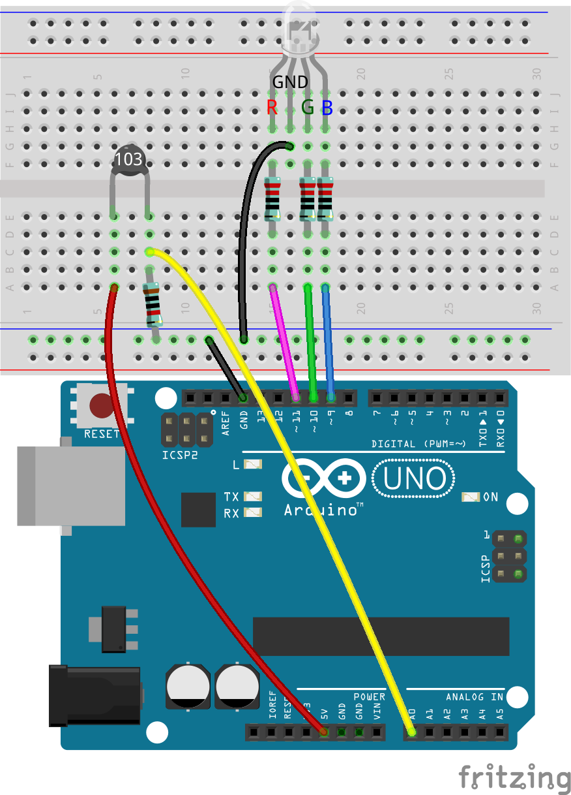
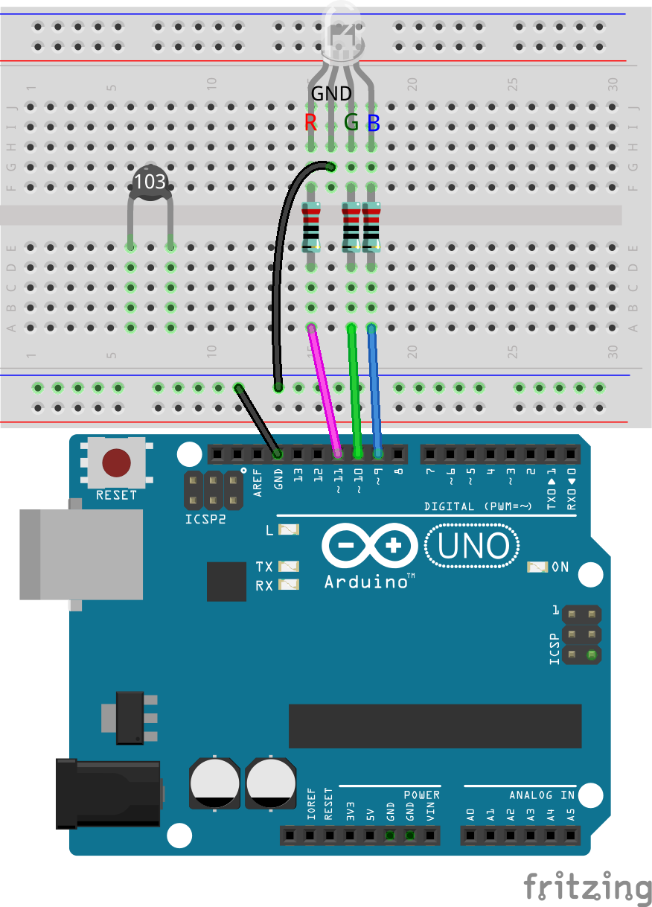
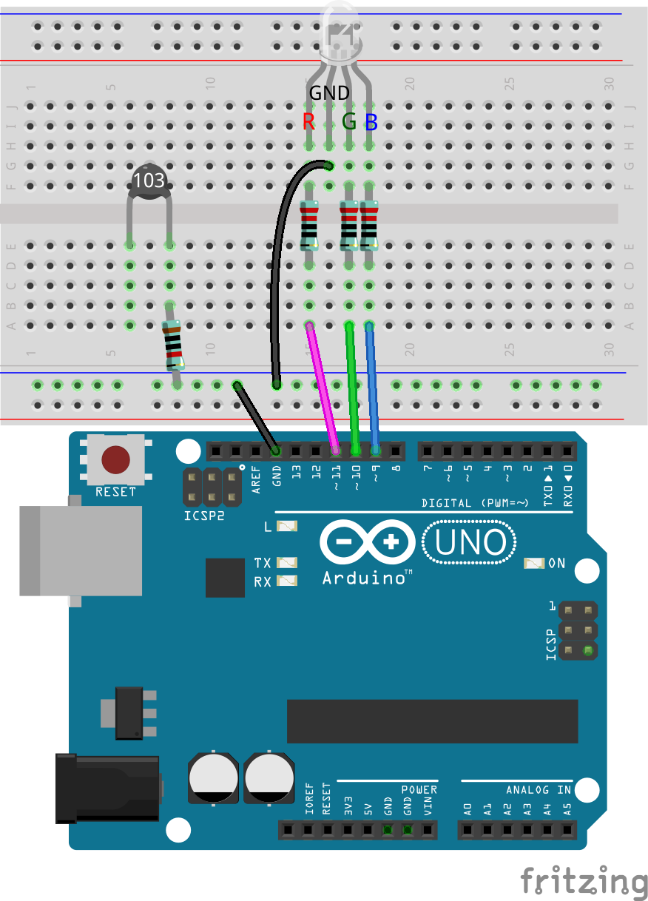
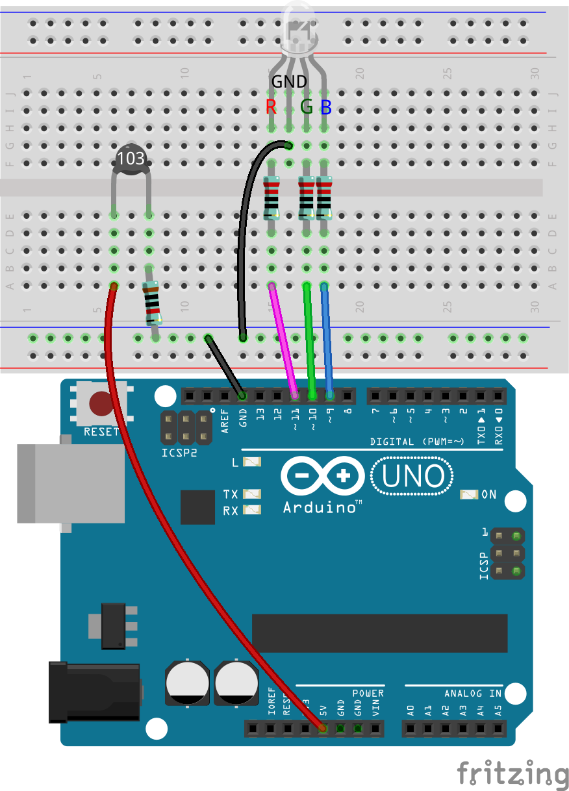
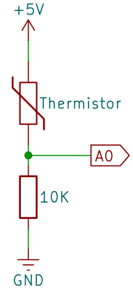

.. note::

    Bonjour, bienvenue dans la communauté SunFounder Raspberry Pi & Arduino & ESP32 Enthusiasts sur Facebook ! Plongez au cœur des Raspberry Pi, Arduino et ESP32 avec d'autres passionnés.

    **Pourquoi nous rejoindre ?**

    - **Support d'experts** : Résolvez les problèmes après-vente et les défis techniques avec l'aide de notre communauté et de notre équipe.
    - **Apprendre et partager** : Échangez des astuces et des tutoriels pour perfectionner vos compétences.
    - **Aperçus exclusifs** : Accédez en avant-première aux annonces de nouveaux produits et aux avant-goûts.
    - **Réductions spéciales** : Profitez de réductions exclusives sur nos produits les plus récents.
    - **Promotions festives et concours** : Participez à des tirages au sort et des promotions spéciales lors des fêtes.

    👉 Prêt à explorer et créer avec nous ? Cliquez sur [|link_sf_facebook|] et rejoignez-nous dès aujourd'hui !

16. Alarme de température
=============================

Dans cette leçon, nous allons explorer l'importance de la gestion de la température dans la sécurité alimentaire. Tous les aliments ne nécessitent pas une réfrigération ou une congélation, mais même des produits stables à température ambiante comme les chips, le pain et certains fruits doivent être stockés à des températures appropriées pour préserver leur qualité et leur sécurité. En construisant un système de surveillance de la température, nous apprendrons à maintenir les aliments dans des plages de température sûres et à déclencher une alarme en cas de déviation de ces limites. Ce projet pratique permet non seulement de protéger les aliments, mais sert également d'excellente introduction à la surveillance environnementale avec des applications concrètes.

.. .. image:: img/16_temperature.jpg
..     :width: 400
..     :align: center

.. raw:: html

    <video muted controls style = "max-width:90%">
        <source src="../_static/video/16_temp_alarm.mp4" type="video/mp4">
        Your browser does not support the video tag.
    </video>

À la fin de cette leçon, vous serez capable de :

* Comprendre l'importance du contrôle de la température dans la sécurité alimentaire.
* Construire un circuit avec une thermistance pour surveiller les variations de température.
* Écrire un programme Arduino pour lire les données de température d'une thermistance.
* Utiliser la logique en programmation pour déclencher des actions (comme allumer une LED ou déclencher une alarme) en fonction des données de température.
* Appliquer des concepts de résistance électrique et de conversion de température dans des scénarios pratiques.

Construction du circuit
--------------------------

**Composants nécessaires**

.. list-table:: 
   :widths: 25 25 25 25
   :header-rows: 0

   * - 1 * Arduino Uno R3
     - 1 * LED RGB
     - 3 * Résistances 220Ω
     - 1 * Résistance 10KΩ
   * - |list_uno_r3| 
     - |list_rgb_led| 
     - |list_220ohm| 
     - |list_10kohm| 
   * - 1 * Thermistance
     - 1 * Plaque de montage (breadboard)
     - Fils de connexion
     - 1 * Câble USB
   * - |list_thermistor| 
     - |list_breadboard| 
     - |list_wire| 
     - |list_usb_cable| 
   * - 1 * Multimètre
     - 
     - 
     - 
   * - |list_meter| 
     - 
     - 
     - 

Étapes de construction
---------------------------

Ce circuit est basé sur celui de la leçon 12, avec l'ajout d'une thermistance.

1. Sur la base du circuit de la leçon 12, retirez le fil reliant la broche GND de l'Arduino Uno R3 à la broche GND de la LED RGB, puis insérez-le dans la borne négative de la breadboard. Ensuite, connectez un fil de cette borne négative à la broche GND de la LED RGB.

.. image:: img/16_temperature_alarm_gnd.png
    :width: 500
    :align: center

2. Insérez la thermistance dans les trous 6E et 8E. Les broches ne sont pas directionnelles et peuvent être insérées librement.

Une thermistance est un type spécial de résistance dont la valeur change en fonction de la température. Cet appareil est très utile pour détecter et mesurer la température, permettant ainsi de la contrôler dans divers projets et dispositifs électroniques.

Voici le symbole électronique de la thermistance.

.. image:: img/16_thermistor_symbol.png
    :width: 300
    :align: center

Il existe deux types fondamentaux opposés de thermistances :

* **Thermistances NTC** : La résistance diminue avec l'augmentation de la température. Elles sont couramment utilisées comme capteurs de température ou limiteurs de courant d'appel dans les circuits.
* **Thermistances PTC** : La résistance augmente avec l'augmentation de la température. Elles sont souvent utilisées comme fusibles réarmables dans les circuits pour protéger contre les surintensités.

Dans ce kit, nous utilisons une **NTC**.

Utilisez maintenant un multimètre pour mesurer la résistance de cette thermistance et vérifiez si elle diminue effectivement avec une augmentation de la température.

3. Comme la résistance nominale de la thermistance est de 10K, réglez le multimètre sur la plage de mesure de résistance de 20 kilo-ohms (20K).

.. image:: img/multimeter_20k.png
    :width: 300
    :align: center

4. Touchez maintenant les deux broches de la thermistance avec les fils de test rouge et noir du multimètre.

.. image:: img/16_temperature_alarm_test.png
    :width: 500
    :align: center

5. Lisez la valeur de la résistance à la température ambiante actuelle et enregistrez-la dans le tableau ci-dessous.

.. list-table::
   :widths: 20 20
   :header-rows: 1

   * - Environment
     - Resistance (kilohm)
   * - Current temperature
     - *9.37*
   * - Higher temperature
     - 
   * - Lower temperature
     - 

6. Maintenant, vous pouvez demander à un ami de vous aider à tenir la thermistance ou utiliser quelque chose d'autre pour augmenter la température autour de la thermistance (pas d'eau, pas de feu, la sécurité d'abord). Notez la valeur de la résistance de la thermistance dans le tableau.

.. list-table::
   :widths: 20 20
   :header-rows: 1

   * - Environnement
     - Résistance (kilohms)
   * - Température actuelle
     - *9.37*
   * - Température plus élevée
     - *6.10*
   * - Température plus basse
     - 

7. Vous pouvez placer la thermistance à l'extérieur ou utiliser un éventail pour diminuer la température autour d'elle. Notez la résistance mesurée dans le tableau à ce moment.

.. list-table::
   :widths: 20 20
   :header-rows: 1

   * - Environnement
     - Résistance (kilohms)
   * - Température actuelle
     - *9.37*
   * - Température plus élevée
     - *6.10*
   * - Température plus basse
     - *12.49*

À travers ces mesures, on peut voir que plus la température ambiante est élevée, plus la résistance diminue.

8. Vous pouvez maintenant continuer à construire le circuit. Connectez une extrémité de la thermistance à une résistance de 10K et l'autre extrémité de la résistance de 10K à la borne négative de la breadboard.

9. Connectez l'autre extrémité de la breadboard à la broche 5V de l'Arduino Uno R3.

10. Enfin, connectez la broche commune de la thermistance et de la résistance 10K à la broche A0 de l'Arduino Uno R3.

Compréhension du calcul de la température
---------------------------------------------

**À propos de la formule de la température**

La résistance d'une thermistance NTC change avec la température. Cette relation est généralement décrite avec précision par l'équation de Steinhart-Hart, comme suit :

.. image:: img/16_format_steinhart.png
    :width: 400
    :align: center

Ici, a, b et c sont appelés les paramètres de Steinhart-Hart, qui doivent être spécifiés pour chaque appareil. T est la température absolue, et R est la résistance.

En plus de l'équation de Steinhart-Hart, de nombreuses applications pratiques utilisent également une formule simplifiée basée sur le modèle du paramètre bêta pour calculer rapidement la température. Ce modèle suppose que la relation entre la résistance et la température peut être approximée par une relation exponentielle plus simple, simplifiant ainsi le processus de calcul et le rendant adapté à la surveillance rapide de la température dans des applications techniques.

.. image:: img/16_format_3.png
    :width: 400
    :align: center

* **T** est la température de la thermistance en Kelvin.
* **T0** est une température de référence, généralement de 25°C (soit 273,15 + 25 en Kelvin).
* **B** est le paramètre bêta du matériau, le coefficient bêta de la thermistance NTC utilisée dans ce kit est de 3950.
* **R** est la résistance que nous mesurons.
* **R0** est la résistance à la température de référence T0, la résistance de la thermistance NTC dans ce kit à 25°C est de 10 kilo-ohms.

Après conversion des formules ci-dessus, la température en Kelvin est calculée comme : ``T=1/(ln(R/R0)/B+1/T0)``, soustrayez 273,15 pour la convertir en Celsius.

**Comment mesurer la résistance ?**

Nous connectons la thermistance et une résistance de 10K en série dans notre circuit.

La tension à la broche A0, que nous mesurons, divisée par la résistance de la série (la résistance de 10K), nous indique le courant circulant dans le circuit. Ce courant peut également être obtenu en divisant la tension totale par la résistance totale du circuit (résistance en série + thermistance) :

.. image:: img/16_format_1.png
    :width: 400
    :align: center

* **Vsupply** : La tension fournie au circuit.
* **Rseries** : La valeur de la résistance en série.
* **Vmesurée** : La tension aux bornes de la résistance de 10K, également la tension à la broche A0.

À partir de cela, nous pouvons réarranger la formule pour trouver la résistance de la thermistance :

.. image:: img/16_format_2.png
    :width: 400
    :align: center

Dans notre code, nous utilisons la fonction ``analogRead()`` pour lire la tension à la broche A0. La relation entre la tension **Vmesurée** et la valeur analogique lue est :

.. code-block::

    (Analog value at A0) / 1023.0 = Vmeasured / Vsupply

En utilisant la formule ci-dessus, nous calculons la résistance de la thermistance :

.. code-block::

    R_thermistor =R_series x (1023.0 / (Analog value at A0) - 1)

.. note::

    Si les formules vous paraissent compliquées, souvenez-vous simplement des formules finales ci-dessous, et tout ira bien !

    La résistance de la thermistance peut être obtenue grâce à la formule suivante :

    .. code-block::

        R_thermistor =R_series x (1023.0 / (Valeur analogique à A0) - 1)

    Ensuite, calculez la température en Kelvin avec la formule suivante :

    .. code-block::

        T=1/(ln(R/R0)/B+1/T0)

    * **T0** : 273.15 + 25.
    * **B** : 3950.
    * **R** est la résistance que nous mesurons.
    * **R0** : 10 kilo-ohms.

    Enfin, convertissez en Celsius avec la formule suivante :

    .. code-block::

        Tc = T - 273.15

Création de Code
--------------------

**Obtenir la Température**

1. Ouvrez l'IDE Arduino et démarrez un nouveau projet en sélectionnant "New Sketch" dans le menu "File".
2. Sauvegardez votre sketch sous le nom de ``Lesson16_Temperature_Alarm`` en utilisant ``Ctrl + S`` ou en cliquant sur “Save”.

3. Dans les leçons précédentes, nous avons directement référencé les broches de la LED RGB dans notre code ; ici, nous les définissons comme des constantes.

.. code-block:: Arduino
    :emphasize-lines: 2-5

    // Configuration des broches
    const int tempSensorPin = A0;  // Entrée analogique pour le thermistor NTC
    const int redPin = 11;         // Broche numérique pour la LED rouge
    const int greenPin = 10;       // Broche numérique pour la LED verte
    const int bluePin = 9;         // Broche numérique pour la LED bleue

    void setup() {
        // Configuration à exécuter une seule fois :
    }

L'utilisation de constantes au lieu de variables, qui ne changent pas tout au long du programme, apporte clarté et simplifie la maintenance. Cela permet d'utiliser des noms explicites au lieu de nombres, et toute modification n'est requise qu'au moment de la déclaration, pas partout dans le code. Les constantes suivent les mêmes règles de nommage que les variables, en évitant les mots-clés réservés par l'IDE Arduino.

4. Avant d'utiliser le thermistor, nous devons également définir quelques constantes supplémentaires pour stocker des paramètres liés au circuit.

.. note::

    Vous remarquerez qu'il y a des constantes de type ``int`` et ``float``. Alors, quelle est la différence entre ces deux types de constantes ?

  * ``const int`` : Une constante de type ``int`` (entier) contient des nombres entiers. Ce type ne supporte pas les fractions ou les nombres décimaux. Il occupe généralement 16 ou 32 bits de mémoire selon le système.
  * ``const float`` : Une constante de type ``float`` (nombre à virgule flottante) contient des nombres pouvant avoir des parties fractionnaires. Elle est utilisée lorsque plus de précision est nécessaire, par exemple dans des mesures nécessitant des valeurs décimales. Un ``float`` occupe généralement 32 bits de mémoire et peut représenter une gamme plus large de nombres que ``int``.

.. code-block:: Arduino
    :emphasize-lines: 2-5

    // Configuration des broches
    const int tempSensorPin = A0;  // Entrée analogique pour le thermistor NTC
    const int redPin = 10;         // Broche numérique pour la LED rouge
    const int greenPin = 11;       // Broche numérique pour la LED verte
    const int bluePin = 12;        // Broche numérique pour la LED bleue

    // Constantes pour le calcul de la température
    const float beta = 3950.0;               // Valeur Beta du thermistor NTC
    const float seriesResistor = 10000;      // Valeur de la résistance série (ohms)
    const float roomTempResistance = 10000;  // Résistance du NTC à 25°C
    const float roomTemp = 25 + 273.15;      // Température ambiante en Kelvin

5. Dans ``void setup()``, configurez les broches de la LED RGB comme sorties et configurez la communication série à une vitesse de 9600 bauds.

.. code-block:: Arduino
    :emphasize-lines: 2-5

    void setup() {
        // Initialiser les broches des LEDs en tant que sorties
        pinMode(redPin, OUTPUT);
        pinMode(greenPin, OUTPUT);
        pinMode(bluePin, OUTPUT);
        
        // Démarrer la communication série à 9600 bauds
        Serial.begin(9600);
    }

6. D'abord, lisez la valeur analogique de la broche A0 dans ``void loop()``.

.. code-block:: Arduino
    :emphasize-lines: 2

    void loop() {
        int adcValue = analogRead(tempSensorPin);                     // Lire la valeur du thermistor
    }

7. Ensuite, calculez la résistance de la thermistance en utilisant la formule dérivée précédemment pour convertir les valeurs analogiques en tension.

.. code-block:: Arduino
    :emphasize-lines: 3

    void loop() {
        int adcValue = analogRead(tempSensorPin);                     // Lire la valeur du thermistor
        float resistance = (1023.0 / adcValue - 1) * seriesResistor;  // Calculer la résistance du thermistor
    }

8. Ensuite, calculez la température en Kelvin en utilisant la formule ci-dessous :

.. code-block:: Arduino
    :emphasize-lines: 6

    void loop() {
        int adcValue = analogRead(tempSensorPin);                     // Lire la valeur du thermistor
        float resistance = (1023.0 / adcValue - 1) * seriesResistor;  // Calculer la résistance du thermistor

        // Calculer la température en Kelvin à l'aide de l'équation Beta
        float tempK = 1 / (log(resistance / roomTempResistance) / beta + 1 / roomTemp);
    }

9. Soustrayez 273,15 de la température en Kelvin pour la convertir en Celsius, puis affichez le résultat sur le moniteur série à l'aide de la fonction ``Serial.println()``.

.. code-block:: Arduino
    :emphasize-lines: 8,9

    void loop() {
        int adcValue = analogRead(tempSensorPin);                     // Lire la valeur du thermistor
        float resistance = (1023.0 / adcValue - 1) * seriesResistor;  // Calculer la résistance du thermistor

        // Calculer la température en Kelvin à l'aide de l'équation Beta
        float tempK = 1 / (log(resistance / roomTempResistance) / beta + 1 / roomTemp);
    
        float tempC = tempK - 273.15;  // Convertir en Celsius
        Serial.println(tempC);         // Afficher la température en Celsius sur le moniteur série
    }

10. À ce stade, vous pouvez télécharger le code sur votre Arduino Uno R3 et obtenir les valeurs actuelles de la température en Celsius.

.. code-block::

    26.28
    26.19
    26.19
    26.28
    26.28

**Changer la couleur de la LED RGB**

Maintenant, changeons la couleur de la LED RGB en fonction de la température mesurée par le thermistor.

Par exemple, nous définissons trois plages de températures :

* En dessous de 10 degrés, la LED RGB s'affiche en vert, indiquant que la température est confortable.
* Entre 10 et 20 degrés, la LED RGB s'affiche en jaune, signalant une attention particulière à la température actuelle.
* Au-dessus de 21 degrés, la LED RGB s'affiche en rouge, indiquant que la température est trop élevée et que des mesures doivent être prises.

11. Pour contrôler la LED RGB, nous utiliserons la fonction ``setColor()`` créée dans les leçons précédentes.

.. code-block:: Arduino

    // Fonction pour définir la couleur de la LED RGB
    void setColor(int red, int green, int blue) {
        // Envoyer les valeurs PWM pour les couleurs rouge, vert et bleu à la LED RGB
        analogWrite(11, red);
        analogWrite(10, green);
        analogWrite(9, blue);
    }

12. Maintenant, nous utilisons une instruction ``if else if`` pour contrôler la couleur de la LED RGB en fonction des différentes températures.

.. code-block:: Arduino
    :emphasize-lines: 12-18

    void loop() {
        int adcValue = analogRead(tempSensorPin);                     // Lire la valeur du thermistor
        float resistance = (1023.0 / adcValue - 1) * seriesResistor;  // Calculer la résistance du thermistor

        // Calculer la température en Kelvin à l'aide de l'équation Beta
        float tempK = 1 / (log(resistance / roomTempResistance) / beta + 1 / roomTemp);
    
        float tempC = tempK - 273.15;  // Convertir en Celsius
        Serial.println(tempC);         // Afficher la température en Celsius sur le Moniteur Série

        // Ajuster la couleur de la LED en fonction de la température
        if (tempC < 10) {
            setColor(0, 0, 255);  // Froid : bleu
        } else if (tempC >= 10 && tempC <= 21) {
            setColor(0, 255, 0);  // Confortable : vert
        } else if (tempC > 21) {
            setColor(255, 0, 0);  // Chaud : rouge
        }
        delay(1000);  // Attendre 1 seconde avant la prochaine lecture
    }

13. Votre code complet est maintenant prêt. Vous pouvez télécharger le code sur votre Arduino Uno R3 pour voir les effets.

.. code-block:: Arduino

    // Configuration des broches
    const int tempSensorPin = A0;  // Entrée analogique pour le thermistor NTC
    const int redPin = 10;         // Broche numérique pour la LED rouge
    const int greenPin = 11;       // Broche numérique pour la LED verte
    const int bluePin = 12;        // Broche numérique pour la LED bleue

    // Constantes pour le calcul de la température
    const float beta = 3950.0;               // Valeur Beta du thermistor NTC
    const float seriesResistor = 10000;      // Valeur de la résistance en série (ohms)
    const float roomTempResistance = 10000;  // Résistance du NTC à 25°C
    const float roomTemp = 25 + 273.15;      // Température ambiante en Kelvin

    void setup() {
        // Initialiser les broches des LEDs en tant que sorties
        pinMode(redPin, OUTPUT);
        pinMode(greenPin, OUTPUT);
        pinMode(bluePin, OUTPUT);

        // Démarrer la communication série à 9600 bauds
        Serial.begin(9600);
    }

    void loop() {
        int adcValue = analogRead(tempSensorPin);                     // Lire la valeur du thermistor
        float resistance = (1023.0 / adcValue - 1) * seriesResistor;  // Calculer la résistance du thermistor

        // Calculer la température en Kelvin à l'aide de l'équation Beta
        float tempK = 1 / (log(resistance / roomTempResistance) / beta + 1 / roomTemp);

        float tempC = tempK - 273.15;  // Convertir en Celsius
        Serial.println(tempC);         // Afficher la température en Celsius sur le Moniteur Série

        // Ajuster la couleur de la LED en fonction de la température
        if (tempC < 10) {
            setColor(0, 0, 255);  // Froid : bleu
        } else if (tempC >= 10 && tempC <= 21) {
            setColor(0, 255, 0);  // Confortable : vert
        } else if (tempC > 21) {
            setColor(255, 0, 0);  // Chaud : rouge
        }
        delay(1000);  // Attendre 1 seconde avant la prochaine lecture
    }

    // Fonction pour définir la couleur de la LED RGB
    void setColor(int red, int green, int blue) {
        // Envoyer les valeurs PWM pour rouge, vert et bleu à la LED RGB
        analogWrite(11, red);
        analogWrite(10, green);
        analogWrite(9, blue);
    }

14. Enfin, n'oubliez pas de sauvegarder votre code et de ranger votre espace de travail.

**Question**

1. Dans le code, les températures en Kelvin et en Celsius sont calculées. Si vous souhaitez également connaître la température en Fahrenheit, que devez-vous faire ?

2. Pouvez-vous penser à d'autres situations ou lieux où un système de surveillance de la température comme celui que nous avons construit aujourd'hui pourrait être utile ?

**Résumé**

Dans la leçon d'aujourd'hui, nous avons construit un système d'alarme de température utilisant un thermistor pour surveiller la température d'une zone de stockage d'aliments non périssables. Nous avons appris à lire et à convertir les valeurs de résistance du thermistor en relevés de température en Celsius. Grâce à notre programmation, nous avons également mis en place des conditions pour changer la couleur d'une LED RGB en fonction de la température, fournissant une alerte visuelle pour les températures trop basses, adéquates ou trop élevées.

