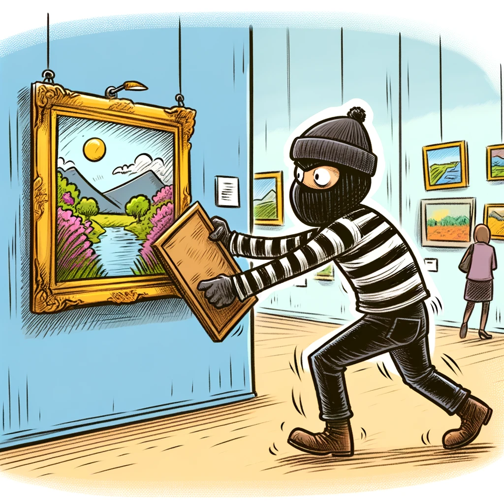
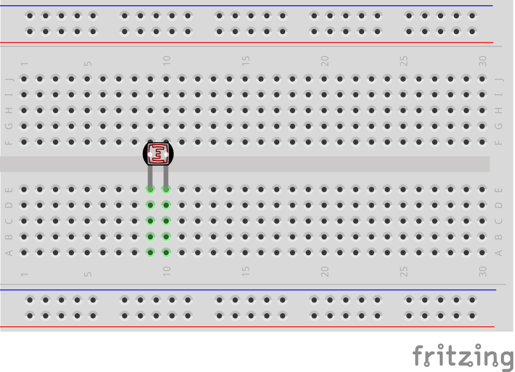
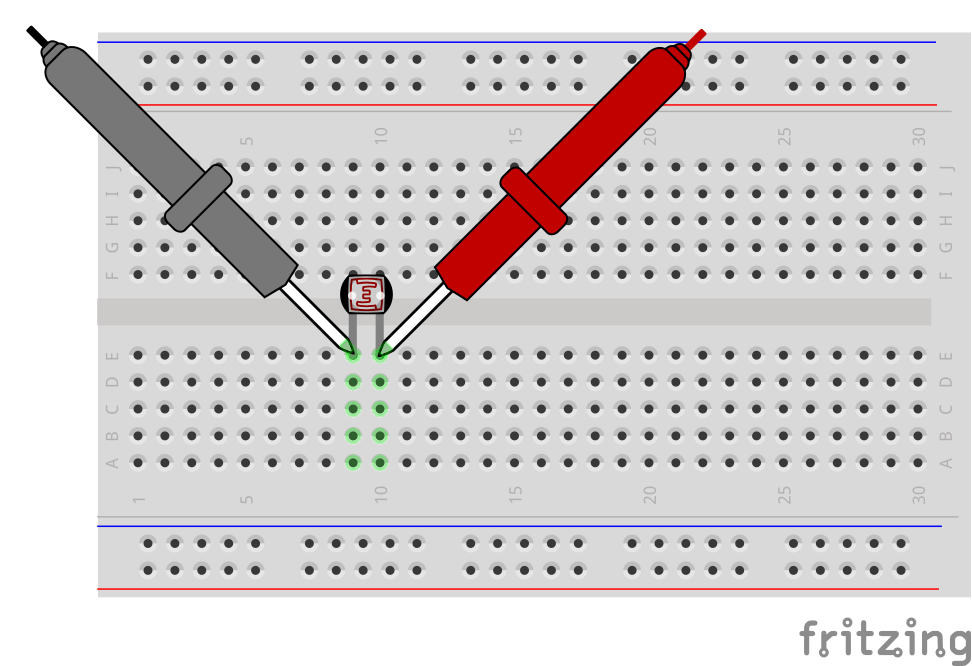
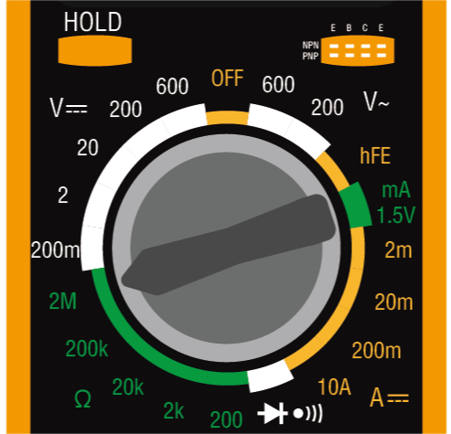
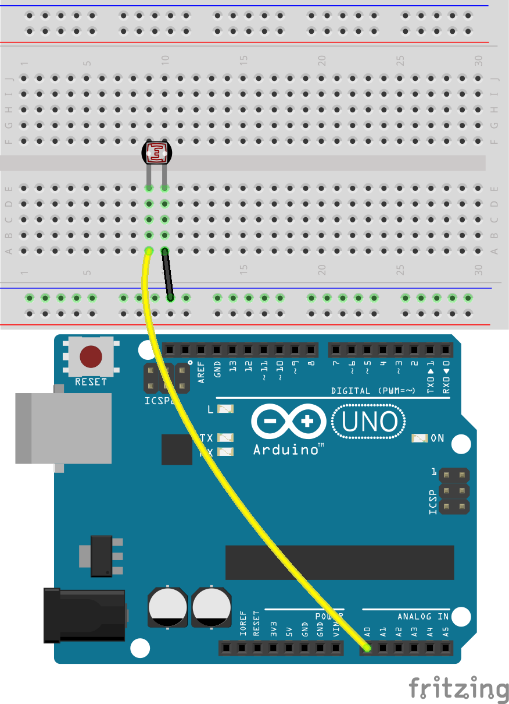
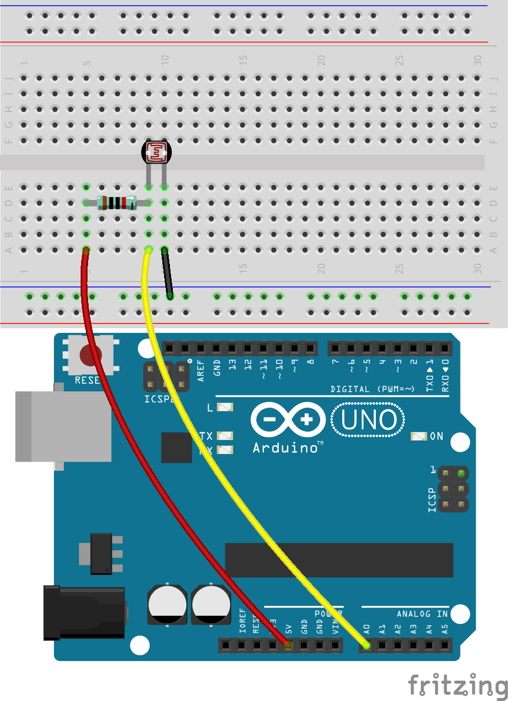
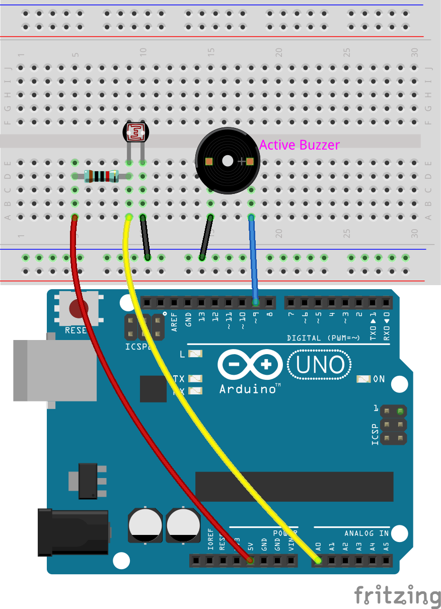

.. note::

    Bonjour, bienvenue dans la communauté des passionnés de Raspberry Pi, Arduino et ESP32 de SunFounder sur Facebook ! Plongez plus profondément dans le monde du Raspberry Pi, Arduino et ESP32 avec d'autres passionnés.

    **Pourquoi nous rejoindre ?**

    - **Support d'experts** : Résolvez vos problèmes après-vente et relevez vos défis techniques avec l'aide de notre communauté et de notre équipe.
    - **Apprenez et partagez** : Échangez des astuces et tutoriels pour améliorer vos compétences.
    - **Aperçus exclusifs** : Accédez en avant-première aux nouvelles annonces de produits et bénéficiez d'aperçus exclusifs.
    - **Réductions spéciales** : Profitez de réductions exclusives sur nos nouveaux produits.
    - **Promotions et concours festifs** : Participez à des concours et des promotions spéciales pendant les fêtes.

    👉 Prêt à explorer et créer avec nous ? Cliquez sur [|link_sf_facebook|] et rejoignez-nous dès aujourd'hui !

18. Alarme lumineuse
========================

Imaginez une scène digne d'un film :
Dans un musée faiblement éclairé, un voleur rusé s'approche discrètement d'un tableau inestimable.
Il avance furtivement, essayant de réaliser son vol sous le couvert de la nuit.
Cependant, dès qu'il touche la peinture, une série de capteurs sophistiqués se déclenche,
déclenchant des alarmes dans toute la galerie, illuminant instantanément les environs.
Le voleur est rapidement appréhendé par les agents de sécurité sur place, empêchant ainsi un vol d'œuvre d'art.
Ce n'est pas un film ; c'est un exemple réel de la technologie des capteurs utilisée dans les systèmes de sécurité modernes.

Comment cela est-il réalisé ? Cela implique de placer une photo-résistance ou un capteur de lumière plus sophistiqué près du cadre du tableau. Toute tentative de déplacer ou de masquer la peinture modifie les conditions lumineuses, déclenchant ainsi le système d'alarme.

Construisons maintenant un système d'alarme lumineuse simulé en utilisant une photo-résistance et un buzzer, d'accord ?

.. raw:: html

    <video controls style = "max-width:90%">
        <source src="../_static/video/18_light_alarm.mp4" type="video/mp4">
        Your browser does not support the video tag.
    </video>

Dans cette leçon, vous apprendrez :

* Les principes de fonctionnement et les caractéristiques d'une photo-résistance.
* Comment construire un simple système d'alarme lumineuse.

Construction du circuit
---------------------------

**Composants nécessaires**

.. list-table:: 
   :widths: 25 25 25 25
   :header-rows: 0

   * - 1 * Arduino Uno R3
     - 1 * Photo-résistance
     - 1 * Résistance 10KΩ
     - 1 * Buzzer actif
   * - |list_uno_r3| 
     - |list_photoresistor| 
     - |list_10kohm| 
     - |list_active_buzzer| 
   * - 1 * Câble USB
     - 1 * Plaque d'essai
     - Fils de connexion
     - 1 * Multimètre
   * - |list_usb_cable| 
     - |list_breadboard| 
     - |list_wire| 
     - |list_meter|

**Étapes de construction**

1. Commencez avec une photo-résistance.

.. image:: img/17_photoresistor.png
    :width: 100
    :align: center

Une photo-résistance ou cellule photoélectrique est une résistance variable contrôlée par la lumière. La résistance d'une photo-résistance diminue à mesure que l'intensité de la lumière incidente augmente ; en d'autres termes, elle présente une photoconductivité.

Les photo-résistances peuvent être utilisées comme des semi-conducteurs résistifs dans des circuits de détection sensibles à la lumière et dans des circuits de commutation activés par la lumière ou l'obscurité. Dans l'obscurité, la résistance d'une photo-résistance peut atteindre plusieurs mégaohms (MΩ), tandis qu'en conditions lumineuses, elle peut descendre à quelques centaines d'ohms.

Le kit comprend une résistance de 10K à 25°C. Utilisez maintenant un multimètre pour mesurer la résistance de la photo-résistance dans des conditions de lumière normale, éclairée et d'obscurité.

2. Comme la résistance nominale de la photo-résistance est de 10K, réglez le multimètre pour mesurer la résistance dans la plage des 20 kilo-ohms (20K).

.. image:: img/multimeter_20k.png
    :width: 300
    :align: center

3. Insérez la photo-résistance dans la plaque d'essai aux positions 10E et 11E. Les broches ne sont pas directionnelles et peuvent être insérées librement.

4. Touchez maintenant les deux broches de la photo-résistance avec les sondes rouge et noire du multimètre.

5. Lisez la valeur de résistance sous la lumière ambiante actuelle et enregistrez-la dans le tableau ci-dessous.

.. list-table::
   :widths: 20 20
   :header-rows: 1

   * - Environnement
     - Résistance (kilohms)
   * - Lumière normale
     - *5.48*
   * - Lumière intense
     - 
   * - Obscurité
     - 

6. Demandez maintenant à un ami d'éclairer directement la photo-résistance avec une lampe de poche ou une autre source lumineuse, enregistrez la valeur de résistance, qui pourrait être de quelques centaines d'ohms. Vous devrez donc peut-être régler le multimètre sur 2K, voire sur 200 ohms pour une lecture plus précise.

.. note::

    Nous avons défini l'unité de résistance dans le tableau en kilohms. 1 kilohm (kΩ) = 1000 ohms.

    Si vous avez choisi la plage de 200 ohms et obtenu une lecture de 164,5 ohms, convertissez-la en 0,16 kilohms (arrondi recommandé à deux décimales), puis entrez la valeur convertie dans le tableau.

.. list-table::
   :widths: 20 20
   :header-rows: 1

   * - Environnement
     - Résistance (kilohms)
   * - Lumière normale
     - *≈5.48*
   * - Lumière intense
     - *≈0.16*
   * - Obscurité
     - 

7. Pour les conditions d'obscurité, la résistance de la photo-résistance peut atteindre plusieurs mégaohms, nous devons donc régler le multimètre sur la position 2 mégaohms.

8. Recouvrez complètement la photo-résistance avec un objet noir, puis enregistrez la résistance mesurée dans le tableau.

.. note::
    Nous avons défini l'unité de résistance dans le tableau en kilohms. 1 mégaohm (MΩ) = 1000 kilohms.

    Si vous avez choisi la plage de 2 mégaohms et obtenu une lecture de 1,954 mégaohms, convertissez-la en 1954 kilohms, qui est la valeur à inscrire.

    Si la lecture dépasse directement 2MΩ, l'affichage indiquera "1.", auquel cas vous pouvez inscrire directement 2 mégaohms, ou envisager d'utiliser un multimètre plus précis pour obtenir une valeur exacte.

.. list-table::
   :widths: 20 20
   :header-rows: 1

   * - Environnement
     - Résistance (kilohms)
   * - Lumière normale
     - *≈5.48*
   * - Lumière intense
     - *≈0.16*
   * - Obscurité
     - *≈1954*

D'après les mesures, nous avons confirmé les propriétés photoconductrices de la photo-résistance : plus la lumière est forte, plus la résistance est faible ; plus la lumière est faible, plus la résistance est élevée, pouvant atteindre plusieurs mégaohms.

9. Continuez à construire le circuit. Connectez une broche de la photo-résistance à la borne négative de la plaque d'essai et l'autre broche au pin A0 de l'Arduino Uno R3.

10. Insérez une résistance de 10K dans la même rangée que la connexion de la photo-résistance à A0.

Dans ce circuit, la résistance de 10K et la photo-résistance sont connectées en série, et le courant qui les traverse est le même. La résistance de 10K agit comme protection, et le pin A0 lit la valeur après la conversion de la tension de la photo-résistance.

Lorsque la lumière augmente, la résistance de la photo-résistance diminue, donc sa tension diminue, et la valeur du pin A0 diminue ; si la lumière est suffisamment forte, la résistance de la photo-résistance sera proche de 0, et la valeur du pin A0 sera proche de 0. À ce moment-là, la résistance de 10K joue un rôle de protection, empêchant un court-circuit en évitant que les 5V et la masse ne soient directement connectés.

Si vous placez la photo-résistance dans l'obscurité, la valeur du pin A0 augmentera. Dans une obscurité totale, la résistance de la photo-résistance sera infinie, et sa tension sera proche de 5V (la résistance de 10K devient négligeable), et la valeur du pin A0 sera proche de 1023.

11. Connectez l'autre broche de la résistance de 10K au pin 5V de l'Arduino Uno R3.

12. Ensuite, comme dans la leçon précédente, insérez le buzzer actif dans la plaque d'essai, en connectant son anode au pin 9 du R3 et sa cathode à la borne négative de la plaque d'essai.

13. Enfin, connectez la borne négative de la plaque d'essai au pin GND de l'Arduino Uno R3 à l'aide d'un câble de connexion.

Création du code
---------------------
1. Ouvrez l'IDE Arduino et démarrez un nouveau projet en sélectionnant "New Sketch" dans le menu "Fichier".
2. Enregistrez votre sketch sous le nom ``Lesson18_Light_Alarm`` en utilisant ``Ctrl + S`` ou en cliquant sur "Enregistrer".

3. Avant le ``void setup()``, créez des constantes pour la photo-résistance et le buzzer, ainsi qu'une valeur de seuil qui déclenchera l'alarme lorsque la lecture de la photo-résistance passera en dessous de ce seuil.

.. code-block:: Arduino
    :emphasize-lines: 1,2,3

    const int sensorPin = A0;   // Attribue le pin A0 à la constante pour la photo-résistance
    const int buzzerPin = 9;    // Attribue le pin 9 à la constante pour le buzzer
    const int threshold = 300;  // Définit la valeur seuil

    void setup() {
        // Mettez votre code d'initialisation ici, qui sera exécuté une fois :
    }

4. Créez également une variable pour stocker la valeur lue depuis la photo-résistance.

.. code-block:: Arduino
    :emphasize-lines: 5

    const int sensorPin = A0;   // Attribue le pin A0 à la constante pour la photo-résistance
    const int buzzerPin = 9;    // Attribue le pin 9 à la constante pour le buzzer
    const int threshold = 300;  // Définit la valeur seuil

    int sensorValue = 0;  // Pour stocker la lecture de la photo-résistance

    void setup() {
        // Mettez votre code d'initialisation ici, qui sera exécuté une fois :
    }

5. Dans le ``void setup()``, configurez le buzzer comme une sortie et démarrez la communication série pour surveiller les lectures de la photo-résistance.

.. code-block:: Arduino
    :emphasize-lines: 3,4

    void setup() {
        // Mettez ici votre code d'initialisation, à exécuter une seule fois :
        pinMode(buzzerPin, OUTPUT);  // Configurez la broche du buzzer comme une sortie
        Serial.begin(9600);          // Initialisez la communication série à 9600 bauds
    }

6. Dans le ``void loop()``, utilisez la fonction ``analogRead()`` pour lire les données de la photo-résistance et stockez la valeur dans la variable ``sensorValue``. Ensuite, imprimez cette valeur sur le moniteur série. N'oubliez pas de définir un intervalle de temps entre chaque lecture.

.. code-block:: Arduino
    :emphasize-lines: 3,4,5

    void loop() {
        // Mettez ici votre code principal, à exécuter en boucle :
        sensorValue = analogRead(sensorPin);  // Lisez la valeur analogique de la photo-résistance
        Serial.println(sensorValue);          // Imprimez la lecture de la photo-résistance sur le moniteur série
        delay(100); // Attendez 0,1 seconde
    }

7. Lorsque l'environnement passe de l'obscurité à la lumière, la résistance de la photo-résistance diminue, tout comme la lecture au pin A0. Utilisez maintenant une instruction ``if`` pour vérifier si la valeur de la photo-résistance est inférieure au ``seuil`` ; si c'est le cas, activez le buzzer, sinon, désactivez-le.

.. code-block:: Arduino
    :emphasize-lines: 7-12

    void loop() {
        // Mettez ici votre code principal, à exécuter en boucle :
        sensorValue = analogRead(sensorPin);  // Lisez la valeur analogique de la photo-résistance
        Serial.println(sensorValue);          // Imprimez la lecture de la photo-résistance sur le moniteur série
        delay(100);                           // Attendez 0,1 seconde

        // Vérifiez si la lecture est inférieure au seuil
        if (sensorValue < threshold) {
            digitalWrite(buzzerPin, HIGH);  // Si inférieure au seuil, activez le buzzer
        } else {
            digitalWrite(buzzerPin, LOW);  // Si non inférieure au seuil, désactivez le buzzer
        }
    }

8. Voici votre code complet. Vous pouvez maintenant cliquer sur "Téléverser" pour envoyer le code vers l'Arduino Uno R3.

.. code-block:: Arduino

    const int sensorPin = A0;   // Attribue la broche A0 à la constante pour la photo-résistance
    const int buzzerPin = 9;    // Attribue la broche 9 à la constante pour le buzzer
    const int threshold = 300;  // Définit la valeur seuil

    int sensorValue = 0;  // Pour stocker la lecture de la photo-résistance

    void setup() {
        // Mettez ici votre code d'initialisation, à exécuter une seule fois :
        pinMode(buzzerPin, OUTPUT);  // Configurez la broche du buzzer comme une sortie
        Serial.begin(9600);          // Initialisez la communication série à 9600 bauds
    }

    void loop() {
        // Mettez ici votre code principal, à exécuter en boucle :
        sensorValue = analogRead(sensorPin);  // Lisez la valeur analogique de la photo-résistance
        Serial.println(sensorValue);          // Imprimez la lecture de la photo-résistance sur le moniteur série
        delay(100);                           // Attendez 0,1 seconde

        // Vérifiez si la lecture est inférieure au seuil
        if (sensorValue < threshold) {
            digitalWrite(buzzerPin, HIGH);  // Si inférieure au seuil, activez le buzzer
        } else {
            digitalWrite(buzzerPin, LOW);  // Si non inférieure au seuil, désactivez le buzzer
        }
    }

9. Enfin, n'oubliez pas d'enregistrer votre code et de ranger votre espace de travail.

**Question**

Les voleurs astucieux pourraient choisir de voler la nuit, et si un tableau disparaît, 
la photo-résistance pourrait ne pas détecter de changement de lumière, échouant ainsi à déclencher l'alarme. Que peut-on faire pour améliorer cette faille ?
