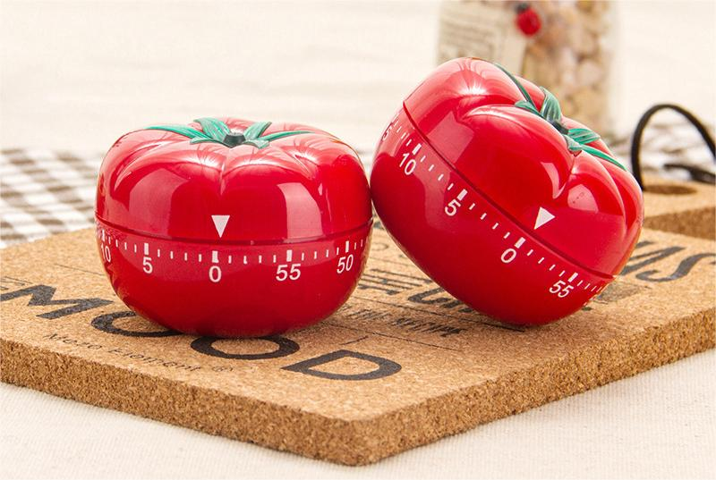
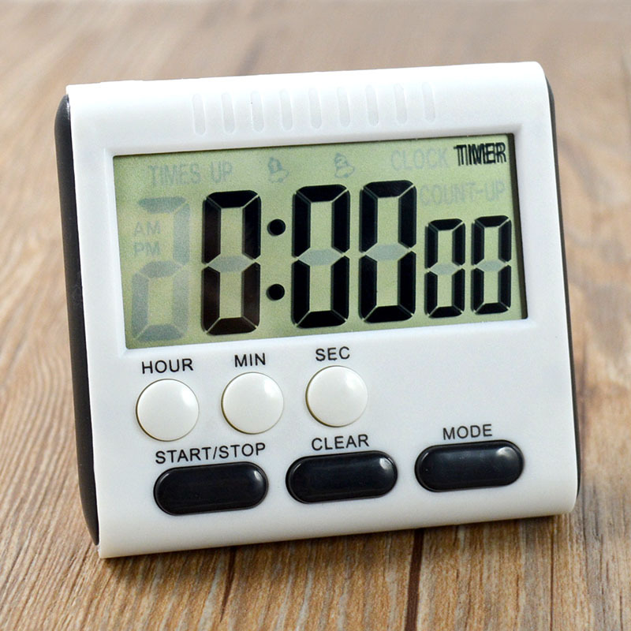
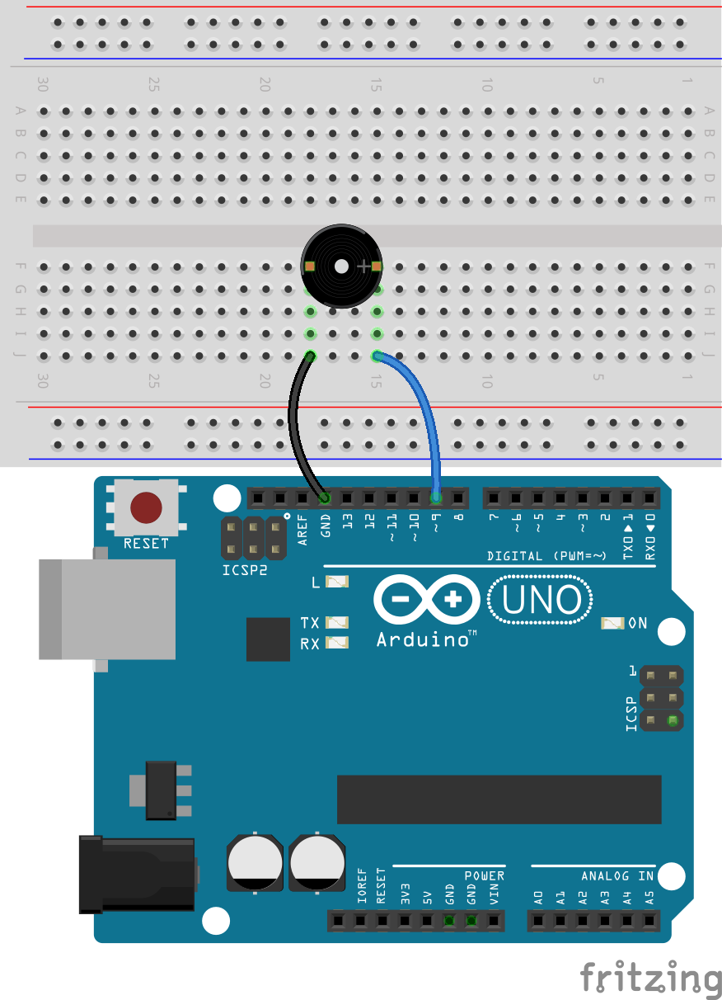

.. note::

    Hallo, willkommen in der SunFounder Raspberry Pi & Arduino & ESP32 Enthusiasten-Community auf Facebook! Tauche tiefer in Raspberry Pi, Arduino und ESP32 ein, gemeinsam mit anderen Enthusiasten.

    **Warum beitreten?**

    - **Expertenunterstützung**: Löse Probleme nach dem Kauf und technische Herausforderungen mit Hilfe unserer Community und unseres Teams.
    - **Lernen & Teilen**: Tausche Tipps und Tutorials aus, um deine Fähigkeiten zu verbessern.
    - **Exklusive Vorschauen**: Erhalte frühzeitigen Zugang zu neuen Produktankündigungen und Sneak Peeks.
    - **Sonderrabatte**: Genieße exklusive Rabatte auf unsere neuesten Produkte.
    - **Festliche Aktionen und Verlosungen**: Nimm an Verlosungen und Sonderaktionen zu Feiertagen teil.

    👉 Bereit, mit uns zu erkunden und zu erschaffen? Klicke auf [|link_sf_facebook|] und tritt noch heute bei!

20. Der Pomodoro-Timer
===========================================

In dieser Lektion werden wir den Schnittpunkt von Zeitmanagement und Technologie erkunden, indem wir einen Pomodoro-Timer mit einem Arduino und einem aktiven Summer erstellen. Du wirst lernen, wie du die internen Timing-Fähigkeiten des Arduino nutzt, um einen Timer zu bauen, der Arbeit in 25-minütige fokussierte Intervalle mit anschließenden 5-minütigen Pausen unterteilt. Diese Methode, bekannt als Pomodoro-Technik, steigert Produktivität und Konzentration. Im Laufe des Kurses wirst du ein solides Fundament in elektronischer Zeitmessung erlangen und praktische Erfahrungen in Programmierung und Schaltungsaufbau sammeln, die in der Erstellung eines funktionsfähigen Pomodoro-Timers gipfeln. Schließe dich uns an, um deine Zeit zu meistern und die Effizienz in deinen täglichen Aktivitäten zu steigern!

.. raw:: html

     <video controls style = "max-width:90%">
        <source src="../_static/video/20_beep_timer.mp4" type="video/mp4">
        Your browser does not support the video tag.
    </video>

Am Ende dieser Lektion wirst du in der Lage sein:

* Die historische Bedeutung von Klang in der Zeitmessung zu verstehen.
* Die Komponenten zu identifizieren, die benötigt werden, um eine elektronische Timer-Schaltung zu bauen.
* Ein Arduino zu programmieren, um einen Summer für das Zeitmanagement mit den Funktionen ``delay()`` und ``millis()`` zu steuern.
* Die Pomodoro-Technik praktisch anzuwenden, indem du einen Timer erstellst, der zwischen Arbeits- und Pausenzeiten wechselt.

Uhren und Klang
--------------------

In der Antike wurden groß angelegte Glockenschläge verwendet, um den Zeitablauf und bestimmte gesellschaftliche Ereignisse zu markieren.
Zum Beispiel nutzten mittelalterliche europäische Städte Kirchenglockenschläge, um Gebetszeiten und den Beginn sowie das Ende der Arbeitstage zu kennzeichnen.
Diese Glockenschläge waren mehr als nur Zeitmarkierungen; sie dienten als Werkzeuge der sozialen Ordnung, um die sich das tägliche Leben der Gemeinschaft drehte.

**Mechanische Uhren und Klang**

Mit der Entwicklung mechanischer Uhren, insbesondere mit dem Design des Big Ben, begannen Uhren, komplexere Glocken und Zeitmechanismen zu integrieren.
Der Klang des Big Ben wird von seinen großen Bronzeglocken getragen, was sowohl die Reichweite der Schallausbreitung als auch die Präzision der Zeitansagen verbessert.
In vielen Städten wurde der Klang des Big Ben für die Bewohner zum Referenzpunkt, um ihre täglichen Aktivitäten anzupassen, und spielte eine entscheidende Rolle bei der genaueren Zeitplanung für die Navigation, Fahrpläne der Eisenbahnen und mehr.

**Klang und Zeitmessung im Elektronischen Zeitalter**

Mit dem Eintritt in das elektronische Zeitalter entwickelten sich Klang-Timer neu. 
Die Einführung elektronischer Summer, insbesondere mit der Hilfe von Mikrocontrollern 
wie dem Arduino, machte die Zeitmarkierung unabhängig von großen mechanischen Geräten. 
Diese kleinen Geräte können Töne in verschiedenen Frequenzen und Tonhöhen erzeugen, die 
für verschiedene Zeitmessungsanwendungen verwendet werden können, von einfachen Küchentimern 
bis hin zu komplexen industriellen Prozesssteuerungssystemen. Beispiele hierfür sind die 
Rufsysteme in modernen Krankenhäusern, Schulglocken und Erinnerungen in persönlichen 
elektronischen Geräten, die alle elektronische Summer zur Zeitverwaltung nutzen.

Schaltungsaufbau
-----------------------

**Benötigte Komponenten**

.. list-table:: 
   :widths: 25 25 25 25
   :header-rows: 0

   * - 1 * Arduino Uno R3
     - 1 * Breadboard
     - 1 * Aktiver Summer
     - Jumper-Kabel
   * - |list_uno_r3| 
     - |list_breadboard| 
     - |list_active_buzzer| 
     - |list_wire| 
   * - 1 * USB-Kabel
     -
     - 
     - 
   * - |list_usb_cable| 
     -
     - 
     - 

**Schritt-für-Schritt-Aufbau**

Diese Lektion verwendet denselben Schaltkreis wie Lektion 17.

Codeerstellung - Tick Tick
----------------------------

Im Arduino ist ``delay()`` die einfachste und am häufigsten verwendete Timing-Funktion.
Wir verwenden sie oft, um das Programm für kurze Zeit anzuhalten, was in Kombination mit Schleifen einen Blinkeffekt bei LEDs erzeugen kann. Hier verwenden wir die ``delay()``-Funktion, um den Summer jede Sekunde einmal ertönen zu lassen.

1. Öffne die Arduino-IDE und starte ein neues Projekt, indem du „New Sketch“ aus dem Menü „File“ auswählst.
2. Speichere deinen Sketch als ``Lesson20_Timer_Tick_Tick`` mit ``Ctrl + S`` oder durch Klicken auf „Speichern“.

3. Schreibe den folgenden Code:

.. code-block:: Arduino

  const int buzzerPin = 9;   // Weist Pin 9 der Konstanten für den Summer zu  
  
  void setup() {
    // setze deinen Setup-Code hier, um ihn einmal auszuführen:
    pinMode(buzzerPin, OUTPUT);  // Setze Pin 9 als Ausgang
  } 

  void loop() {
    // setze deinen Hauptcode hier, um ihn wiederholt auszuführen:
    digitalWrite(buzzerPin, HIGH);  // Summer einschalten
    delay(100);                     // Beep-Dauer: 100 Millisekunden
    digitalWrite(buzzerPin, LOW);   // Summer ausschalten
    delay(1000);                    // Intervall zwischen den Signalen: 1000 Millisekunden
  }

In diesem Setup pausiert die erste ``delay()``-Funktion den Arduino Uno R3 für 100 Millisekunden, während der Summer weiterhin ertönt. Die zweite ``delay()``-Funktion pausiert den Arduino für 1000 Millisekunden (1 Sekunde), während der Summer stumm ist.

4. Nachdem du den Code auf den Arduino Uno R3 hochgeladen hast, wirst du hören, dass der Summer jede Sekunde einmal piept.

Coding Creation - ``millis()``
------------------------------

Die Verwendung von ``delay()`` pausiert deinen Code, was manchmal unpraktisch sein kann.

Stell dir zum Beispiel vor, du erwärmst eine Pizza in der Mikrowelle und wartest gleichzeitig auf wichtige E-Mails.
Du legst die Pizza in die Mikrowelle und stellst die Zeit auf 10 Minuten ein. Die Analogie zur Nutzung von ``delay()`` wäre, vor der Mikrowelle zu sitzen und den Timer dabei zu beobachten, wie er von 10 Minuten auf null herunterzählt. Solltest du in dieser Zeit eine wichtige E-Mail erhalten, würdest du sie verpassen.

Was du normalerweise tust, ist, die Pizza in die Mikrowelle zu legen, dann deine E-Mails zu prüfen und vielleicht noch etwas anderes zu erledigen, während du hin und wieder kontrollierst, ob der Timer auf null steht und deine Pizza fertig ist.

Arduino bietet auch ein Timing-Tool, das das Programm nicht pausiert: ``millis()``.

``millis()`` ist eine sehr wichtige Funktion in der Arduino-Programmierung. Sie gibt die Anzahl der Millisekunden zurück, die seit dem Einschalten oder dem letzten Zurücksetzen des Arduino-Boards vergangen sind.

  * ``time = millis()``: Gibt die Anzahl der Millisekunden zurück, die seit dem Start des aktuellen Programms auf dem Arduino vergangen sind. Dieser Wert wird nach etwa 50 Tagen überlaufen (zurück auf null).

  **Parameter**
    Keine

  **Rückgabewert**
    Anzahl der Millisekunden seit Programmstart. Datentyp: unsigned long.

Hier lassen wir den Summer ebenfalls einmal pro Sekunde ertönen.

1. Öffne die Arduino-IDE und starte ein neues Projekt, indem du „New Sketch“ aus dem Menü „File“ auswählst.
2. Speichere deinen Sketch als ``Lesson20_Timer_Millis`` mit ``Ctrl + S`` oder durch Klicken auf „Speichern“.

3. Zuerst erstellst du eine Konstante namens ``buzzerPin`` und setzt sie auf Pin 9.

.. code-block:: Arduino
  :emphasize-lines: 1

  const int buzzerPin = 9;   // Weist Pin 9 der Konstanten für den Summer zu

  void setup() {
    // setze deinen Setup-Code hier, um ihn einmal auszuführen:
  }

4. Erstelle zwei Variablen vom Typ long: ``previousMillis`` speichert den Zeitpunkt, an dem der Summer zuletzt ertönte, und ``interval`` legt fest, wie oft der Summer ertönt, in Millisekunden. Hier ist es auf jede Sekunde (1000 Millisekunden) eingestellt.

.. code-block:: Arduino
  :emphasize-lines: 3,4

  const int buzzerPin = 9;  // Weist Pin 9 der Konstanten für den Summer zu

  unsigned long previousMillis = 0;  // Speichert den Zeitpunkt des letzten Summertons
  long interval = 1000;              // Intervall für den Summerton (Millisekunden)

5. In der Funktion ``void setup()`` setzt du den Pin des Summers auf den Ausgangsmodus.

.. code-block:: Arduino
  :emphasize-lines: 8

  const int buzzerPin = 9;  // Weist Pin 9 der Konstanten für den Summer zu

  unsigned long previousMillis = 0;  // Speichert den Zeitpunkt des letzten Summertons
  long interval = 1000;              // Intervall für den Summerton (Millisekunden)

  void setup() {
    // setze deinen Setup-Code hier, um ihn einmal auszuführen:
    pinMode(buzzerPin, OUTPUT);  // Setze Pin 9 als Ausgang
  }

6. In der Funktion ``void loop()`` erstellst du eine Variable vom Typ ``unsigned long`` namens ``currentMillis``, um die aktuelle Zeit zu speichern.

.. code-block:: Arduino
  :emphasize-lines: 3

  void loop() {
    // setze deinen Hauptcode hier, um ihn wiederholt auszuführen:
    unsigned long currentMillis = millis();
  }

7. Wenn die aktuelle Laufzeit minus der letzten Aktualisierungszeit 1000ms überschreitet, wird eine Funktion ausgelöst. Aktualisiere zudem ``previousMillis`` auf die aktuelle Zeit, damit die nächste Auslösung in einer Sekunde erfolgt.

.. code-block:: Arduino
  :emphasize-lines: 5,6

  void loop() {
    // setze deinen Hauptcode hier, um ihn wiederholt auszuführen:
    unsigned long currentMillis = millis();

    if (currentMillis - previousMillis >= interval) {
      previousMillis = currentMillis;  // Speichere die Zeit des letzten Summertons
    }
  }

8. Füge die Hauptfunktionen hinzu, die periodisch ausgeführt werden sollen. In diesem Fall lässt du den Summer ertönen.

.. code-block:: Arduino
  :emphasize-lines: 7,8,9

  void loop() {
    // setze deinen Hauptcode hier, um ihn wiederholt auszuführen:
    unsigned long currentMillis = millis();

    if (currentMillis - previousMillis >= interval) {
      previousMillis = currentMillis;  // Speichere die Zeit des letzten Summertons
      digitalWrite(buzzerPin, HIGH);   // Summer einschalten
      delay(100);
      digitalWrite(buzzerPin, LOW);    // Summer ausschalten
    }
  }

9. Dein kompletter Code sollte nun wie folgt aussehen. Lade ihn auf den Arduino Uno R3 hoch, und der Summer wird jede Sekunde einmal ertönen.

.. code-block:: Arduino

  const int buzzerPin = 9;  // Weist Pin 9 der Konstanten für den Summer zu

  unsigned long previousMillis = 0;  // Speichert den Zeitpunkt des letzten Summertons
  long interval = 1000;              // Intervall für den Summerton (Millisekunden)

  void setup() {
    // setze deinen Setup-Code hier, um ihn einmal auszuführen:
    pinMode(buzzerPin, OUTPUT);  // Setze Pin 9 als Ausgang
  }

  void loop() {
    // setze deinen Hauptcode hier, um ihn wiederholt auszuführen:
    unsigned long currentMillis = millis();

    if (currentMillis - previousMillis >= interval) {
      previousMillis = currentMillis;  // Speichere die Zeit des letzten Summertons
      digitalWrite(buzzerPin, HIGH);   // Summer einschalten
      delay(100);
      digitalWrite(buzzerPin, LOW);    // Summer ausschalten
    }
  }

**Frage**

Was passiert, wenn ``delay(100);`` auf ``delay(1000);`` geändert wird? Warum?

Coding Creation - Pomodoro-Timer
-----------------------------------

Die Pomodoro-Technik, auch bekannt als Tomaten-Technik, ist eine Methode des Zeitmanagements, die von Francesco Cirillo Ende der 1980er Jahre entwickelt wurde.
Diese Methode nutzt einen Timer, um die Arbeit in 25-minütige Intervalle zu unterteilen, gefolgt von kurzen Pausen.
Jedes Arbeitsintervall wird „Pomodoro“ genannt, nach dem tomatenförmigen Küchentimer, den Cirillo während seiner Studienzeit verwendete.

Die grundlegenden Schritte der Pomodoro-Technik sind:

1. **Aufgabe festlegen**: Bestimme die Aufgabe, die du vor Beginn erledigen möchtest.
2. **Pomodoro-Timer einstellen**: Stelle den Timer auf 25 Minuten Arbeitszeit.
3. **Intensiv arbeiten**: Konzentriere dich vollständig auf die Aufgabe während dieser 25 Minuten und vermeide jegliche Ablenkungen.
4. **Kurze Pause machen**: Sobald die Arbeitszeit vorbei ist, mache eine 5-minütige Pause. In dieser Zeit kannst du herumlaufen, dich strecken, Wasser trinken usw., aber vermeide es, arbeitsbezogene Tätigkeiten auszuführen.

Die Vorteile der Pomodoro-Technik umfassen gesteigerte Konzentration, reduzierte Ermüdung, klare Abgrenzung von Arbeits- und Pausenzeiten, die helfen, Ablenkungen zu vermeiden, sowie erhöhte Motivation und Zufriedenheit durch das Erledigen von Aufgaben. Darüber hinaus erfordert die Pomodoro-Technik keine komplexen Werkzeuge oder Technologien – ein einfacher Timer reicht aus.

Als Nächstes programmieren wir einen Timer, der alle 25 Minuten einen Summer ertönen lässt, um das Ende einer Arbeitsphase anzuzeigen, gefolgt von einer Erinnerung an eine 5-minütige Pause:

1. Öffne die Arduino IDE und starte ein neues Projekt, indem du „New Sketch“ aus dem Menü „File“ auswählst.
2. Speichere deinen Sketch als ``Lesson20_Timer_Millis_Pomodoro`` mit ``Ctrl + S`` oder durch Klicken auf „Speichern“.

3. Definiere einige Konstanten und Variablen vor ``void setup()``.

* ``buzzerPin`` identifiziert, an welchem Pin der Summer angeschlossen ist.
* ``startMillis`` verfolgt, wann der Timer gestartet wurde.
* ``workPeriod`` und ``breakPeriod`` legen fest, wie lange jede Phase dauert.
* ``isWorkPeriod`` ist eine boolesche Variable, die festlegt, ob es Zeit für Arbeit oder eine Pause ist.

.. code-block:: Arduino

  const int buzzerPin = 9;          // Weist Pin 9 der Konstanten für den Summer zu
  unsigned long startMillis;        // Speichert die Zeit, zu der der Timer startet
  const long workPeriod = 1500000;  // Arbeitsphase von 25 Minuten
  const long breakPeriod = 300000;  // Pausenphase von 5 Minuten
  static bool isWorkPeriod = true;  // Verfolgt, ob es eine Arbeits- oder Pausenphase ist

4. Initialisiere den Pin des Summers als Ausgang und starte den Timer, indem du die Startzeit mit ``millis()`` speicherst.

.. code-block:: Arduino
  :emphasize-lines: 2,3

  void setup() {
    pinMode(buzzerPin, OUTPUT); // Initialisiere den Pin des Summers als Ausgang
    startMillis = millis(); // Speichere die Startzeit
  }

5. Erstelle in der Funktion ``void loop()`` eine Variable vom Typ ``unsigned long`` namens ``currentMillis``, um die aktuelle Zeit zu speichern.

.. code-block:: Arduino
  :emphasize-lines: 2

  void loop() {
    unsigned long currentMillis = millis(); // Aktualisiere die aktuelle Zeit
  }

6. Verwende ``if else if``-Bedingungen, um festzustellen, ob es sich um eine Arbeitsphase handelt.

.. code-block:: Arduino
  :emphasize-lines: 4-6

  void loop() {
    unsigned long currentMillis = millis(); // Aktualisiere die aktuelle Zeit

    if (isWorkPeriod){ 
    } else if (!isWorkPeriod){
    }
  }

7. Falls es eine Arbeitsphase ist, prüfe, ob die aktuelle Zeit die ``workPeriod`` überschritten hat. Wenn ja, setze den Timer zurück, wechsle zur Pausenphase und lass den Summer zweimal für eine längere Dauer ertönen.

.. code-block:: Arduino
  :emphasize-lines: 5-16

  void loop() {
    unsigned long currentMillis = millis();  // Aktualisiere die aktuelle Zeit

    if (isWorkPeriod) {
      if (currentMillis - startMillis >= workPeriod) {
        startMillis = currentMillis;  // Setze den Timer zurück
        isWorkPeriod = false;         // Wechsle zur Pausenphase
        digitalWrite(buzzerPin, HIGH);  // Summer einschalten
        delay(500);                     // Summer für 500 Millisekunden eingeschaltet
        digitalWrite(buzzerPin, LOW);   // Summer ausschalten
        delay(200);                     // Summer für 200 Millisekunden ausgeschaltet
        digitalWrite(buzzerPin, HIGH);  // Summer einschalten
        delay(500);                     // Summer für 500 Millisekunden eingeschaltet
        digitalWrite(buzzerPin, LOW);   // Summer ausschalten
        delay(200);                     // Summer für 200 Millisekunden ausgeschaltet
      }
    } else if (!isWorkPeriod) {
    }
  }

8. Verwende ``else if``-Bedingungen, um festzustellen, ob es sich um eine Pausenphase handelt, und prüfe ebenfalls, ob die aktuelle Zeit die ``breakPeriod`` überschritten hat. Wenn ja, setze den Timer zurück, wechsle zur Arbeitsphase und lass den Summer zweimal kurz ertönen.

.. code-block:: Arduino

  } else if (!isWorkPeriod) {
    if (currentMillis - startMillis >= breakPeriod) {
      startMillis = currentMillis;  // Timer zurücksetzen
      isWorkPeriod = true;          // Wechsel zur Arbeitsphase
      digitalWrite(buzzerPin, HIGH);  // Summer einschalten
      delay(200);                     // Summer für 200 Millisekunden eingeschaltet
      digitalWrite(buzzerPin, LOW);   // Summer ausschalten
      delay(200);                     // Summer für 200 Millisekunden ausgeschaltet
      digitalWrite(buzzerPin, HIGH);  // Summer einschalten
      delay(200);                     // Summer für 200 Millisekunden eingeschaltet
      digitalWrite(buzzerPin, LOW);   // Summer ausschalten
      delay(200);                     // Summer für 200 Millisekunden ausgeschaltet
    }
  }

9. Dein vollständiger Code sollte nun wie folgt aussehen. Du kannst ihn auf den Arduino Uno R3 hochladen, um die Wirkung zu sehen.

.. note::

  Wenn dir das Warten von 25 Minuten für eine Arbeitsphase und 5 Minuten für eine Pause während des Debuggings zu lang ist, 
  kannst du die ``workPeriod`` auf 15000 Millisekunden und die ``breakPeriod`` auf 3000 Millisekunden verkürzen. Du wirst dann den Summer zweimal lang alle 15 Sekunden hören, gefolgt von einem kurzen Doppelton nach 3 Sekunden.

.. code-block:: Arduino

  const int buzzerPin = 9;          // Weist Pin 9 der Konstanten für den Summer zu
  unsigned long startMillis;        // Speichert die Zeit, zu der der Timer startet
  const long workPeriod = 1500000;  // Arbeitsphase von 25 Minuten
  const long breakPeriod = 300000;  // Pausenphase von 5 Minuten
  static bool isWorkPeriod = true;  // Verfolgt, ob es eine Arbeits- oder Pausenphase ist

  void setup() {
    pinMode(buzzerPin, OUTPUT); // Summerpin als Ausgang initialisieren
    startMillis = millis(); // Startzeit speichern
  }

  void loop() {
    unsigned long currentMillis = millis(); // Aktualisiere die aktuelle Zeit

    if (isWorkPeriod){ 
      if(currentMillis - startMillis >= workPeriod) {
        startMillis = currentMillis; // Timer zurücksetzen
        isWorkPeriod = false; // Wechsel zur Pausenphase
        digitalWrite(buzzerPin, HIGH);  // Summer einschalten
        delay(500);                     // Summer für 500 Millisekunden eingeschaltet
        digitalWrite(buzzerPin, LOW);   // Summer ausschalten
        delay(200);                     // Summer für 200 Millisekunden ausgeschaltet
        digitalWrite(buzzerPin, HIGH);  // Summer einschalten
        delay(500);                     // Summer für 500 Millisekunden eingeschaltet
        digitalWrite(buzzerPin, LOW);   // Summer ausschalten
        delay(200);                     // Summer für 200 Millisekunden ausgeschaltet
      }
    } else if (!isWorkPeriod) 
      if(currentMillis - startMillis >= breakPeriod) {
        startMillis = currentMillis; // Timer zurücksetzen
        isWorkPeriod = true; // Wechsel zur Arbeitsphase
        digitalWrite(buzzerPin, HIGH);  // Summer einschalten
        delay(200);                     // Summer für 200 Millisekunden eingeschaltet
        digitalWrite(buzzerPin, LOW);   // Summer ausschalten
        delay(200);                     // Summer für 200 Millisekunden ausgeschaltet
        digitalWrite(buzzerPin, HIGH);  // Summer einschalten
        delay(200);                     // Summer für 200 Millisekunden eingeschaltet
        digitalWrite(buzzerPin, LOW);   // Summer ausschalten
        delay(200);                     // Summer für 200 Millisekunden ausgeschaltet
      }
    }
  }

10. Vergiss nicht, deinen Code zu speichern und deinen Arbeitsplatz aufzuräumen.

**Frage**

Denke über andere Bereiche in deinem Leben nach, in denen du die Zeit „hören“ kannst. Liste einige Beispiele auf und schreibe sie in dein Handbuch!

**Zusammenfassung**

In der heutigen Stunde haben wir erfolgreich eine elektronische Version des Pomodoro-Timers gebaut, ein wertvolles Werkzeug zur Steigerung der Produktivität durch strukturierte Arbeits- und Pausenphasen. Durch dieses Projekt haben die Schüler die Nützlichkeit von Summern im Zeitmanagement kennengelernt und die praktische Anwendung der ``millis()``-Funktion zur Erstellung eines nicht-blockierenden Timer-Codes im Arduino verstanden. Dieser Ansatz ermöglicht Multitasking in Mikrocontroller-Anwendungen und spiegelt komplexere Systeme in Technologie und Industrie wider.
