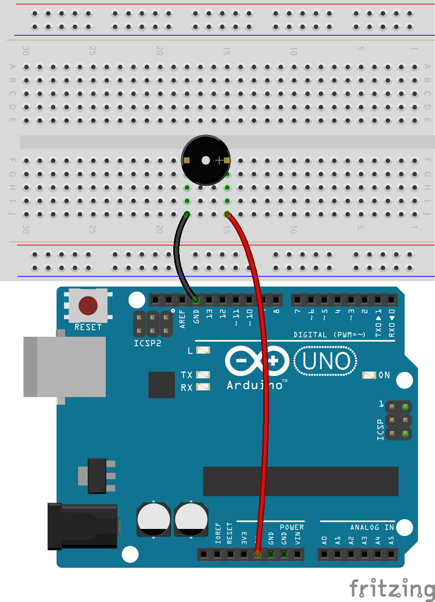

.. note::

    Bonjour et bienvenue dans la communauté des passionnés de Raspberry Pi, Arduino et ESP32 de SunFounder sur Facebook ! Plongez dans l'univers du Raspberry Pi, Arduino et ESP32 avec d'autres passionnés.

    **Pourquoi nous rejoindre ?**

    - **Support d'experts** : Résolvez les problèmes après-vente et relevez les défis techniques grâce à l'aide de notre communauté et de notre équipe.
    - **Apprenez & Partagez** : Échangez des astuces et des tutoriels pour améliorer vos compétences.
    - **Aperçus exclusifs** : Accédez en avant-première aux annonces de nouveaux produits et à des avant-premières exclusives.
    - **Réductions spéciales** : Profitez de réductions exclusives sur nos nouveaux produits.
    - **Promotions festives et concours** : Participez à des concours et à des promotions spéciales pendant les fêtes.

    👉 Prêt à explorer et créer avec nous ? Cliquez sur [|link_sf_facebook|] et rejoignez-nous dès aujourd'hui !

21. Son de Sirène
=========================

Dans ce projet Arduino, nous allons explorer comment créer un système de sirène en programmant et en intégrant du matériel électronique.

Les sons de sirène utilisent un motif spécifique de fréquences et de hauteurs, caractérisé par des montées et descentes rapides des hauteurs, ce qui les rend facilement reconnaissables et distincts des autres sons du quotidien.
Ces variations de hauteur peuvent provoquer un sentiment d'urgence, car elles sont souvent associées à des signaux d'avertissement ou à des situations dangereuses dans la nature.

En ajustant la fréquence d'un buzzer passif, nous pouvons simuler les montées et descentes caractéristiques d'une sirène.

.. raw:: html

    <video controls style = "max-width:90%">
        <source src="../_static/video/21_siren_sound.mp4" type="video/mp4">
        Your browser does not support the video tag.
    </video>

Dans cette leçon, vous apprendrez :

* Comment fonctionnent les buzzers passifs
* Comment piloter un buzzer passif en utilisant la fonction tone()
* Comment utiliser la boucle for en programmation
* Comment implémenter un son de sirène

Comprendre les propriétés du son
-----------------------------------

Le son est un phénomène ondulatoire qui se propage à travers des milieux comme l'air, l'eau ou les solides sous forme d'énergie vibratoire. Comprendre les propriétés physiques du son peut nous aider à mieux comprendre et contrôler son comportement dans différents environnements.
Voici plusieurs propriétés physiques clés du son :

**Fréquence**

La fréquence fait référence au nombre de cycles de vibration par unité de temps, généralement exprimée en Hertz (Hz).
La fréquence détermine la hauteur du son : des fréquences plus élevées produisent des sons plus aigus ; des fréquences plus basses produisent des sons plus graves. La plage audible pour l'humain est d'environ 20 Hz à 20 000 Hz.

**Amplitude**
L'amplitude est l'intensité de la vibration d'une onde sonore, et elle détermine le volume du son.
Une plus grande amplitude signifie un son plus fort ; une amplitude plus faible signifie un son plus doux.
En physique, l'amplitude est généralement directement liée à l'énergie d'une onde sonore, tandis que dans le langage courant, nous utilisons souvent les décibels (dB) pour décrire l'intensité sonore.

**Timbre**
Le timbre décrit la texture ou le "coloris" du son, qui nous permet de distinguer les sons provenant de différentes sources même s'ils ont la même hauteur et la même intensité.
Par exemple, même si un violon et un piano jouent la même note, nous pouvons toujours les distinguer grâce à leur timbre.

Dans ce projet, nous explorerons uniquement l'influence de la fréquence sur le son.

Construction du circuit
---------------------------

**Composants nécessaires**

.. list-table:: 
   :widths: 25 25 25 25
   :header-rows: 0

   * - 1 * Arduino Uno R3
     - 1 * Plaque d'essai
     - 1 * Buzzer passif
     - Fils de connexion
   * - |list_uno_r3| 
     - |list_breadboard| 
     - |list_passive_buzzer| 
     - |list_wire| 
   * - 1 * Câble USB
     - 
     - 
     - 
   * - |list_usb_cable| 
     - 
     - 
     - 

**Étapes de construction**

Dans les leçons précédentes, nous avons utilisé un buzzer actif. Dans cette leçon, nous utiliserons un buzzer passif. Le circuit reste le même, mais la manière de le contrôler via le code est différente.

1. Localisez un buzzer passif, qui a un circuit imprimé visible à l'arrière.

.. image:: img/7_beep_2.png

2. Bien qu'il y ait un signe '+' sur le buzzer passif, il ne s'agit pas d'un composant polarisé. Insérez-le dans n'importe quelle direction dans les trous 15F et 18F de la plaque d'essai.

.. image:: img/16_morse_code_buzzer.png
    :width: 500
    :align: center

3. Connectez une broche du buzzer passif à la broche GND de l'Arduino Uno R3.

.. image:: img/16_morse_code_gnd.png
    :width: 500
    :align: center

4. Connectez l'autre broche du buzzer passif à la broche 5V de l'Arduino Uno R3. Le buzzer ne produira aucun son, contrairement à un buzzer actif qui émettrait un son lorsqu'il est connecté de cette manière.

5. Maintenant, retirez le fil inséré dans la broche 5V et insérez-le dans la broche 9 de l'Arduino Uno R3, afin que le buzzer puisse être contrôlé par le code.

.. image:: img/16_morse_code.png
    :width: 500
    :align: center

Création du code - Faire sonner le buzzer passif
----------------------------------------------------

Comme nous l'avons appris en connectant, il ne suffit pas d'appliquer une alimentation haute et basse à un buzzer passif pour le faire sonner. En programmation Arduino, la fonction ``tone()`` est utilisée pour contrôler un buzzer passif ou d'autres dispositifs audio afin de générer un son à une fréquence spécifiée.

    * ``tone()`` : Génère une onde carrée de la fréquence spécifiée (avec un cycle de 50 %) sur une broche. Une durée peut être spécifiée, sinon l'onde continue jusqu'à un appel à ``noTone()``.

    **Syntaxe**

        * ``tone(pin, frequency)``
        * ``tone(pin, frequency, duration)``

    **Paramètres**

        * ``pin`` : la broche Arduino sur laquelle générer le son.
        * ``frequency`` : la fréquence du son en Hertz. Types de données autorisés : unsigned int.
        * ``duration`` : la durée du son en millisecondes (facultatif). Types de données autorisés : unsigned long.

    **Retourne**
        Aucun résultat

1. Ouvrez l'IDE Arduino et démarrez un nouveau projet en sélectionnant "New Sketch" dans le menu "Fichier".
2. Enregistrez votre sketch sous le nom ``Lesson21_Tone`` en utilisant ``Ctrl + S`` ou en cliquant sur "Enregistrer".

3. Commencez par définir la broche du buzzer.

.. code-block:: Arduino

    const int buzzerPin = 9;  // Assigne la broche 9 à la constante pour le buzzer

    void setup() {
        // Mettez ici votre code de configuration, exécuté une seule fois :
    }

4. Pour comprendre pleinement l'utilisation de la fonction ``tone()``, nous l'écrivons dans le ``void setup()`` afin que le buzzer émette un son à une fréquence spécifique pendant une durée définie.

.. code-block:: Arduino
    :emphasize-lines: 5

    const int buzzerPin = 9;  // Assigne la broche 9 à la constante pour le buzzer

    void setup() {
        // Mettez ici votre code de configuration, exécuté une seule fois :
        tone(buzzerPin, 1000, 100);  // Allumer le buzzer à 1000 Hz pendant une durée de 100 millisecondes
    }

    void loop() {
        // Mettez ici votre code principal, exécuté en boucle :
    }

5. Vous pouvez maintenant téléverser le code sur l'Arduino Uno R3, après quoi vous entendrez un bref "bip" du buzzer passif, puis il se taira.

**Questions**

1. Si vous changez le code et connectez le buzzer aux broches 7 ou 8, qui ne sont pas des broches PWM, le buzzer émettra-t-il encore un son ? Vous pouvez tester et noter votre réponse dans le carnet.

2. Pour explorer comment ``frequency`` et ``duration`` dans ``tone(pin, frequency, duration)`` affectent le son du buzzer, veuillez modifier le code dans deux conditions et remplir les phénomènes observés dans votre carnet :

* En gardant ``frequency`` à 1000, augmentez progressivement ``duration``, de 100, 500 à 1000. Comment le son du buzzer change-t-il et pourquoi ?

* En gardant ``duration`` à 100, augmentez progressivement ``frequency``, de 1000, 2000 à 5000. Comment le son du buzzer change-t-il et pourquoi ?

Création du code - Émettre un son de sirène
------------------------------------------------

Précédemment, nous avons appris à faire émettre un son à un buzzer et à comprendre comment la fréquence et la durée influencent le son. Maintenant, si nous voulons que le buzzer émette un son de sirène qui monte d'un ton bas à un ton élevé, comment devrions-nous procéder ?

D'après nos explorations précédentes, nous savons que l'utilisation de la fonction ``tone(pin, frequency)`` permet à un buzzer passif d'émettre un son. En augmentant progressivement la ``fréquence``, la hauteur du son du buzzer passif devient plus aiguë. Implémentons cela avec du code maintenant.

1. Ouvrez le sketch que vous avez sauvegardé précédemment, ``Lesson21_Tone``.

2. Cliquez sur “Enregistrer sous...” dans le menu “Fichier”, et renommez-le en ``Lesson21_Siren_Sound``. Cliquez sur "Enregistrer".

3. Écrivez la fonction ``tone()`` dans la boucle ``void loop()`` et définissez trois fréquences différentes. Pour entendre clairement la différence entre chaque fréquence, utilisez la fonction ``delay()`` pour les séparer.

.. code-block:: Arduino

    const int buzzerPin = 9;  // Assigne la broche 9 à la constante pour le buzzer

    void setup() {
        // Mettez ici votre code de configuration, exécuté une seule fois :
    }

    void loop() {
        // Mettez ici votre code principal, exécuté en boucle :
        tone(buzzerPin, 100);  // Allumer le buzzer à 100 Hz
        delay(500);
        tone(buzzerPin, 300);  // Allumer le buzzer à 300 Hz
        delay(500);
        tone(buzzerPin, 600);  // Allumer le buzzer à 600 Hz
        delay(500);
    }

4. À ce stade, vous pouvez téléverser le code sur l'Arduino Uno R3, et vous entendrez le buzzer émettre trois sons différents à répétition.

5. Pour obtenir une montée en fréquence plus fluide, nous devrions définir des intervalles plus courts pour la ``fréquence``, par exemple un intervalle de 10, en commençant de 100, 110, 120... jusqu'à 1000. Nous pouvons écrire le code suivant.

.. code-block:: Arduino

    void loop() {
        // Mettez ici votre code principal, exécuté en boucle :
        tone(buzzerPin, 100);  // Allumer le buzzer à 100 Hz
        delay(500);
        tone(buzzerPin, 110);  // Allumer le buzzer à 110 Hz
        delay(500);
        tone(buzzerPin, 120);  // Allumer le buzzer à 120 Hz
        delay(500);
        tone(buzzerPin, 130);  // Allumer le buzzer à 130 Hz
        delay(500);
        tone(buzzerPin, 140);  // Allumer le buzzer à 140 Hz
        delay(500);
        tone(buzzerPin, 150);  // Allumer le buzzer à 150 Hz
        delay(500);
        tone(buzzerPin, 160);  // Allumer le buzzer à 160 Hz
        delay(500);
        ...
    }

6. Vous remarquerez que si vous souhaitez réellement monter jusqu'à 1000, ce code ferait plus de deux cents lignes. À ce stade, vous pouvez utiliser l'instruction ``for``, qui est utilisée pour répéter un bloc d'instructions entre des accolades.

    * ``for`` : L'instruction ``for`` est utile pour toute opération répétitive et est souvent utilisée en combinaison avec des tableaux pour opérer sur des ensembles de données/broches. Un compteur d'incrémentation est généralement utilisé pour répéter et terminer la boucle.

    **Syntaxe**

    .. code-block::

        for (initialization; condition; increment) {
            // instruction(s);
        }

    **Paramètres**

        * ``initialization`` : se produit une seule fois au début.
        * ``condition`` : chaque passage dans la boucle teste cette condition ; si elle est vraie, le bloc d'instructions et l'incrémentation sont exécutés, puis la condition est testée à nouveau. Quand elle devient fausse, la boucle se termine.
        * ``increment`` : s'exécute à chaque passage de la boucle lorsque la condition est vraie.

.. image:: img/for_loop.png
    :width: 400
    :align: center

7. Modifiez maintenant la fonction ``void loop()`` comme indiqué ci-dessous, où ``freq`` commence à 100 et augmente de 10 jusqu'à 1000.

.. code-block:: Arduino
    :emphasize-lines: 3-6

    void loop() {
        // Augmenter progressivement la hauteur
        for (int freq = 100; freq <= 1000; freq += 10) {
            tone(buzzerPin, freq);  // Émettre un son
            delay(20);              // Attendre avant de changer la fréquence
        }
    }

8. Ensuite, faites en sorte que ``freq`` commence à 1000 et diminue de 10 jusqu'à 100, afin que vous puissiez entendre le son du buzzer monter puis descendre, simulant ainsi un son de sirène.

.. code-block:: Arduino
    :emphasize-lines: 9-12

    void loop() {
        // Augmenter progressivement la hauteur
        for (int freq = 100; freq <= 1000; freq += 10) {
            tone(buzzerPin, freq);  // Émettre un son
            delay(20);              // Attendre avant de changer la fréquence
        }

        // Diminuer progressivement la hauteur
        for (int freq = 1000; freq >= 100; freq -= 10) {
            tone(buzzerPin, freq);  // Émettre un son
            delay(20);              // Attendre avant de changer la fréquence
        }
    }

9. Voici votre code complet. Vous pouvez maintenant cliquer sur "Téléverser" pour charger le code sur l'Arduino Uno R3.

.. code-block:: Arduino

    const int buzzerPin = 9;  // Assigner la broche 9 à la constante pour le buzzer

    void setup() {
        // Mettez ici votre code de configuration, exécuté une seule fois :
    }

    void loop() {
        // Augmenter progressivement la hauteur
        for (int freq = 100; freq <= 1000; freq += 10) {
            tone(buzzerPin, freq);  // Émettre un son
            delay(20);              // Attendre avant de changer la fréquence
        }

        // Diminuer progressivement la hauteur
        for (int freq = 1000; freq >= 100; freq -= 10) {
            tone(buzzerPin, freq);  // Émettre un son
            delay(20);              // Attendre avant de changer la fréquence
        }
    }

10. Enfin, n'oubliez pas d'enregistrer votre code et de ranger votre espace de travail.

**Résumé**

Dans cette leçon, nous avons exploré comment utiliser un Arduino et un buzzer passif pour simuler un son de sirène. En discutant des propriétés physiques de base du son, telles que la fréquence et la hauteur, nous avons appris comment ces éléments influencent la perception et l'effet du son. À travers des activités pratiques, nous avons non seulement appris à construire des circuits, mais aussi maîtrisé la programmation avec la fonction ``tone()`` sur Arduino pour contrôler la fréquence et la durée du son, réussissant ainsi à simuler un son de sirène qui monte et descend en hauteur.

