.. note::

    ¡Hola! Bienvenido a la comunidad de entusiastas de SunFounder para Raspberry Pi, Arduino y ESP32 en Facebook. Sumérgete en el fascinante mundo de Raspberry Pi, Arduino y ESP32 junto con otros aficionados.

    **¿Por qué unirte?**

    - **Soporte experto**: Resuelve problemas postventa y desafíos técnicos con la ayuda de nuestra comunidad y equipo.
    - **Aprende y comparte**: Intercambia consejos y tutoriales para mejorar tus habilidades.
    - **Preestrenos exclusivos**: Obtén acceso anticipado a nuevos anuncios de productos y avances exclusivos.
    - **Descuentos especiales**: Disfruta de descuentos exclusivos en nuestros productos más recientes.
    - **Promociones y sorteos festivos**: Participa en sorteos y promociones especiales durante las festividades.

    👉 ¿Listo para explorar y crear con nosotros? Haz clic en [|link_sf_facebook|] y únete hoy mismo.

25. Mostrar Números con 74HC595
=====================================

En la lección anterior, quizá hayas notado que el 74HC595 y la pantalla de 7 segmentos hacen una pareja perfecta. El 74HC595 puede emitir simultáneamente señales de 8 bits, mientras que la pantalla de 7 segmentos se controla mediante 8 señales eléctricas (incluyendo el segmento del punto decimal, es decir, el segmento "dp").

Entonces, ¿se puede usar el 74HC595 para controlar la pantalla de 7 segmentos? La respuesta es sí.

En esta lección, utilizaremos el 74HC595 para controlar la pantalla de 7 segmentos y mostrar diferentes números.

.. raw:: html

    <video muted controls style = "max-width:90%">
        <source src="../_static/video/25_show_number.mp4" type="video/mp4">
        Your browser does not support the video tag.
    </video>

En esta lección, podrás:

* Entender cómo usar el registro de desplazamiento 74HC595 para controlar una pantalla de 7 segmentos.
* Aprender las representaciones binarias de los dígitos del 0 al 9 y cómo convertirlas a formatos decimales y hexadecimales.
* Comprender cómo utilizar el Monitor Serial para introducir datos y mostrarlos en la pantalla de 7 segmentos.

Construcción del Circuito
--------------------------------

**Componentes Necesarios**

.. list-table:: 
   :widths: 25 25 25 25
   :header-rows: 0

   * - 1 * Arduino Uno R3
     - 1 * Pantalla de 7 segmentos
     - 1 * Resistor de 220Ω
     - 1 * 74HC595
   * - |list_uno_r3| 
     - |list_7segment| 
     - |list_220ohm| 
     - |list_74hc595| 
   * - 1 * Protoboard
     - Cables de conexión
     - 1 * Cable USB
     - 
   * - |list_breadboard| 
     - |list_wire| 
     - |list_usb_cable| 
     - 

**Construcción Paso a Paso**

Sigue el diagrama de conexión o los pasos a continuación para armar tu circuito.

.. image:: img/25_show_number.png
    :width: 500
    :align: center

1. Inserta la pantalla de 7 segmentos en el protoboard, con el punto decimal en la esquina inferior derecha.

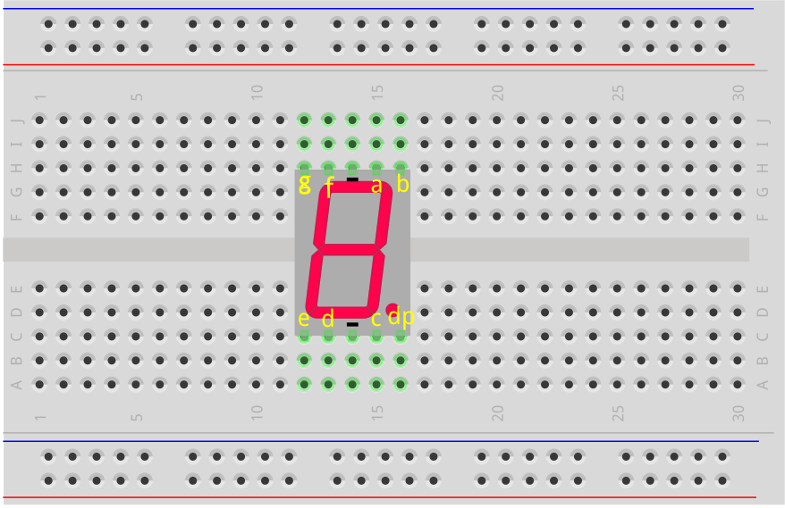

2. Conecta el terminal negativo (-) de la pantalla de 7 segmentos al riel de tierra del protoboard usando un cable de conexión.

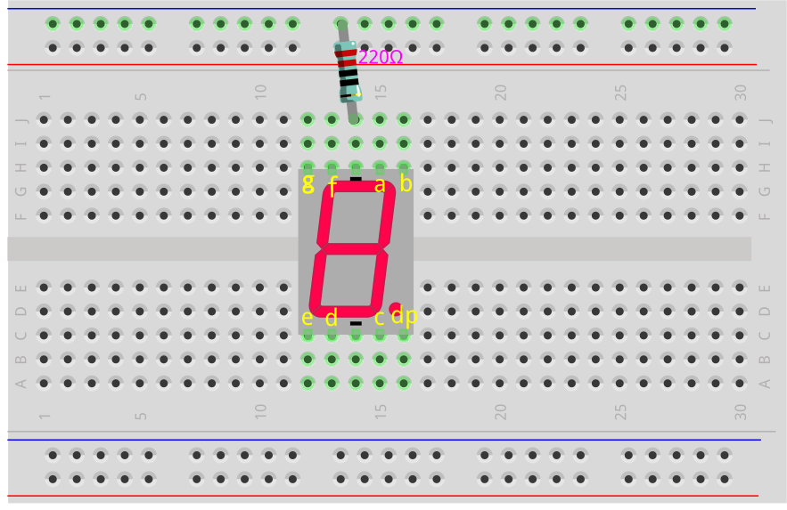

3. Ubica el chip 74HC595 e insértalo en el protoboard, asegurándote de que abarque la separación central.

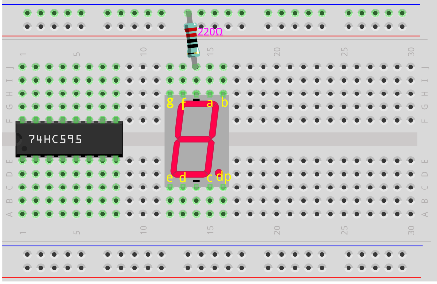

4. Conecta los pines VCC y MR del 74HC595 al riel positivo del protoboard.

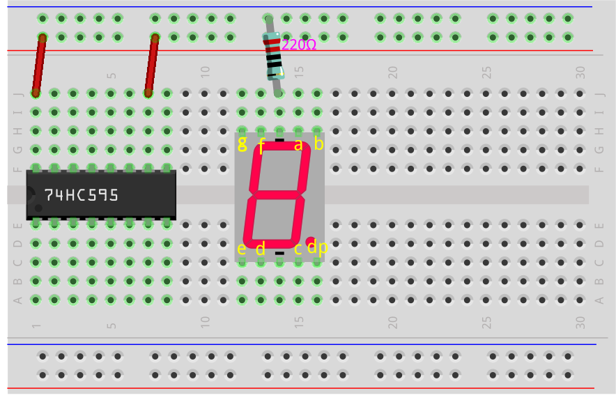

5. Conecta los pines CE y GND del 74HC595 al riel negativo del protoboard.

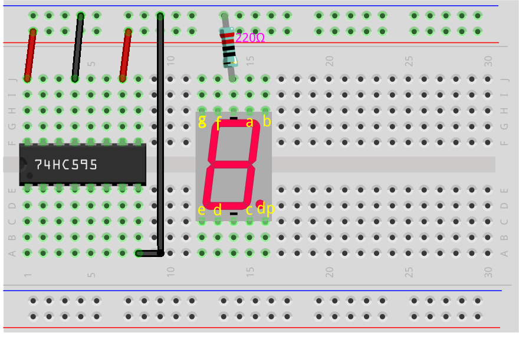

6. Conecta el pin Q0 del 74HC595 al pin "a" de la pantalla de 7 segmentos, Q1 al pin "b", Q2 al pin "c", Q3 al pin "d" y Q4 al pin "e".

.. image:: img/25_show_number_q0_q4.png
    :width: 500
    :align: center

7. Conecta el pin Q5 del 74HC595 al pin "f" de la pantalla de 7 segmentos, Q6 al pin "g" y Q7 al pin "dp".

.. image:: img/25_show_number_q5_q7.png
    :width: 500
    :align: center

8. Conecta el pin DS del 74HC595 al pin 11 del Arduino Uno R3.

.. image:: img/25_show_number_pin11.png
    :width: 500
    :align: center

9. Conecta el pin ST_CP del 74HC595 al pin 12 del Arduino Uno R3.

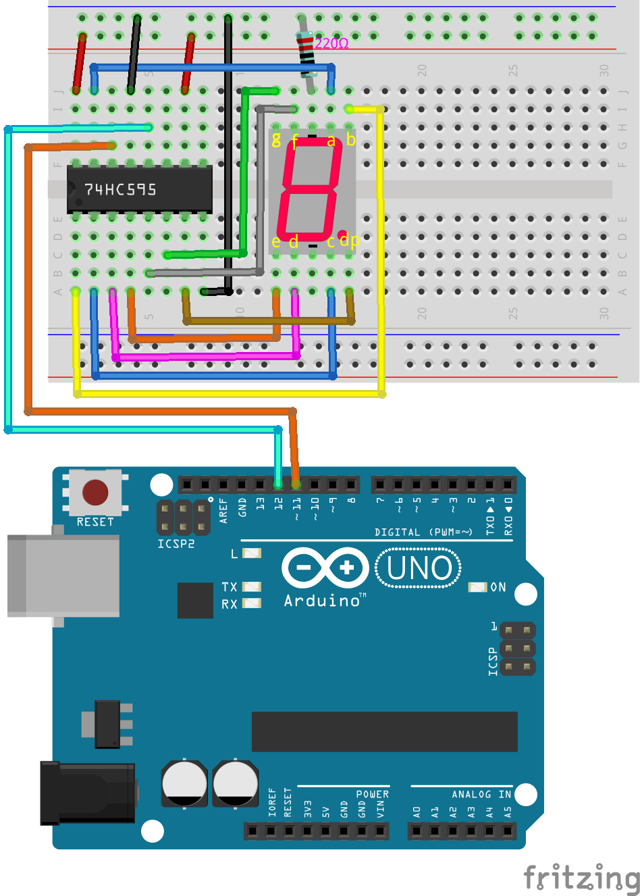

10. Conecta el pin SH_CP del 74HC595 al pin 8 del Arduino Uno R3.

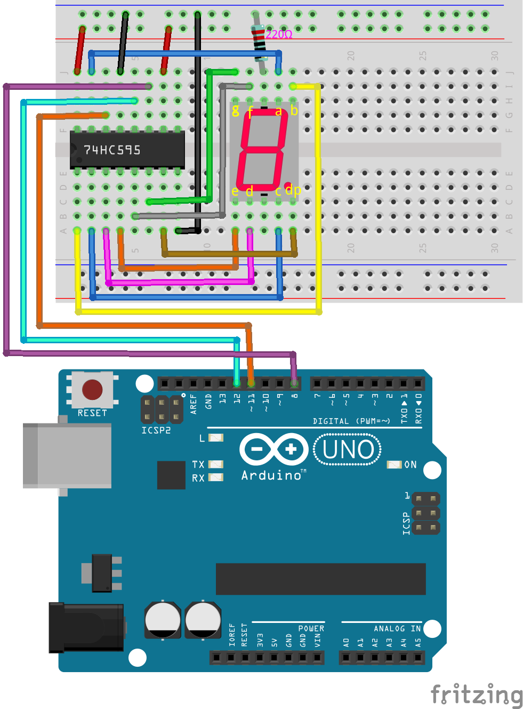

11. Finalmente, conecta los pines GND y 5V del Arduino Uno R3 a los rieles negativo y positivo del protoboard, respectivamente.

.. image:: img/25_show_number.png
    :width: 500
    :align: center

12. Las siguientes tablas muestran las conexiones de pines entre el 74HC595, el Arduino Uno R3 y la pantalla de 7 segmentos.

.. list-table::
    :widths: 20 20
    :header-rows: 1

    *   - 74HC595
        - Arduino UNO R3
    *   - VCC
        - 5V
    *   - DS
        - 11
    *   - CE
        - GND
    *   - ST_CP
        - 12
    *   - SH_CP
        - 8
    *   - MR
        - 5V
    *   - GND
        - GND

.. list-table::
    :widths: 20 20
    :header-rows: 1

    *   - 74HC595
        - Pantalla de 7 segmentos
    *   - Q0
        - a
    *   - Q1
        - b 
    *   - Q2
        - c
    *   - Q3
        - d
    *   - Q4
        - e
    *   - Q5
        - f
    *   - Q6
        - g
    *   - Q7
        - dp

Números Binarios para los Dígitos 0 al 9
-----------------------------------------------

En este proyecto, usamos el registro de desplazamiento 74HC595 para controlar la pantalla de 7 segmentos y mostrar diferentes números. Sin embargo, el 74HC595 recibe números binarios, por lo que antes de programar, debemos conocer los números binarios correspondientes a los dígitos del 0 al 9.

Supongamos que queremos mostrar el dígito 2 en la pantalla de 7 segmentos, necesitamos apagar los segmentos f y c y encender los segmentos restantes.

.. image:: img/23_segment_2.png
    :align: center
    :width: 200

De acuerdo con el diagrama de cableado, los pines de salida Q0 a Q7 del 74HC595 corresponden a los pines respectivos de la pantalla de 7 segmentos, como se muestra en el diagrama. En binario, 0 representa apagado (cerrado) y 1 representa encendido (abierto). Para mostrar el dígito 2, dp, f y c deben ser 0, mientras que los otros segmentos deben ser 1, lo que resulta en el número binario ``B01011011``.

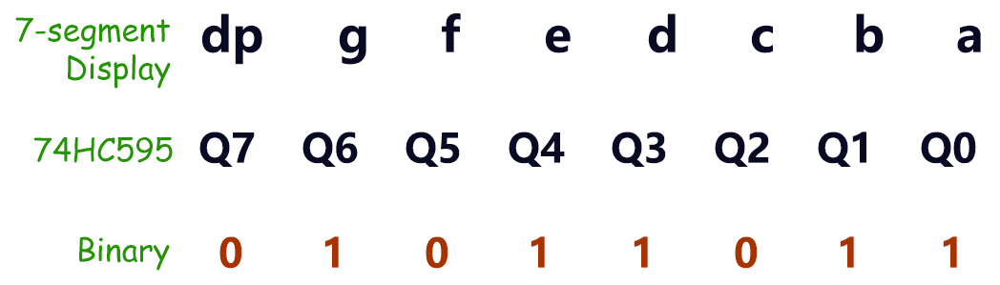

.. note::

    Cuando solo tienes una pantalla de 7 segmentos, el pin DP siempre se establece en 0. Cuando tienes múltiples pantallas de 7 segmentos en una configuración en cadena, puedes usar el pin DP para indicar el punto decimal.

Para mostrar el dígito 0, dp y g deben ser 0, y todos los demás segmentos deben ser 1, dando como resultado el número binario ``B00111111``.

**Pregunta**

Ahora que conocemos las representaciones binarias para los dígitos 0 y 2, por favor completa los números binarios para los dígitos restantes en la siguiente tabla.

.. list-table::
    :widths: 20 20
    :header-rows: 1

    *   - Número
        - Binario
    *   - 0
        - B00111111
    *   - 1
        - 
    *   - 2
        - B01011011
    *   - 3
        - 
    *   - 4
        - 
    *   - 5
        - 
    *   - 6
        - 
    *   - 7
        - 
    *   - 8
        - 
    *   - 9
        - 

Creación de Código - Mostrando Números
------------------------------------------------
1. Abre el sketch que guardaste anteriormente, ``Lesson24_Flowing_Light``.

2. Haz clic en “Guardar como...” en el menú “Archivo” y renómbralo como ``Lesson25_Show_Number_Binary``. Haz clic en "Guardar".

3. Cambia el ``datArray[]`` para mostrar los números binarios correspondientes a los dígitos del 0 al 9.

.. code-block:: Arduino
    :emphasize-lines: 5

    const int STcp = 12;  // Pin conectado a ST_CP del 74HC595
    const int SHcp = 8;   // Pin conectado a SH_CP del 74HC595
    const int DS = 11;    // Pin conectado a DS del 74HC595
    //mostrar 0,1,2,3,4,5,6,7,8,9
    int datArray[] = { B00111111, B00000110, B01011011, B01001111, B01100110, B01101101, B01111101, B00000111, B01111111, B01101111 };

4. Dado que el array ``datArray[]`` contiene 10 elementos, modifica el rango de la variable ``num`` a ``num <= 9``.

.. code-block:: Arduino
    :emphasize-lines: 2

    void loop() {
        for (int num = 0; num <= 9; num++) {
            digitalWrite(STcp, LOW);                      // Conectar ST_CP a tierra y mantenerlo bajo mientras se transmite
            shiftOut(DS, SHcp, MSBFIRST, datArray[num]);  // Desplazar los datos, empezando por el bit más significativo
            digitalWrite(STcp, HIGH);                     // Subir ST_CP para guardar los datos
            delay(1000);                                  // Esperar un segundo
        }
    }

5. Tu código completo debería verse así. En este punto, puedes cargar el código al Arduino Uno R3 y verás que la pantalla de 7 segmentos mostrará los números del 0 al 9 en secuencia.

.. code-block:: Arduino

    const int STcp = 12;  // Pin conectado a ST_CP del 74HC595
    const int SHcp = 8;   // Pin conectado a SH_CP del 74HC595
    const int DS = 11;    // Pin conectado a DS del 74HC595
    //mostrar 0,1,2,3,4,5,6,7,8,9
    int datArray[] = { B00111111, B00000110, B01011011, B01001111, B01100110, B01101101, B01111101, B00000111, B01111111, B01101111 };

    void setup() {
        // configurar los pines como salida
        pinMode(STcp, OUTPUT);
        pinMode(SHcp, OUTPUT);
        pinMode(DS, OUTPUT);
    }

    void loop() {
        for (int num = 0; num <= 9; num++) {
            digitalWrite(STcp, LOW);                      // Conectar ST_CP a tierra y mantenerlo bajo mientras se transmite
            shiftOut(DS, SHcp, MSBFIRST, datArray[num]);  // Desplazar los datos, empezando por el bit más significativo
            digitalWrite(STcp, HIGH);                     // Subir ST_CP para guardar los datos
            delay(1000);                                  // Esperar un segundo
        }
    }

Conversión Binaria
----------------------

En aplicaciones prácticas, escribir números binarios puede expresar más claramente el estado de cada bit en los datos. Sin embargo, para la representación numérica general, escribir números decimales es más conveniente.

.. note::

    Escribir números en binario, decimal o incluso hexadecimal no afecta el resultado del programa, sino solo la legibilidad del código. Por ejemplo, escribir el número decimal ``91`` se convertirá internamente en su forma binaria ``B01011011``.

Veamos cómo convertir números binarios a decimales.

**Conversión a Decimal**

En el sistema binario, cada bit representa un valor posicional correspondiente. El valor posicional es una potencia de 2, como 2^0, 2^1, 2^2…, etc. Al multiplicar cada bit por su valor posicional correspondiente y sumar todos los resultados, obtenemos el número decimal.

Por ejemplo, el número binario ``B01011011`` se convierte en el número decimal 91.

.. image:: img/25_binary_dec.png
    :align: center
    :width: 600
 
**Uso de la Calculadora**

En aplicaciones prácticas, puedes usar la calculadora de tu computadora. Cambia al modo de Programador, y podrás convertir fácilmente entre binario, decimal y hexadecimal.

Busca "Calculadora" en tu computadora y luego cambia a modo **Programador**.

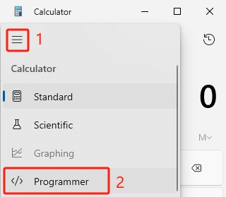

2. Si ya conoces el número binario y deseas convertirlo a otra base, selecciona **BIN**.

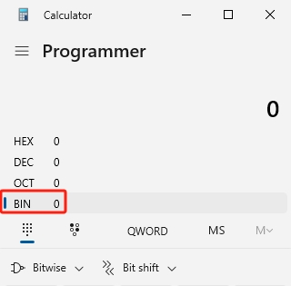

3. Ahora, puedes comenzar a ingresar el número binario.

* Los bits efectivos en binario se refieren al rango desde el bit más significativo (el bit más a la izquierda que no es cero) hasta el bit menos significativo (el bit más a la derecha que no es cero).
* Entonces, para el número binario ``B00111111``, los bits efectivos son ``111111``. 
* Ahora, ingresa ``111111`` en la calculadora para obtener los números decimales y hexadecimales correspondientes.

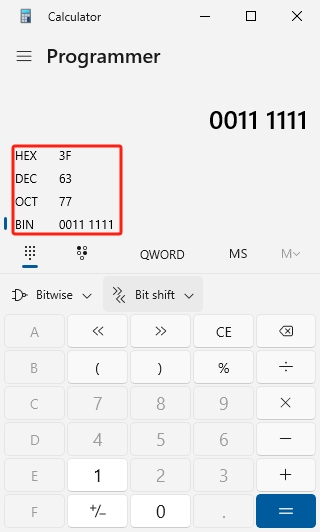

**Pregunta**

Convierte los números binarios que representan los dígitos del 0 al 9 en números decimales y hexadecimales usando una calculadora, y completa la tabla. Esto te proporcionará una guía rápida para las conversiones de base.

.. list-table::
    :widths: 20 40 30 30
    :header-rows: 1

    *   - Número
        - Binario
        - Decimal
        - Hexadecimal
    *   - 0
        - B00111111
        - 63
        - 0x3F
    *   - 1
        - B00000110
        - 6
        - 0x06
    *   - 2
        - B01011011
        - 91
        - 0x5B
    *   - 3
        - B01001111
        - 79
        - 0x4F
    *   - 4
        - B01100110
        - 102
        - 0x66
    *   - 5
        - B01101101
        - 109
        - 0x6D
    *   - 6
        - B01111101
        - 125
        - 0x7D
    *   - 7
        - B00000111
        - 7
        - 0x07
    *   - 8
        - B01111111
        - 127
        - 0x7F
    *   - 9
        - B01101111
        - 111
        - 0x6F

**Modificar el Sketch**

Ahora, abre tu sketch ``Lesson25_Show_Number_Binary`` en el IDE de Arduino. Haz clic en "Archivo" -> "Guardar como...", nombra el archivo ``Lesson25_Show_Number_Decimal``. Haz clic en "Guardar".

Cambia todos los elementos de ``datArray[]`` a decimales, como se muestra en el código. Una vez modificado, puedes cargar el código en el Arduino Uno R3 para ver el efecto.

.. code-block:: Arduino

    const int STcp = 12;  // Pin conectado a ST_CP del 74HC595
    const int SHcp = 8;   // Pin conectado a SH_CP del 74HC595
    const int DS = 11;    // Pin conectado a DS del 74HC595
    //mostrar 0,1,2,3,4,5,6,7,8,9
    int datArray[] = { 63, 6, 91, 79, 102, 109, 125, 7, 127, 111 };

    void setup() {
        // Configurar pines como salida
        pinMode(STcp, OUTPUT);
        pinMode(SHcp, OUTPUT);
        pinMode(DS, OUTPUT);
    }

    void loop() {
        for (int num = 0; num <= 9; num++) {
            digitalWrite(STcp, LOW);                      // Conectar ST_CP a tierra y mantenerlo bajo mientras se transmite
            shiftOut(DS, SHcp, MSBFIRST, datArray[num]);  // Desplazar los datos, empezando por el bit más significativo
            digitalWrite(STcp, HIGH);                     // Subir ST_CP para guardar los datos
            delay(1000);                                  // Esperar un segundo
        }
    }

Creación de Código - Entrada Serial
-----------------------------------------

El Monitor Serial es una herramienta poderosa proporcionada por el IDE de Arduino para la comunicación con la placa Arduino. Lo hemos utilizado para monitorear la salida de datos del Arduino, como leer valores analógicos de un fotorresistor. También puede usarse para enviar datos al Arduino, permitiéndole realizar acciones en función de los datos recibidos.

En esta actividad, escribiremos un número entre 0 y 9 en el Monitor Serial para mostrarlo en la pantalla de 7 segmentos.

1. Abre tu sketch ``Lesson25_Show_Number_Decimal`` en el IDE de Arduino. Haz clic en "Archivo" -> "Guardar como...", nombra el archivo ``Lesson25_Show_Number_Serial``. Haz clic en "Guardar".

2. En ``void setup()``, inicia el monitor serial y configura su velocidad en baudios a 9600.

.. code-block:: Arduino
    :emphasize-lines: 6

    void setup() {
        // Configurar pines como salida
        pinMode(STcp, OUTPUT);
        pinMode(SHcp, OUTPUT);
        pinMode(DS, OUTPUT);
        Serial.begin(9600);  // Configuración de la comunicación serial a 9600 baudios
    }

3. Cuando uses el Monitor Serial, puedes leer los datos ingresados a través del código de Arduino. Aquí, necesitas entender dos funciones:

* ``Serial.available()``: Obtiene el número de bytes (caracteres) disponibles para leer desde el puerto serie. Estos son los datos que ya han llegado y están almacenados en el búfer de recepción serie (que tiene una capacidad de 64 bytes).
* ``Serial.read()``: Devuelve el código ASCII del carácter recibido a través de la entrada serie.

Ahora, usa una declaración ``if`` en ``void loop()`` para verificar si se han leído datos del puerto y luego imprímelos.

.. note::

    Temporalmente, comenta la declaración for en ``void loop()`` que muestra caracteres en la pantalla de 7 segmentos para evitar que afecte el proceso de impresión.

.. code-block:: Arduino
    :emphasize-lines: 2-5

    void loop() {
        if (Serial.available() > 0) {
            // Imprimir el carácter recibido desde el puerto serie
            Serial.println(Serial.read());
        }

        // for (int num = 0; num <= 9; num++) {
        //   digitalWrite(STcp, LOW);                      // Conectar ST_CP a tierra y mantenerlo bajo mientras se transmite
        //   shiftOut(DS, SHcp, MSBFIRST, datArray[num]);  // Desplazar los datos, empezando por el bit más significativo
        //   digitalWrite(STcp, HIGH);                     // Subir ST_CP para guardar los datos
        //   delay(1000);                                  // Esperar un segundo
        // }
    }

4. A continuación, se muestra tu código completo. En este punto, puedes cargar el código en el Arduino Uno R3.

.. code-block:: Arduino

    const int STcp = 12;  // Pin conectado a ST_CP del 74HC595
    const int SHcp = 8;   // Pin conectado a SH_CP del 74HC595
    const int DS = 11;    // Pin conectado a DS del 74HC595
    // mostrar 0,1,2,3,4,5,6,7,8,9
    int datArray[] = { 63, 6, 91, 79, 102, 109, 125, 7, 127, 111 };

    void setup() {
        // configurar pines como salida
        pinMode(STcp, OUTPUT);
        pinMode(SHcp, OUTPUT);
        pinMode(DS, OUTPUT);
        Serial.begin(9600);  // Configuración de comunicación serial a 9600 baudios
    }

    void loop() {
        if (Serial.available() > 0) {
            // Imprimir el carácter recibido desde el puerto serie
            Serial.println(Serial.read());
        }

        // for (int num = 0; num <= 9; num++) {
        //   digitalWrite(STcp, LOW);                      // Conectar ST_CP a tierra y mantener bajo mientras se transmite
        //   shiftOut(DS, SHcp, MSBFIRST, datArray[num]);  // Desplazar los datos, comenzando por el bit más significativo
        //   digitalWrite(STcp, HIGH);                     // Subir ST_CP para guardar los datos
        //   delay(1000);                                  // Esperar un segundo
        // }
    }

5. Después de cargar el código, abre el Monitor Serial. En el cuadro de entrada, escribe el número ``0`` (o cualquier dígito entre 0-9) y presiona Enter. En ese momento, verás que el Serial imprime un número ``48``.

.. note::

    * Si está seleccionada la opción "Nueva línea" en el final de línea del Monitor Serial, también verás un ``10``.
    * ``10`` es el código ASCII para un carácter de nueva línea (también llamado LF - Line Feed).

.. image:: img/25_serial_read.png
    :align: center
    :width: 600

Entonces, ¿a dónde fue nuestro input de ``0``? ¿De dónde salió ese ``48``? ¿Es posible que ``0`` sea ``48``?

Esto se debe a que el ``0`` que ingresamos en el Monitor Serial se considera un "carácter", no un "número".

La transferencia de caracteres sigue un estándar de codificación conocido como ASCII (Código Estándar Americano para el Intercambio de Información).

ASCII incluye caracteres comunes como letras mayúsculas (A-Z), letras minúsculas (a-z), dígitos (0-9) y signos de puntuación (como puntos, comas, signos de exclamación, etc.). También define algunos caracteres de control utilizados para controlar dispositivos y protocolos de comunicación. Estos caracteres de control generalmente no se muestran en la pantalla, pero se utilizan para controlar el comportamiento de dispositivos como impresoras, terminales, etc., tales como salto de línea, retroceso, retorno de carro, etc.

Aquí tienes una tabla ASCII:

.. image:: img/25_ascii_table.png
    :align: center
    :width: 800

Cuando escribes el carácter ``0`` en el Monitor Serial, el código ASCII para el carácter ``0`` se envía al Arduino.
En ASCII, el código para el carácter ``0`` es ``48`` en decimal.

6. Antes de continuar programando, debes comentar el código anterior que imprime el código ASCII para evitar conflictos con el siguiente código.

.. code-block:: Arduino
    :emphasize-lines: 4

    void loop() {
        if (Serial.available() > 0) {
            // Imprimir el carácter recibido desde el puerto serie
            // Serial.println(Serial.read());
        }

        // for (int num = 0; num <= 9; num++) {
        //   digitalWrite(STcp, LOW);                      // Conectar ST_CP a tierra y mantener bajo mientras se transmite
        //   shiftOut(DS, SHcp, MSBFIRST, datArray[num]);  // Desplazar los datos, comenzando por el bit más significativo
        //   digitalWrite(STcp, HIGH);                     // Subir ST_CP para guardar los datos
        //   delay(1000);                                  // Esperar un segundo
        // }
    }

7. Necesitas crear una nueva variable ``char`` para almacenar el carácter leído desde el Monitor Serial.

.. code-block:: Arduino
    :emphasize-lines: 6,7

    void loop() {
        if (Serial.available() > 0) {
            // Imprimir el carácter recibido desde el puerto serie
            // Serial.println(Serial.read());

            // Leer el carácter recibido desde el puerto serie
            char receivedChar = Serial.read();
        }
    }

8. Ahora, convierte el carácter a un número. En ASCII, el valor para el carácter ``'0'`` es ``48``, ``'1'`` es ``49``, y así sucesivamente. Por lo tanto, restando el código ASCII de ``'0'``, podemos obtener el valor numérico correspondiente.

.. code-block:: Arduino
    :emphasize-lines: 8,9

    void loop() {
        if (Serial.available() > 0) {
            // Imprimir el carácter recibido desde el puerto serie
            Serial.println(Serial.read());

            // Leer el carácter recibido desde el puerto serie
            char receivedChar = Serial.read();
            // Convertir el carácter a un dígito
            int digit = receivedChar - '0';
        }
    }

9. En este ejemplo, asumimos que la entrada son caracteres numéricos de ``'0'`` a ``'9'``. Por lo tanto, solo nos importa si el carácter de entrada está dentro de este rango. Necesitas verificar si el número está dentro del rango válido:

* Selecciona la sentencia ``for`` previamente comentada y presiona ``Ctrl + /`` para descomentarlo.
* Luego, modifica la sentencia ``for`` a una sentencia ``if`` para verificar si el carácter de entrada está dentro del rango de ``'0'`` a ``'9'``. Si lo está, haz que la pantalla de 7 segmentos muestre el número correspondiente.

.. code-block:: Arduino
    :emphasize-lines: 9

    void loop() {
        if (Serial.available() > 0) {
            // Imprimir el carácter recibido desde el puerto serie
            // Serial.println(Serial.read());

            // Leer el carácter recibido desde el puerto serie
            char receivedChar = Serial.read();
            // Convertir el carácter a un dígito
            int digit = receivedChar - '0';

            if (digit >= 0 && digit <= 9) {
                digitalWrite(STcp, LOW);                        // Conectar ST_CP a tierra y mantener bajo mientras se transmite
                shiftOut(DS, SHcp, MSBFIRST, datArray[digit]);  // Enviar los datos, comenzando por el bit más significativo
                digitalWrite(STcp, HIGH);                       // Subir ST_CP para guardar los datos
                delay(1000);                                    // Esperar un segundo
            }
        }
    }

10. Tu código completo debería verse de la siguiente manera. Ahora puedes cargar el código en el Arduino Uno R3 y abrir el Monitor Serial. Ingresa cualquier número entre 0 y 9 para ver si la pantalla de 7 segmentos muestra el número correspondiente.

.. code-block:: Arduino

    const int STcp = 12;  // Pin conectado a ST_CP del 74HC595
    const int SHcp = 8;   // Pin conectado a SH_CP del 74HC595
    const int DS = 11;    // Pin conectado a DS del 74HC595
    // mostrar 0,1,2,3,4,5,6,7,8,9
    int datArray[] = { 63, 6, 91, 79, 102, 109, 125, 7, 127, 111 };

    void setup() {
        // Configurar pines como salida
        pinMode(STcp, OUTPUT);
        pinMode(SHcp, OUTPUT);
        pinMode(DS, OUTPUT);
        Serial.begin(9600);  // Configuración de comunicación serial a 9600 baudios
    }   

    void loop() {
        if (Serial.available() > 0) {
            // Imprimir el carácter recibido desde el puerto serie
            // Serial.println(Serial.read());

            // Leer el carácter recibido desde el puerto serie
            char receivedChar = Serial.read();
            // Convertir el carácter a un dígito
            int digit = receivedChar - '0';

            if (digit >= 0 && digit <= 9) {
                digitalWrite(STcp, LOW);                        // Conectar ST_CP a tierra y mantener bajo mientras se transmite
                shiftOut(DS, SHcp, MSBFIRST, datArray[digit]);  // Enviar los datos, comenzando por el bit más significativo
                digitalWrite(STcp, HIGH);                       // Subir ST_CP para guardar los datos
                delay(1000);                                    // Esperar un segundo
            }
        }
    }

11. Finalmente, recuerda guardar tu código y organizar tu espacio de trabajo.

**Resumen**

En esta lección, aprendiste cómo usar el registro de desplazamiento 74HC595 para controlar una pantalla de 7 segmentos y reducir la cantidad de pines necesarios en el Arduino Uno R3. También exploraste las representaciones binarias para los dígitos a mostrar y comprendiste cómo convertir números binarios a formatos decimales y hexadecimales, haciendo el código más legible.

Además, aprendiste a usar el Monitor Serial para la entrada de datos seriales y cómo los caracteres ingresados se convierten internamente en códigos ASCII. Al comprender esta conversión, pudiste mapear caracteres a sus equivalentes numéricos, permitiendo una visualización precisa en la pantalla de 7 segmentos.

En resumen, esta lección proporcionó un entendimiento integral de cómo utilizar registros de desplazamiento, controlar pantallas de 7 segmentos y manejar la comunicación serial para proyectos interactivos.
