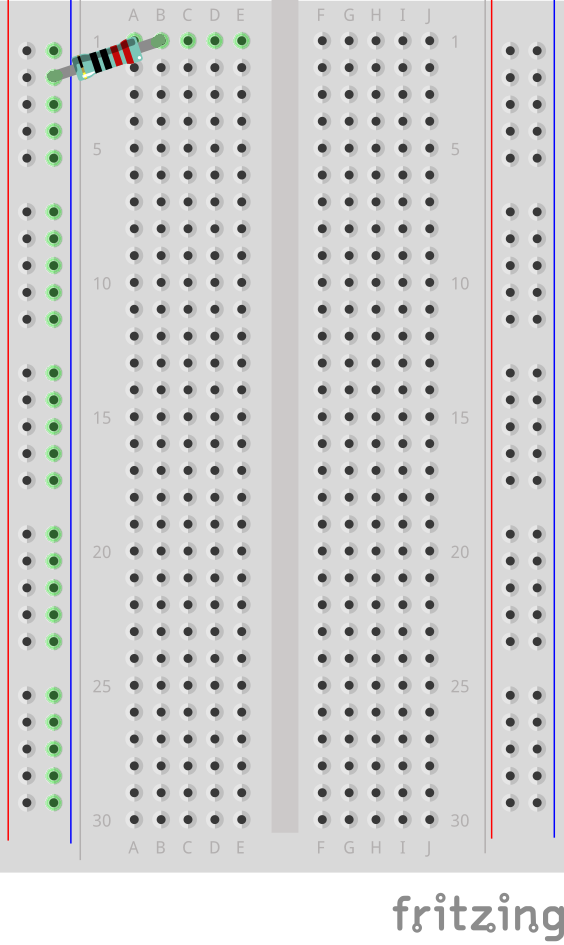
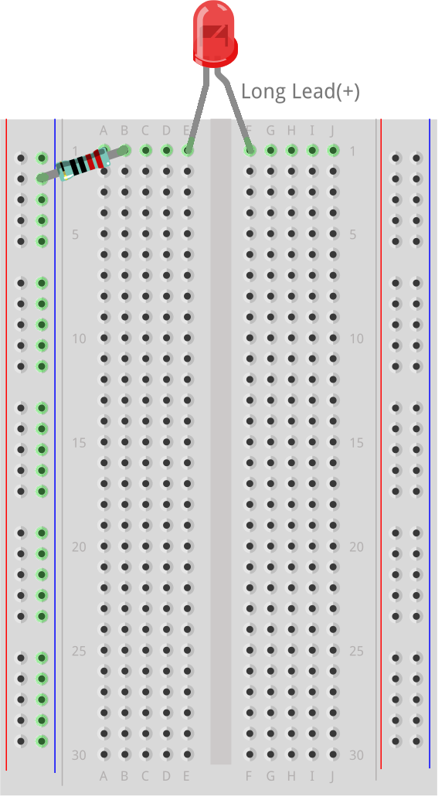
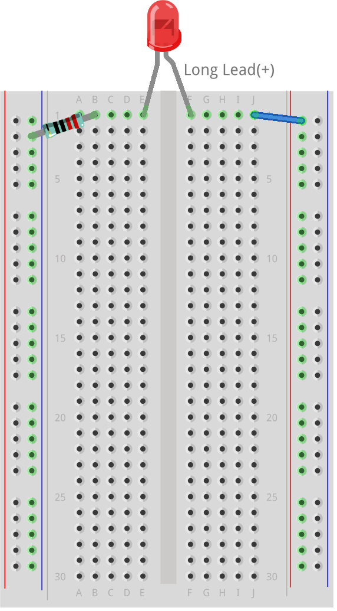
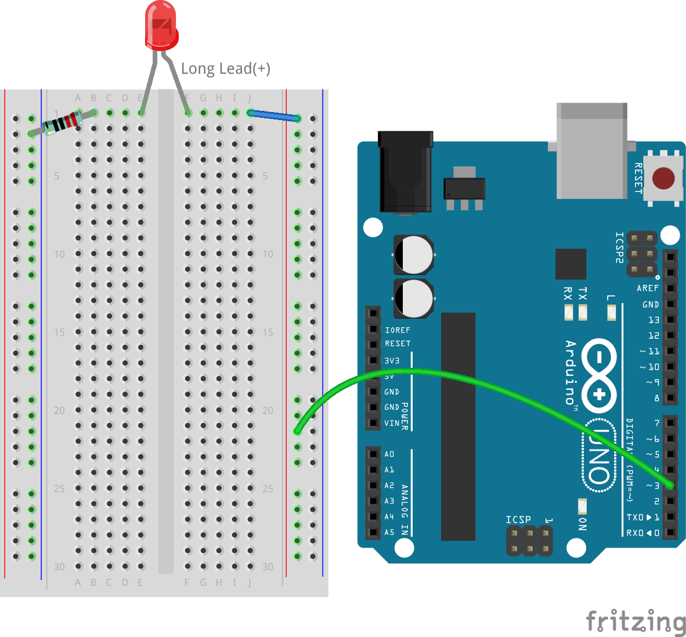
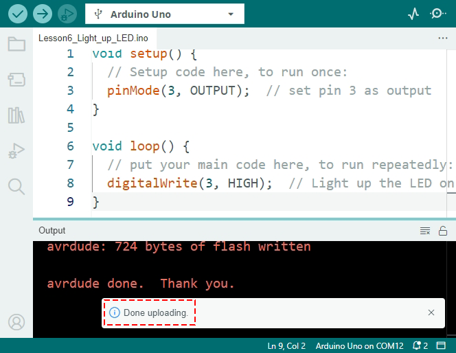
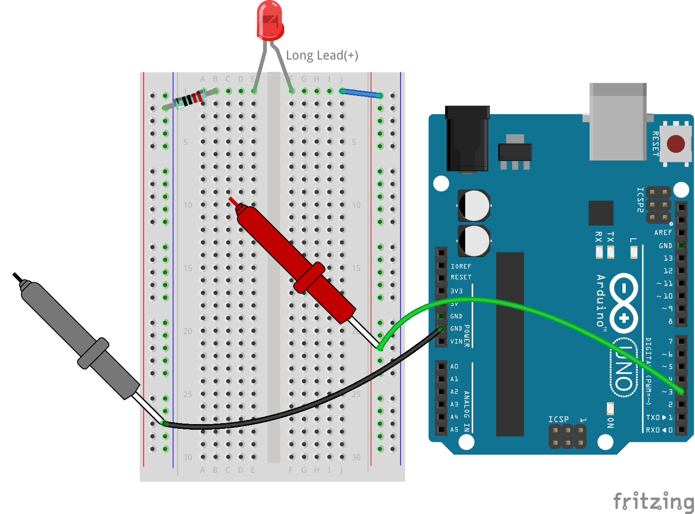

.. note::

    ¡Hola! Bienvenidos a la comunidad de entusiastas de SunFounder Raspberry Pi & Arduino & ESP32 en Facebook. Sumérgete en el mundo de Raspberry Pi, Arduino y ESP32 con otros entusiastas.

    **¿Por qué unirte?**

    - **Soporte experto**: Resuelve problemas postventa y desafíos técnicos con la ayuda de nuestra comunidad y equipo.
    - **Aprende y comparte**: Intercambia consejos y tutoriales para mejorar tus habilidades.
    - **Vistas previas exclusivas**: Obtén acceso anticipado a anuncios de nuevos productos y adelantos.
    - **Descuentos especiales**: Disfruta de descuentos exclusivos en nuestros productos más recientes.
    - **Promociones festivas y sorteos**: Participa en sorteos y promociones especiales.

    👉 ¿Listo para explorar y crear con nosotros? ¡Haz clic en [|link_sf_facebook|] y únete hoy mismo!

6. Parpadeo del LED
======================
¡Bienvenido a esta lección! Aprenderás a manipular los pines digitales del Arduino Uno R3 para controlar un LED programáticamente, encendiéndolo y apagándolo sin intervención manual, una habilidad fundamental tanto para aplicaciones domésticas como industriales.

.. raw:: html

    <video muted controls style = "max-width:90%">
        <source src="../_static/video/6_blink_led.mp4" type="video/mp4">
        Your browser does not support the video tag.
    </video>

En esta lección, aprenderás a:

* Crear y guardar sketches usando el IDE de Arduino.
* Usar las funciones ``pinMode()`` y ``digitalWrite()`` para controlar elementos del circuito.
* Cargar sketches en el Arduino Uno R3 y comprender sus efectos en tiempo real.
* Implementar ``delay()`` en los sketches para gestionar el comportamiento del circuito.

Al final de esta lección, serás capaz de construir un circuito que no solo encienda un LED, sino que también lo haga parpadear en intervalos que establezcas, dándote una comprensión básica de cómo el software interactúa con el hardware.

Construyendo el Circuito
--------------------------------

**Componentes necesarios**

.. list-table:: 
   :widths: 25 25 25 25
   :header-rows: 0

   * - 1 * Arduino Uno R3
     - 1 * LED rojo
     - 1 * Resistor de 220Ω
     - Cables de puente
   * - |list_uno_r3| 
     - |list_red_led| 
     - |list_220ohm| 
     - |list_wire| 
   * - 1 * Cable USB
     - 1 * Protoboard
     - 1 * Multímetro
     -   
   * - |list_usb_cable| 
     - |list_breadboard| 
     - |list_meter|
     - 

**Pasos para armar**

Toma el circuito construido en :ref:`2_first_circuit`, y cambia el cable del pin 5V al pin 3, como se muestra en la imagen a continuación.

.. image:: img/6_led_circuit.png
    :width: 600
    :align: center

Si desmontaste el circuito anterior, puedes reconstruirlo siguiendo estos pasos:

1. Conecta el resistor de 220 ohmios al protoboard. Un extremo debe estar en el terminal negativo y el otro en el agujero 1B.

2. Añade un LED rojo al protoboard. El ánodo del LED (la pata larga) debe estar en el agujero 1F. El cátodo (la pata corta) debe estar en el agujero 1E. A veces es difícil distinguir el ánodo del cátodo por la longitud de las patas. Recuerda que el lado del cátodo del LED también tiene un borde plano en la lente de color, mientras que el ánodo tiene un borde redondeado.

3. Usa un cable de puente corto para conectar el LED a la fuente de alimentación. Un extremo del cable debe estar en el agujero 1J y el otro en el terminal positivo.

4. Conecta el terminal positivo del protoboard al pin 3 del Arduino Uno R3.

5. Conecta el terminal negativo del protoboard a uno de los pines de tierra (GND) del Arduino Uno R3.

.. image:: img/6_led_circuit.png
    :width: 600
    :align: center

Dando Vida al LED
-----------------------------

¡Es hora del espectáculo para el LED! En lugar de sumergirnos directamente en el ejemplo "Blink" del Arduino, vamos a comenzar desde cero y crear un nuevo sketch. ¡Vamos a ello!

**1. Crear y Guardar un Sketch**

1. Abre el IDE de Arduino. Ve al menú “Archivo” y selecciona “Nuevo Sketch” para empezar desde cero. Puedes cerrar otras ventanas de sketches que puedan estar abiertas.

    .. image:: img/6_blink_ide_new.png
        :align: center

2. Organiza la ventana del IDE de Arduino junto con este tutorial en línea para ver ambas al mismo tiempo. Puede que todo se vea un poco pequeño, pero es mejor que alternar entre ventanas.

    .. image:: img/6_blink_ide_tutorials.png

3. Es momento de guardar tu sketch. Haz clic en “Guardar” en el menú “Archivo” o presiona ``Ctrl + S``.

    .. image:: img/6_blink_ide_save.png

4. Puedes guardar tu sketch en la ubicación predeterminada o en otro lugar. Nombra tu sketch con algo significativo, como ``Leccion6_Encender_LED`` y haz clic en “Guardar”.

    * Nombra tu sketch según su función para encontrarlo fácilmente más tarde.
    * Los nombres de los sketches en Arduino no pueden tener espacios.
    * Al realizar cambios importantes, considera guardar como una nueva versión (por ejemplo, V1) para crear una copia de seguridad.
    
    .. image:: img/6_blink_ide_name.png

5. Tu nuevo sketch tiene dos partes principales, ``void setup()`` y ``void loop()``, que son funciones utilizadas en todos los sketches de Arduino.

    * ``void setup()`` se ejecuta una vez cuando comienza el programa y establece las condiciones iniciales.
    * ``void loop()`` se ejecuta repetidamente, ejecutando acciones continuas.
    * Coloca los comandos para cada función dentro de sus llaves ``{}``.
    * Cualquier línea que comience con ``//`` es un comentario. Estos son para tus notas y no afectarán la ejecución del código.

    .. code-block:: Arduino

        void setup() {
        // Código de configuración aquí, para ejecutarse una vez:

        }

        void loop() {
        // Código principal aquí, para ejecutarse repetidamente:

        }

**2. Selección de Placa y Puerto**

1. Conecta tu Arduino Uno R3 a la computadora con un cable USB. Verás que la luz de encendido del Arduino se enciende.

    .. image:: img/1_connect_uno_pc.jpg
        :width: 600
        :align: center

2. Indica al IDE que estamos usando un **Arduino Uno**. Ve a **Herramientas** -> **Placa** -> **Arduino AVR Boards** -> **Arduino Uno**.

    .. image:: img/6_blink_ide_board.png
        :width: 600
        :align: center

3. A continuación, en el IDE de Arduino, selecciona el puerto al que está conectado tu Arduino.

    .. note::

        * Una vez que se selecciona un puerto, el IDE de Arduino debería recordarlo cada vez que el Arduino se conecte a través de USB.
        * Si se conecta una placa de Arduino diferente, es posible que debas elegir un nuevo puerto.
        * Siempre verifica el puerto primero si hay problemas de conexión.

    .. image:: img/6_blink_ide_port.png
        :width: 600
        :align: center

**3. Escribiendo el Código**

1. En nuestro proyecto, utilizamos el pin digital 3 de la placa para controlar un LED. Cada pin puede funcionar como salida, enviando 5 voltios, o como entrada, leyendo el voltaje entrante. Para configurar el LED, establecemos el pin como salida usando la función ``pinMode(pin, mode)``.

Vamos a analizar la sintaxis de ``pinMode()``.

    * ``pinMode(pin, mode)``: Configura un pin específico como ``INPUT`` o ``OUTPUT``.

    **Parámetros**
        - ``pin``: el número del pin que deseas configurar.
        - ``mode``: ``INPUT``, ``OUTPUT`` o ``INPUT_PULLUP``.

    **Retorno**
        Ninguno.
    
2. Ahora, es momento de agregar nuestra primera línea de código en la función ``void setup()``.
        
    .. note::

        - La codificación en Arduino es sensible a mayúsculas y minúsculas. Asegúrate de escribir las funciones exactamente como son.
        - Observa que el comando termina con un punto y coma. En el IDE de Arduino, todos los comandos deben terminar con uno.
        - Los comentarios en el código son útiles para recordarte qué hace una línea o sección del código.

    .. code-block:: Arduino
        :emphasize-lines: 3

        void setup() {
            // Código de configuración aquí, para ejecutarse una vez:
            pinMode(3,OUTPUT); // configurar el pin 3 como salida
        }
    
        void loop() {
        // Escribe tu código principal aquí, para ejecutarse repetidamente:

        }

**4. Verificando el Código**

Antes de activar nuestro LED, verificaremos el código. Esto comprueba si el IDE de Arduino puede entender y compilar tus comandos en lenguaje de máquina.

1. Para verificar tu código, haz clic en el botón de **verificación** en la esquina superior izquierda de la ventana.

    .. image:: img/6_blink_ide_verify.png
        :width: 600
        :align: center

2. Si tu código es legible por la máquina, un mensaje en la parte inferior indicará que el código ha sido compilado con éxito. Esta área también muestra cuánto espacio de almacenamiento utiliza tu programa.

    .. image:: img/6_blink_ide_verify_done.png
        :width: 600
        :align: center

3. Si hay un error en tu código, verás un mensaje de error en color naranja. El IDE suele resaltar dónde podría estar el problema, generalmente cerca de la línea resaltada. Por ejemplo, un error por falta de punto y coma resaltará la línea inmediatamente después del error.

    .. image:: img/6_blink_ide_verify_error.png
        :width: 600
        :align: center

4. Cuando encuentres errores, es momento de depurar: encontrar y corregir los errores en tu código. Revisa los problemas comunes como:

    - ¿Está la ``M`` en ``pinMode`` en mayúscula?
    - ¿Escribiste ``OUTPUT`` con todas las letras en mayúsculas?
    - ¿Tienes tanto paréntesis de apertura como de cierre en tu función ``pinMode``?
    - ¿Terminaste tu función ``pinMode`` con un punto y coma?
    - ¿Está toda la ortografía correcta? Si encuentras errores, corrígelos y verifica tu código de nuevo. Sigue depurando hasta que tu sketch esté libre de errores.

El IDE de Arduino deja de compilar en el primer error, por lo que puede que tengas que verificar varias veces para corregir múltiples errores. Verificar tu código regularmente es una buena práctica.

Depurar es una gran parte de la programación. Los programadores profesionales a menudo pasan más tiempo depurando que escribiendo nuevo código. Los errores son normales, así que no te desanimes. Convertirse en un buen solucionador de problemas es clave para ser un gran programador.

**5. Continuando con la Escritura del Sketch**

1. Ahora estás listo para comenzar con la función ``void loop()``. Aquí es donde ocurre la acción principal de tu sketch o programa. Para encender el LED conectado al Arduino Uno R3, necesitamos proporcionar voltaje al circuito usando ``digitalWrite()``.

    * ``digitalWrite(pin, value)``: Envía una señal ``HIGH`` (5V) o ``LOW`` (0V) a un pin digital, cambiando el estado operativo del componente.

    **Parámetros**
        - ``pin``: el número del pin de Arduino.
        - ``value``: ``HIGH`` o ``LOW``.
    
    **Retorno**
        Ninguno.

5. Debajo del comentario en la función ``void loop()``, escribe un comando para encender el LED conectado al pin 3. No olvides terminar el comando con un punto y coma. Verifica y depura tu código si es necesario.

    .. code-block:: Arduino
        :emphasize-lines: 8

        void setup() {
            // Código de configuración aquí, para ejecutarse una vez:
            pinMode(3, OUTPUT);  // configurar el pin 3 como salida
        }

        void loop() {
            // Escribe tu código principal aquí, para ejecutarse repetidamente:
            digitalWrite(3, HIGH);
        }

6. Después del comando ``digitalWrite()``, agrega un comentario explicando qué hace esta línea. Por ejemplo:

    .. code-block:: Arduino
        :emphasize-lines: 8

        void setup() {
            // Código de configuración, se ejecuta una vez: 
            pinMode(3, OUTPUT);  // configura el pin 3 como salida
        }

        void loop() {
            // Código principal, se ejecuta repetidamente:
            digitalWrite(3, HIGH);  // Enciende el LED en el pin 3
        }

**6. Cargando el Código**

Con tu código sin errores y verificado, es momento de cargarlo en el Arduino Uno R3 y ver cómo tu LED cobra vida.

1. En el IDE, haz clic en el botón “Subir”. La computadora compilará el código y luego lo transferirá al Arduino Uno R3. Durante la transferencia, deberías ver algunas luces parpadear en la placa, lo que indica la comunicación con la computadora.

.. image:: img/6_blink_ide_upload.png
    :width: 600
    :align: center

2. El mensaje “Carga completada” significa que tu código no tiene problemas y que has seleccionado la placa y el puerto correctos.

3. Una vez que la transferencia esté completa, el código se ejecutará y deberías ver el LED en la placa de pruebas encenderse.

**7. Midiendo el Voltaje a Través del LED**

Vamos a usar un multímetro para medir el voltaje en el pin 3 y comprender qué significa el estado ``HIGH`` en el código.

1. Ajusta el multímetro en la configuración de 20 voltios en corriente continua (DC).

.. image:: img/multimeter_dc_20v.png
    :width: 300
    :align: center

2. Comienza midiendo el voltaje en el Pin 3. Toca el cable de prueba rojo del multímetro al Pin 3 y el cable negro al GND.

3. Registra el voltaje medido en la tabla para el Pin 3 bajo la fila etiquetada como "HIGH".

.. list-table::
   :widths: 25 25
   :header-rows: 1

   * - Estado
     - Voltaje Pin 3
   * - HIGH
     - *≈4.95 voltios*
   * - LOW
     - 

4. Después de medir, recuerda apagar el multímetro configurándolo en la posición "OFF".

Nuestras mediciones revelan que el voltaje en los tres pines es cercano a 5V. Esto indica que al configurar un pin en ``HIGH`` en el código, el voltaje de salida en ese pin es cercano a 5V.

El voltaje del pin en el Arduino R3 es de 5V, por lo que al establecerlo en ``HIGH`` alcanza cerca de 5V. Sin embargo, algunas placas funcionan a 3.3V, lo que significa que su estado ``HIGH`` estaría cerca de 3.3V.

Hacer Parpadear el LED
------------------------------
Ahora que tu LED está encendido, es hora de hacer que parpadee.

1. Abre el sketch que guardaste anteriormente, ``Lesson6_Light_up_LED``. Haz clic en “Guardar como...” en el menú “Archivo” y renómbralo como ``Lesson6_Blink_LED``. Haz clic en "Guardar".

2. En la función ``void loop()`` de tu sketch, copia los comandos ``digitalWrite()`` y pégalos después de los originales. Para hacer que el LED parpadee, primero lo encendiste; ahora establece su estado en ``LOW`` para apagarlo.

    .. note::
       * Copiar y pegar puede ser el mejor aliado de un programador. Replica una sección limpia de código en una nueva posición y ajusta sus parámetros para una ejecución rápida y limpia.
       * Recuerda actualizar los comentarios para que coincidan mejor con la acción realizada.
       * Usa ``Ctrl+T`` para formatear tu código de manera ordenada con un solo clic, haciéndolo más legible y amigable.

    .. code-block:: Arduino
       :emphasize-lines: 8,9

       void setup() {
            // Código de configuración, se ejecuta una vez:
            pinMode(3, OUTPUT);  // configura el pin 3 como salida
       }

       void loop() {
            // Código principal, se ejecuta repetidamente:
            digitalWrite(3, HIGH);  // Enciende el LED en el pin 3   
            digitalWrite(3, LOW);  // Apaga el LED en el pin 3
       }
3. Presiona el botón “Subir” para transferir el sketch al Arduino Uno R3. Después de la transferencia, es posible que notes que el LED no parpadea, o parpadea tan rápido que es imperceptible.

4. Para observar visualmente el parpadeo, puedes usar el comando ``delay()`` para hacer que el Arduino Uno R3 espere el tiempo que especifiques, en milisegundos.

    * ``delay(ms)``: Pausa el programa durante la cantidad de tiempo (en milisegundos) especificada como parámetro. (Hay 1000 milisegundos en un segundo).

    **Parámetros**
        - ``ms``: el número de milisegundos que pausará. Tipos de datos permitidos: unsigned long.

    **Devuelve**
        Nada

5. Ahora, incluye el comando ``delay(time)`` después de cada conjunto de comandos de ENCENDIDO y APAGADO, configurando el tiempo de espera en 3000 milisegundos (3 segundos). Puedes ajustar esta duración para hacer que el LED parpadee más rápido o más lento.

    .. note::

        Durante este retraso, el Arduino Uno R3 no puede realizar ninguna tarea ni ejecutar otros comandos hasta que termine el retraso.

    .. code-block:: Arduino
       :emphasize-lines: 10,11

       void setup() {
            // Código de configuración, se ejecuta una vez:
            pinMode(3, OUTPUT);  // configura el pin 3 como salida
       }

       void loop() {
            // Código principal, se ejecuta repetidamente:
            digitalWrite(3, HIGH);  // Enciende el LED en el pin 3
            delay(3000); // Espera 3 segundos   
            digitalWrite(3, LOW);  // Apaga el LED en el pin 3
            delay(3000); // Espera 3 segundos
       }

6. Sube tu sketch al Arduino Uno R3. Después de la carga, tu LED debería parpadear con un intervalo de 3 segundos.

7. Confirma que todo está funcionando como se espera y luego guarda tu sketch.

8. Usemos un multímetro para medir el voltaje en tres pines y entender qué significa realmente el estado ``LOW`` en el código. Ajusta el multímetro a la configuración de 20 voltios en corriente continua (DC).

.. image:: img/multimeter_dc_20v.png
    :width: 300
    :align: center

9. Comienza midiendo el voltaje en el Pin 3. Toca el cable de prueba rojo del multímetro al Pin 3 y el cable negro a GND.

10. Con los tres LED apagados, registra el voltaje medido para el Pin 3 en la fila "LOW" de tu tabla.

.. list-table::
   :widths: 25 25
   :header-rows: 1

   * - Estado
     - Voltaje Pin 3 
   * - HIGH
     - *≈4.95 voltios*
   * - LOW
     - *0.00 voltios*

A través de nuestras mediciones, descubrimos que cuando los LED están apagados, el voltaje en el Pin 3 cae a 0V. Esto demuestra que en nuestro código, establecer un pin en "LOW" reduce efectivamente el voltaje de salida en ese pin a 0V, apagando el LED conectado. Este principio nos permite controlar los estados de encendido y apagado de los LED con un tiempo preciso, imitando el funcionamiento de un semáforo.

**Pregunta**

Sube el código anterior y verás que el LED parpadea repetidamente con un intervalo de 3 segundos. Si solo quieres que se encienda y apague una vez, ¿qué deberías hacer?

**Resumen**

¡Felicitaciones por completar esta lección! Lograste programar un LED para que parpadee usando el Arduino Uno R3. Esta lección sirvió como introducción a la escritura y carga de sketches en Arduino, la configuración de modos de pines y la manipulación de salidas para lograr respuestas eléctricas deseadas. A través de la construcción del circuito y la programación del Arduino Uno R3, obtuviste valiosas ideas sobre la interacción entre los comandos de software y los comportamientos del hardware físico.

¡Tu capacidad para controlar un LED es solo el comienzo! Imagina lo que puedes lograr a medida que amplíes estos conceptos básicos.
