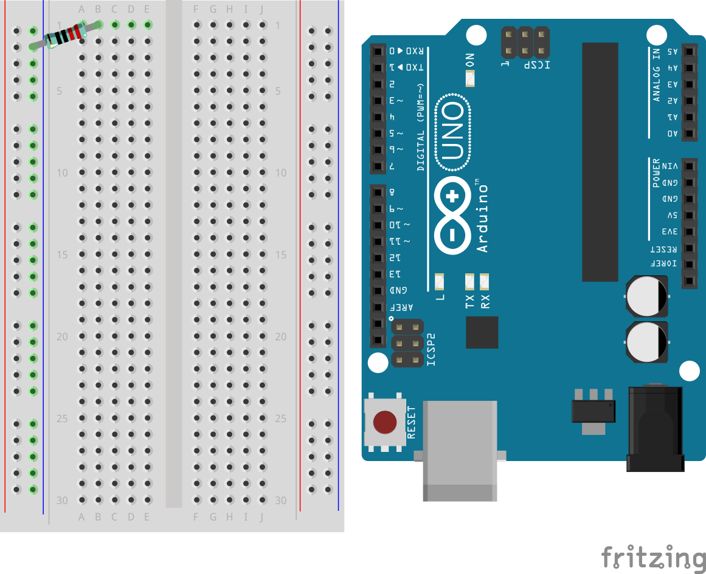
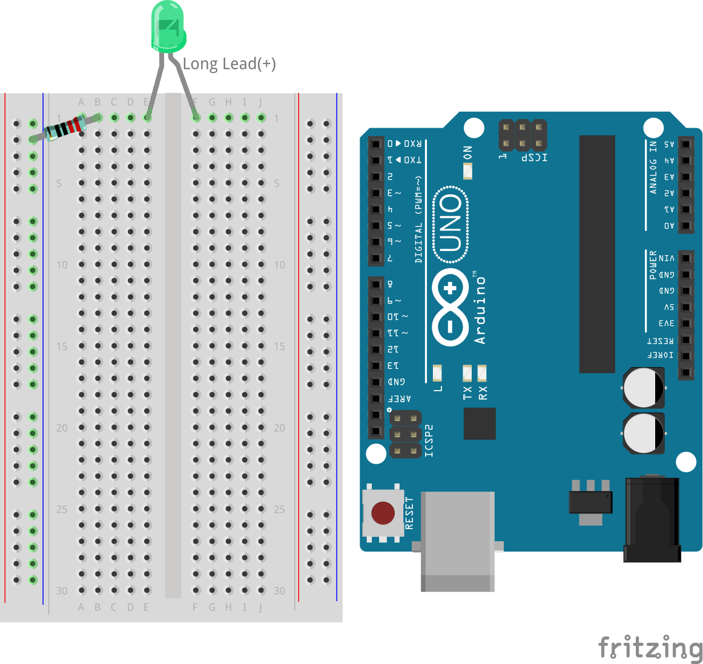
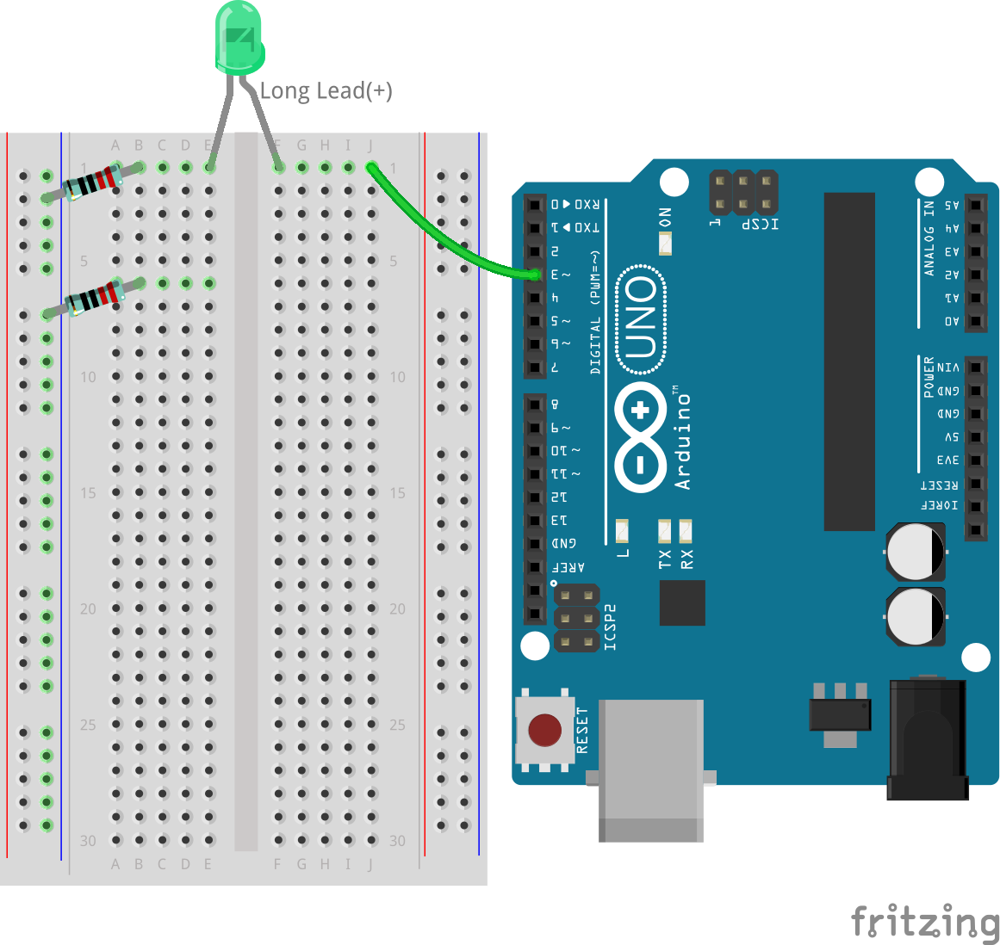
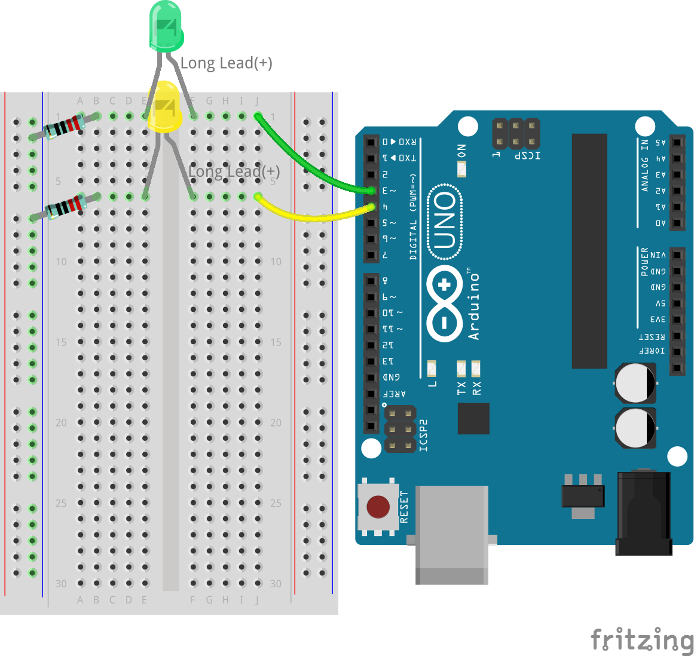
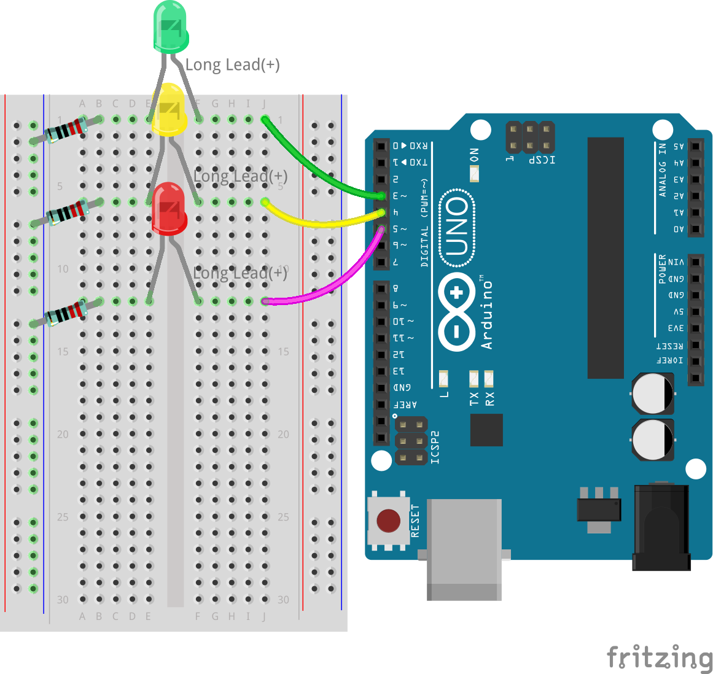

.. note::

    Bonjour et bienvenue dans la communauté SunFounder des passionnés de Raspberry Pi, Arduino et ESP32 sur Facebook ! Plongez plus profondément dans l'univers du Raspberry Pi, Arduino et ESP32 avec d'autres passionnés.

    **Pourquoi nous rejoindre ?**

    - **Support d'experts** : Résolvez les problèmes après-vente et les défis techniques avec l'aide de notre communauté et de notre équipe.
    - **Apprenez et partagez** : Échangez des astuces et des tutoriels pour améliorer vos compétences.
    - **Aperçus exclusifs** : Accédez en avant-première aux annonces de nouveaux produits et aux avant-premières.
    - **Réductions spéciales** : Profitez de réductions exclusives sur nos derniers produits.
    - **Promotions festives et cadeaux** : Participez à des tirages au sort et à des promotions spéciales.

    👉 Prêt à explorer et créer avec nous ? Cliquez sur [|link_sf_facebook|] et rejoignez-nous dès aujourd'hui !

7. Construisons un feu de signalisation !
============================================

.. .. image:: img/5_traffic_light_pic.png
..     :width: 400
..     :align: center

Bienvenue dans cette leçon captivante qui fait le lien entre les concepts théoriques et leur application pratique en électronique et en programmation. Nous allons explorer le processus de conversion d'un pseudo-code — une forme simplifiée de langage de programmation — en sketchs Arduino fonctionnels. Cet exercice simulera le fonctionnement des feux de signalisation, vous offrant une expérience pratique en programmation et en conception de circuits. En apprenant à interpréter et à implémenter un pseudo-code, vous approfondirez vos connaissances de la logique qui régit le contrôle des dispositifs électroniques par du code.

.. raw:: html

    <video muted controls style = "max-width:90%">
        <source src="../_static/video/7_traffic_light.mp4" type="video/mp4">
        Your browser does not support the video tag.
    </video>

Dans cette leçon, vous apprendrez à :

* Écrire et interpréter un pseudo-code pour planifier la fonctionnalité d'un circuit électronique.
* Convertir un pseudo-code en sketchs Arduino pour contrôler une simulation de feux de signalisation.
* Construire et programmer un système de feux de signalisation utilisant des LEDs et une carte Arduino.

En maîtrisant ces compétences, vous serez en mesure de concevoir, programmer et résoudre les problèmes de systèmes électroniques de base, ouvrant la voie à des projets plus complexes.

Préparation du feu de signalisation
----------------------------------------
Prêt à créer votre propre feu de signalisation avec un Arduino ? Voici ce dont nous avons besoin :

**Composants nécessaires**

.. list-table:: 
   :widths: 25 25 25 25
   :header-rows: 0

   * - 1 * Arduino Uno R3
     - 1 * LED rouge
     - 1 * LED jaune
     - 1 * LED verte
   * - |list_uno_r3| 
     - |list_red_led| 
     - |list_yellow_led| 
     - |list_green_led| 
   * - 1 * Câble USB
     - 1 * Plaque d'essai
     - 3 * Résistance de 220Ω
     - Câbles de connexion
   * - |list_usb_cable| 
     - |list_breadboard| 
     - |list_220ohm| 
     - |list_wire| 

**Étapes de construction**

Mettons tout en place, comme si vous construisiez un ensemble LEGO !

.. image:: img/7_traffic_light.png
    :width: 600
    :align: center

1. Connectez une résistance de 220Ω à la plaque d'essai. Une extrémité doit être dans la borne négative, et l'autre dans le trou 1B.

2. Ajoutez une LED verte à la plaque d'essai. L'anode (longue patte) de la LED doit être dans le trou 1F. La cathode (courte patte) doit être dans le trou 1E.

3. Connectez la LED verte à la broche 3 de l'Arduino Uno R3 à l'aide d'un câble. Insérez un câble de connexion dans le trou 1J et l'autre extrémité dans la broche 3 de l'Arduino Uno R3.

.. image:: img/7_traffic_light_pin3.png
    :width: 600
    :align: center

4. Prenez une autre résistance de 220Ω, connectez une extrémité à la borne négative et l'autre extrémité au trou 6B.

5. Prenez une LED jaune. L'anode (longue patte) de la LED doit être dans le trou 6F. La cathode (courte patte) doit être dans le trou 6E.

.. image:: img/7_traffic_light_yellow.png
    :width: 600
    :align: center

6. Connectez la LED jaune à la broche 4 de l'Arduino Uno R3.

7. Connectez la LED rouge de la même manière, elle est reliée à la broche 5 de l'Arduino Uno R3.

8. Oups ! Nous avons presque oublié de mettre le circuit à la masse. Connectez le côté négatif de la plaque d'essai à une broche GND de l'Arduino Uno R3 à l'aide d'un fil noir. Maintenant, tout est prêt !

.. image:: img/7_traffic_light.png
    :width: 600
    :align: center

.. note::

    Il y a trois broches GND sur l'Arduino Uno R3. Vous pouvez utiliser n'importe laquelle d'entre elles ; elles fonctionnent toutes de la même manière.

Et voilà, vous avez un système complet de feux de signalisation ! Chaque lumière colorée est contrôlée par son propre interrupteur sur l'Arduino R3, prête à indiquer aux voitures quand s'arrêter, attendre ou avancer. N'est-ce pas génial de construire quelque chose qui fonctionne comme un vrai feu de signalisation ? Super travail !

Écriture d'un pseudo-code pour un feu de signalisation
-----------------------------------------------------------

Il est temps de donner une utilité à vos LEDs. Dans cette activité, vous allez les programmer pour qu'elles fonctionnent comme un feu de signalisation, régulant le flux de trafic à une intersection animée.

Les feux de signalisation nécessitent un contrôle précis pour passer d'une couleur à l'autre dans un ordre strict, ce qui en fait un projet idéal pour plonger dans la programmation Arduino. Pour perfectionner notre feu de signalisation, nous devons donner des instructions claires à l'Arduino.

La communication entre humains implique l'écoute, la parole, la lecture, l'écriture, les gestes ou les expressions faciales. Communiquer avec des microcontrôleurs (comme celui de votre carte Arduino) implique d'écrire du code.

Nous ne pouvons pas simplement dire à l'Arduino de "faire un feu de signalisation" en langage naturel. Cependant, nous pouvons utiliser un langage naturel pour écrire un "pseudo-code" qui aidera au développement du code Arduino réel.

.. note::
    
    Il n'existe pas de bonnes ou mauvaises réponses dans l'écriture de pseudo-code. Plus votre pseudo-code est détaillé, plus il sera facile de le traduire en programme fonctionnel.

Réfléchissez à ce qui doit se passer pour que votre circuit fonctionne comme un feu de signalisation. Dans l'espace prévu dans votre journal, écrivez le pseudo-code décrivant le fonctionnement de votre feu. Utilisez un langage simple.

Voici quelques questions pour guider votre pseudo-code :

* Deux lumières ou plus doivent-elles être allumées en même temps ?
* Quel est l'ordre des lumières ?
* Que se passe-t-il pour les autres lumières lorsqu'une est allumée ?
* Que se passe-t-il après l'extinction de la troisième lumière ?
* Combien de temps chaque lumière doit-elle rester allumée ?

Voici quelques exemples de pseudo-code :

.. code-block::

    1) Définir toutes les broches des LEDs en sortie.
    2) Démarrer la boucle principale.
    a) Éteindre toutes les lumières.
    b) Allumer la lumière verte pendant 10 secondes.
    c) Éteindre toutes les lumières.
    d) Allumer la lumière jaune pendant 3 secondes.
    e) Éteindre toutes les lumières.
    f) Allumer la lumière rouge pendant 10 secondes.
    3) Revenir au début de la boucle.

.. code-block::

    Configuration :
        Définir toutes les broches des LEDs en sortie
    Boucle principale :
        Allumer la lumière verte
        Éteindre les lumières rouge et jaune
        Attendre 10 secondes
        Allumer la lumière jaune
        Éteindre les lumières rouge et verte
        Attendre 3 secondes
        Allumer la lumière rouge
        Éteindre les lumières verte et jaune
        Attendre 10 secondes

Le pseudo-code n'a pas de format strict, ce qui vous permet de clarifier vos idées et de les organiser logiquement. Cet ordre logique est appelé algorithme. Vous utilisez des algorithmes chaque jour, peut-être sans vous en rendre compte. Pensez à un algorithme comme à une recette ; en programmation, les ingrédients sont les mots-clés et les commandes, et les étapes de préparation sont l'algorithme.
Un algorithme est un ensemble d'étapes ou d'instructions. Lorsqu'un algorithme est traduit du pseudo-code en langage de programmation Arduino, il donne des instructions précises à la carte Arduino sur ce qu'il faut faire et quand le faire.

.. note::
    
    Utiliser des notes autocollantes ou des fiches peut être utile lors de l'écriture de pseudo-code. Placez chaque étape de votre algorithme sur une note distincte. Ainsi, vous pouvez facilement réorganiser, insérer ou supprimer des étapes dans votre algorithme.

Transformer le pseudo-code en un sketch Arduino
----------------------------------------------------

Il est temps d'affiner le code que vous avez écrit et d'ajouter des commandes supplémentaires ``digitalWrite()`` et ``delay()`` si nécessaire. Voici un guide pour structurer votre code : votre fonction ``void loop()`` doit encapsuler des segments distincts pour les LEDs verte, jaune et rouge, chacun suivi d'une période de délai unique. Tous les délais n'ont pas besoin d'être de la même durée. Mettez à jour les commentaires de votre code pour clarifier ce que chaque ligne réalise.

1. Ouvrez le sketch que vous avez sauvegardé précédemment, ``Lesson6_Blink_LED``. Cliquez sur “Enregistrer sous...” dans le menu “Fichier” et renommez-le en ``Lesson7_Traffic_Light``. Cliquez sur "Enregistrer".

2. Maintenant, selon notre pseudo-code, définissez toutes les trois broches en sortie dans le ``void setup()``. Copiez la commande ``pinMode()`` deux fois, collez-la en dessous et ajustez les numéros de broche pour chacune.

    .. code-block:: Arduino
        :emphasize-lines: 4,5

        void setup() {
            // Code de configuration ici, exécuté une seule fois :
            pinMode(3, OUTPUT);  // définir la broche 3 comme sortie
            pinMode(4, OUTPUT);  // définir la broche 4 comme sortie
            pinMode(5, OUTPUT);  // définir la broche 5 comme sortie
        }

3. Dans ``void loop()``, allumez d'abord la LED verte et éteignez les deux autres LEDs. Ainsi, copiez deux fois les commandes ``digitalWrite()`` et modifiez les numéros de broche en 4 et 5, changez ``HIGH`` en ``LOW`` pour les LEDs que vous souhaitez éteindre, et mettez à jour les commentaires pour correspondre au scénario actuel. Le code modifié est le suivant :

    .. code-block:: Arduino
        :emphasize-lines: 4,5

        void loop() {
            // Code principal, exécuté en boucle :
            digitalWrite(3, HIGH);  // Allumer la LED sur la broche 3
            digitalWrite(4, LOW);   // Éteindre la LED sur la broche 4
            digitalWrite(5, LOW);   // Éteindre la LED sur la broche 5
            delay(3000);           // Attendre 3 secondes
        }

4. Vous pourriez vouloir que la LED verte reste allumée plus longtemps. Dans notre système de circulation, cela pourrait durer environ une minute, mais ici nous allons simuler cela avec 10 secondes.

    .. code-block:: Arduino
        :emphasize-lines: 6

        void loop() {
            // Code principal, exécuté en boucle :
            digitalWrite(3, HIGH);  // Allumer la LED sur la broche 3
            digitalWrite(4, LOW);   // Éteindre la LED sur la broche 4
            digitalWrite(5, LOW);   // Éteindre la LED sur la broche 5
            delay(10000);           // Attendre 10 secondes
        }

5. Allumez maintenant la LED jaune, et éteignez les deux autres. Encore une fois, copiez et collez les 4 lignes de ``void loop()``, en réglant la broche 4 sur HIGH et les autres sur LOW. Changez le délai pour la LED jaune à 3 secondes.

    .. code-block:: Arduino
        :emphasize-lines: 7-10

        void loop() {
            // Code principal, exécuté en boucle :
            digitalWrite(3, HIGH);  // Allumer la LED sur la broche 3
            digitalWrite(4, LOW);   // Éteindre la LED sur la broche 4
            digitalWrite(5, LOW);   // Éteindre la LED sur la broche 5
            delay(10000);           // Attendre 10 secondes
            digitalWrite(3, LOW);   // Éteindre la LED sur la broche 3
            digitalWrite(4, HIGH);  // Allumer la LED sur la broche 4
            digitalWrite(5, LOW);   // Éteindre la LED sur la broche 5
            delay(3000);            // Attendre 3 secondes
        }

6. Enfin, allumez la LED rouge pendant 10 secondes, en éteignant les deux autres LEDs. Voici votre code complet :

    .. code-block:: Arduino

        void setup() {
            // Code de configuration ici, exécuté une seule fois :
            pinMode(3, OUTPUT);  // définir la broche 3 comme sortie
            pinMode(4, OUTPUT);  // définir la broche 4 comme sortie
            pinMode(5, OUTPUT);  // définir la broche 5 comme sortie
        }
        
        void loop() {
            // Code principal, exécuté en boucle :
            digitalWrite(3, HIGH);  // Allumer la LED sur la broche 3
            digitalWrite(4, LOW);   // Éteindre la LED sur la broche 4
            digitalWrite(5, LOW);   // Éteindre la LED sur la broche 5
            delay(10000);           // Attendre 10 secondes
            digitalWrite(3, LOW);   // Éteindre la LED sur la broche 3
            digitalWrite(4, HIGH);  // Allumer la LED sur la broche 4
            digitalWrite(5, LOW);   // Éteindre la LED sur la broche 5
            delay(3000);            // Attendre 3 secondes
            digitalWrite(3, LOW);   // Éteindre la LED sur la broche 3
            digitalWrite(4, LOW);   // Éteindre la LED sur la broche 4
            digitalWrite(5, HIGH);  // Allumer la LED sur la broche 5
            delay(10000);           // Attendre 10 secondes
        }

**Question**

Observez les intersections autour de chez vous. Combien de feux de signalisation y a-t-il en général ? Comment se coordonnent-ils entre eux ?

**Résumé**

Félicitations pour avoir terminé la leçon 7 ! Vous avez réussi à traduire un pseudo-code en un système de feux de signalisation contrôlé par Arduino entièrement fonctionnel. Voici un bref récapitulatif de vos réalisations :

* Maîtrise du pseudo-code : Vous avez appris à utiliser le pseudo-code pour définir le fonctionnement des systèmes électroniques, améliorant ainsi vos compétences en logique et en planification.
* Du pseudo-code au code réel : Vous avez expérimenté comment une approche structurée en pseudo-code conduit à une programmation Arduino efficace et précise.
* Application pratique : En assemblant et en programmant un système de feux de signalisation, vous avez démontré l'application pratique de vos connaissances, montrant comment le logiciel contrôle directement le matériel.

Cette leçon a affiné vos compétences techniques et votre réflexion analytique, vous préparant à des projets plus complexes en électronique et en programmation. Continuez à développer ces compétences pour débloquer encore plus de possibilités dans l'intégration des technologies !

