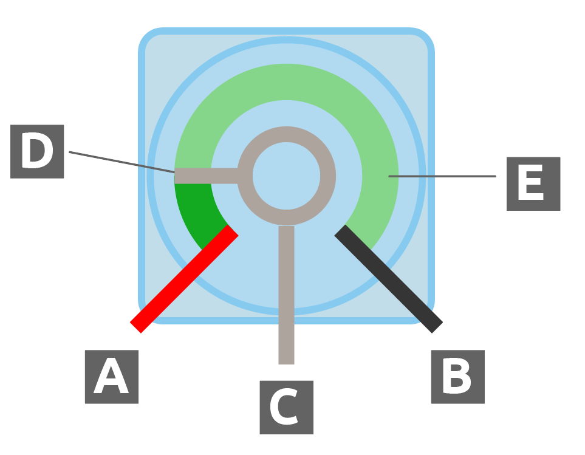
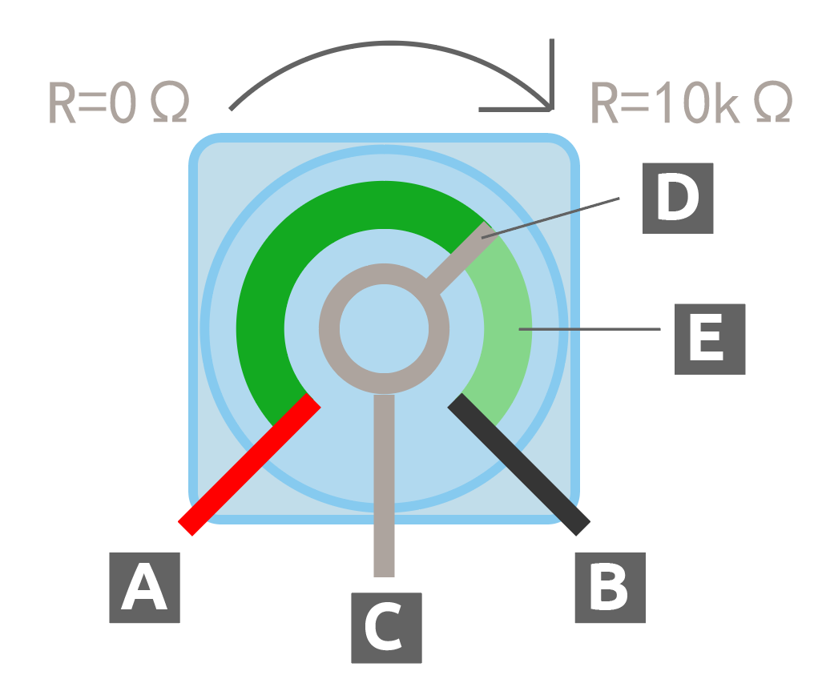
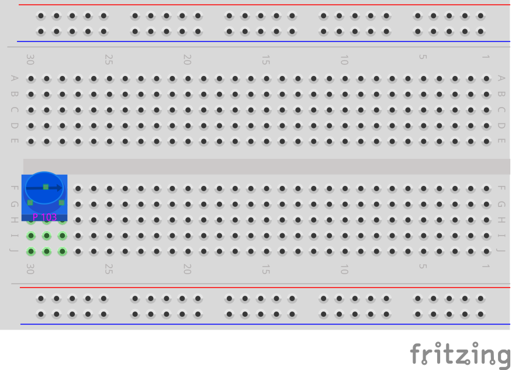
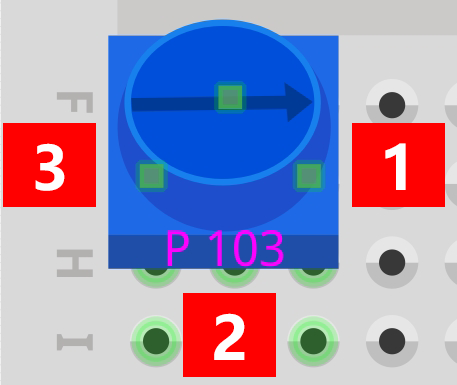
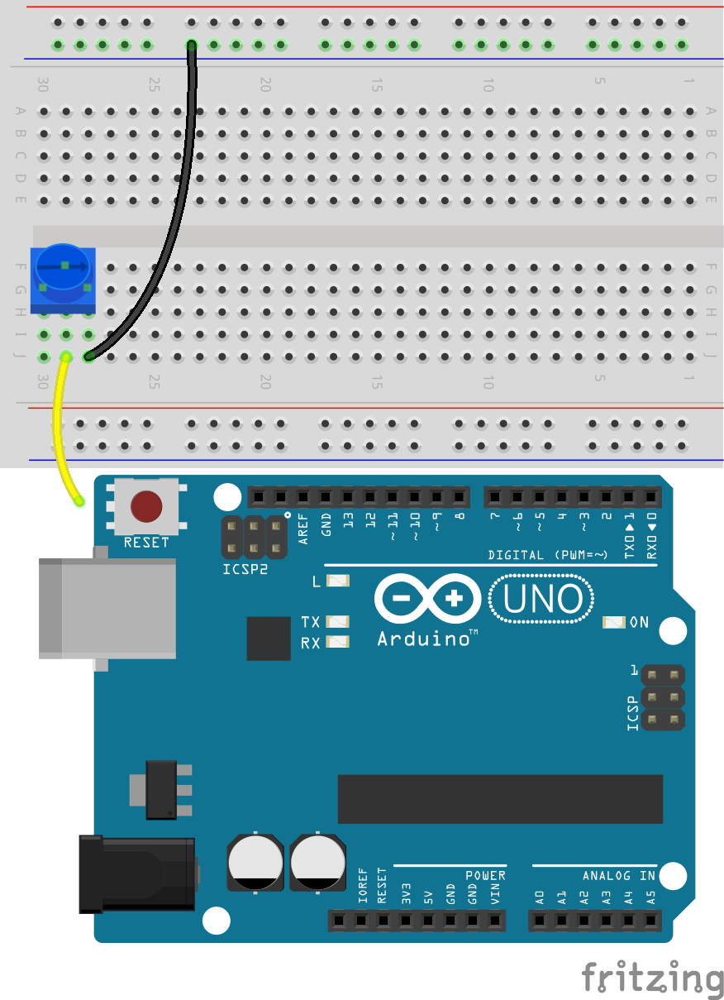
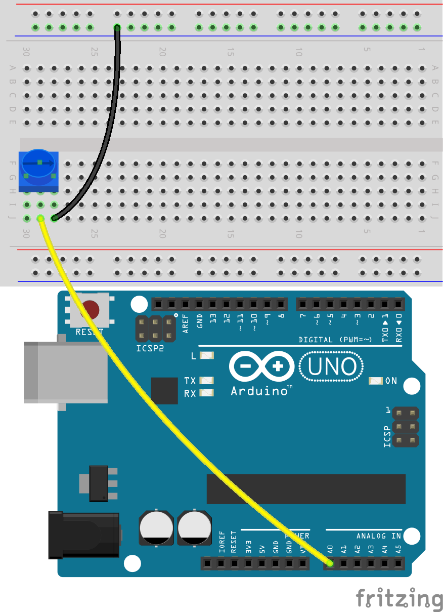
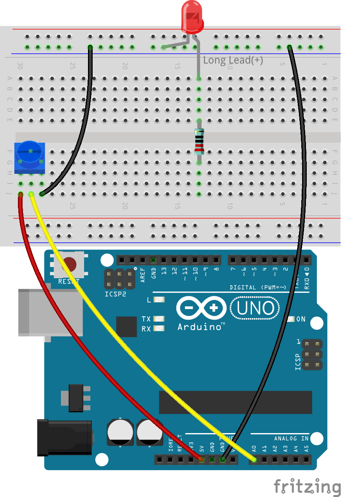
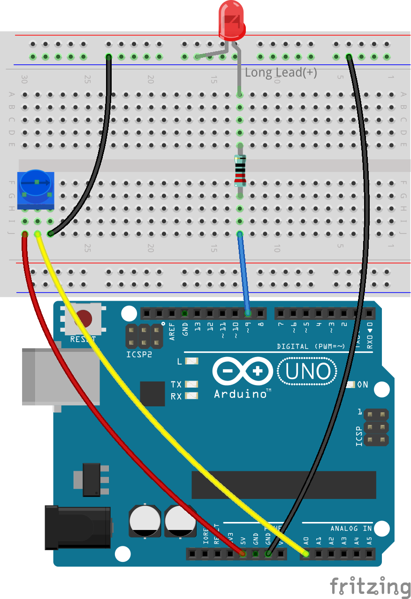
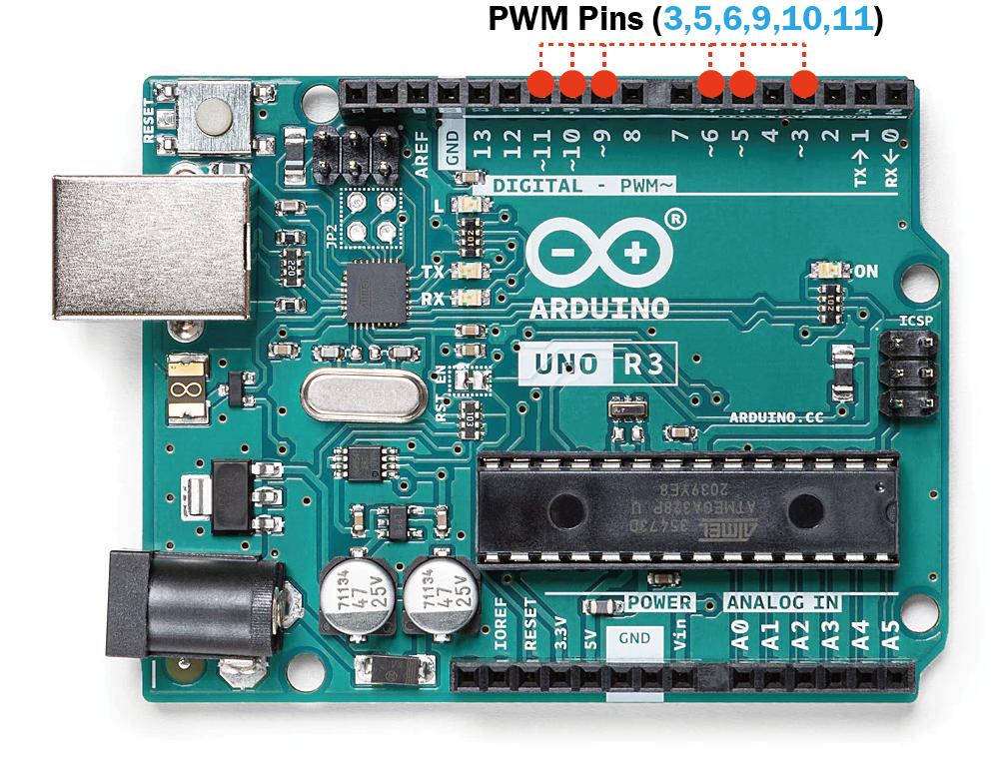

.. note::

    ¡Hola! Bienvenido a la comunidad de entusiastas de SunFounder Raspberry Pi, Arduino y ESP32 en Facebook. Sumérgete en el mundo de Raspberry Pi, Arduino y ESP32 junto a otros entusiastas.

    **¿Por qué unirte?**

    - **Soporte de expertos**: Resuelve problemas post-venta y desafíos técnicos con la ayuda de nuestra comunidad y equipo.
    - **Aprende y comparte**: Intercambia consejos y tutoriales para mejorar tus habilidades.
    - **Acceso exclusivo**: Accede anticipadamente a nuevos lanzamientos de productos y vistas previas.
    - **Descuentos especiales**: Disfruta de descuentos exclusivos en nuestros productos más recientes.
    - **Promociones y sorteos festivos**: Participa en sorteos y promociones especiales durante las festividades.

    👉 ¿Listo para explorar y crear con nosotros? Haz clic en [|link_sf_facebook|] y únete hoy mismo.

9. Lámpara de escritorio regulable
=============================================

Imagina cada lámpara de escritorio en casa, suavemente iluminando tus lecturas nocturnas o proyectos de última hora. ¿Te has preguntado cómo logran estas lámparas ajustar su brillo de manera tan fluida? En esta lección, exploraremos la mecánica y la electrónica detrás de una lámpara de escritorio, transformando la curiosidad en conocimiento al construir una desde cero utilizando Arduino.

.. .. image:: img/9_desk_lamp_pot.jpg
..     :width: 500
..     :align: center
    
.. raw:: html

    <video muted controls style = "max-width:90%">
        <source src="../_static/video/9_dimmble_led.mp4" type="video/mp4">
        Your browser does not support the video tag.
    </video>

Prepárate para:

* Decodificar el papel de las variables en el almacenamiento y manipulación de datos en los esquemas de Arduino.
* Dominar la lectura de señales analógicas con ``analogRead()``.
* Explorar el PWM mediante ``analogWrite()`` para ajustar el brillo de los LED.

Al finalizar esta lección, no solo habrás construido una lámpara de escritorio electrónica completamente funcional, sino que también habrás profundizado tu comprensión de cómo el software interactúa con el hardware para dar vida a objetos cotidianos. Iluminemos nuestro conocimiento construyendo una lámpara de escritorio que responda a tu toque.

Construye el circuito
------------------------------------

**Componentes necesarios**

.. list-table:: 
   :widths: 25 25 25 25
   :header-rows: 0

   * - 1 * Arduino Uno R3
     - 1 * LED rojo
     - 1 * Resistencia de 220Ω
     - 1 * Potenciómetro
   * - |list_uno_r3| 
     - |list_red_led| 
     - |list_220ohm| 
     - |list_potentiometer| 
   * - 1 * Cable USB
     - 1 * Protoboard
     - Cables jumper
     - 1 * Multímetro
   * - |list_usb_cable| 
     - |list_breadboard| 
     - |list_wire| 
     - |list_meter| 

**Pasos de construcción**

1. Encuentra un potenciómetro.

Un potenciómetro, a menudo llamado "pot", actúa como una resistencia variable, lo que significa que puede ajustar su resistencia desde casi cero hasta su límite máximo. La mayoría de los potenciómetros están marcados con su rango. El incluido en tu kit es un potenciómetro 103 (10K), que equivale a 10 kilo-ohmios o 10,000 ohmios.

.. image:: img/9_dimmer_pot.png
    :width: 200
    :align: center

Dentro del potenciómetro hay una tira de material resistivo con un deslizador que se mueve a lo largo de ella. Cada extremo del material resistivo está conectado a un terminal o pin, mostrados a continuación como pines A y B. La resistencia entre los pines A y B es fija y representa la resistencia máxima que puede ofrecer el potenciómetro. Para los de tu kit, la resistencia máxima es de 10 kilo-ohmios.

* **A**: Conectar a la alimentación
* **B**: Conectar a tierra
* **C**: Conectar al pin analógico
* **D**: Deslizador
* **E**: Tira resistiva

El pin C está conectado al deslizador. La resistencia a través del deslizador, o el pin C, depende de la posición del deslizador a lo largo del material resistivo.

En los diagramas esquemáticos, el símbolo de un potenciómetro suele parecerse a una resistencia con una flecha en el centro.

.. image:: img/9_dimmer_pot_4.png
    :width: 200
    :align: center

Ahora exploremos cómo el potenciómetro ajusta la resistencia en un circuito.

2. Conecta un potenciómetro a la protoboard. Inserta sus tres pines en los agujeros 30G, 29F, 28G.

.. note::
    El potenciómetro tiene una etiqueta "P 103", que indica su rango de resistencia. Inserta el potenciómetro en la protoboard como se muestra, con el lado etiquetado mirando hacia ti.

3. Para medir la resistencia del potenciómetro, necesitas insertar un cable en 29J y luego tocarlo con la punta de prueba roja, e insertar otro cable en 28J y tocarlo con la punta negra.

.. image:: img/9_dimmer_test_wore.png
    :width: 500
    :align: center

4. Configura el multímetro para medir la resistencia en el rango de 20 kilo-ohmios (20K).

.. image:: img/multimeter_20k.png
    :width: 300
    :align: center

5. Gira el potenciómetro a la posición "1" indicada en el diagrama.

    
6. Registra los valores de resistencia medidos en la tabla.

.. note::
    Los valores en la tabla son mis mediciones; tus resultados pueden variar. Llénalos según tus propios hallazgos.

.. list-table::
   :widths: 20 20
   :header-rows: 1

   * - Punto de medición
     - Resistencia (kilo-ohmios)
   * - 1
     - *1.52*
   * - 2
     - 
   * - 3
     - 

7. Gira el potenciómetro en sentido horario hacia las posiciones 2 y 3 para medir la resistencia en cada punto, y registra los resultados en la tabla.

.. list-table::
   :widths: 20 20
   :header-rows: 1

   * - Punto de medición
     - Resistencia (kilo-ohmios)
   * - 1
     - *1.52*
   * - 2
     - *5.48*
   * - 3
     - *9.01*

De los resultados de la medición:

* A medida que giras el potenciómetro **en sentido horario** desde la posición 1 a la 3, la resistencia entre la posición 2 y la posición 1 aumenta.
* Por el contrario, al girar **en sentido antihorario** de la posición 3 a la 1, la resistencia entre la posición 2 y la posición 1 disminuirá.

8. Inserta el otro extremo del cable jumper desde 28J en el terminal negativo de la protoboard.

9. Luego, inserta el otro extremo del cable jumper desde 29J en el pin A0 del Arduino Uno R3.

10. Finalmente, conecta el potenciómetro a 5V insertando un cable jumper entre el agujero 30J de la protoboard y el pin de 5V en el Arduino Uno R3.

.. image:: img/9_dimmer_led1_pot_5v.png
    :width: 500
    :align: center

11. Conecta el pin GND del Arduino Uno R3 al terminal negativo de la protoboard usando un cable jumper largo.

.. image:: img/9_dimmer_led1_gnd.png
    :width: 500
    :align: center

12. Saca un LED. Inserta su ánodo (pin más largo) en el agujero 13A, y su cátodo (pin más corto) en el terminal negativo de la protoboard.

13. Coloca una resistencia de 220 ohmios entre los agujeros 13E y 13G.

14. Conecta el agujero 13J de la protoboard al pin 9 del Arduino Uno R3 con un cable.

**Pregunta**:

¿Cómo crees que cambiará el voltaje en A0 cuando se gire el potenciómetro en sentido horario y antihorario?

Creación de Código
-------------------------------------

En esta lección, buscamos ajustar el brillo del LED según la rotación del potenciómetro.

Este sería un pseudocódigo de ejemplo:

.. code-block::

    Crear una variable para almacenar la información de entrada.
    Configurar un pin como salida.
    Iniciar bucle principal:
        Almacenar el valor del potenciómetro en una variable.
        Ajustar el brillo del LED basado en la variable del potenciómetro.
    Finalizar bucle principal.

**Inicialización de Pines**

1. Abre el IDE de Arduino y comienza un nuevo proyecto seleccionando “New Sketch” en el menú “File”.
2. Guarda tu sketch como ``Lesson9_Desk_Lamp`` usando ``Ctrl + S`` o haciendo clic en “Guardar”.

3. El LED en tu circuito está conectado a un pin digital del Arduino Uno R3, configurado como salida. Recuerda añadir un comentario.

.. note::

    El potenciómetro es un dispositivo de entrada analógica conectado al pin A0. Todos los pines analógicos en Arduino son pines de entrada, lo que significa que no necesitan ser declarados como INPUT como los pines digitales.

.. code-block:: Arduino
    :emphasize-lines: 3

    void setup() {
        // Configura el código de inicialización, se ejecuta una vez:
        pinMode(9, OUTPUT);  // Configura el pin 9 como salida
    }

    void loop() {
        // Escribe el código principal aquí, se ejecuta repetidamente:
    }

**Declaración de Variables**

Para controlar el desvanecimiento del LED usando un potenciómetro, necesitas una **variable** para almacenar el valor del potenciómetro.

Vamos a profundizar en el concepto de variables en programación. Una variable actúa como un contenedor en tu programa, permitiendo almacenar y recuperar información más tarde.

Antes de usar una variable, debe ser declarada, lo que se conoce como declaración de variables.

Para declarar una variable, debes definir su tipo y nombre. No es necesario asignar un valor a la variable en el momento de la declaración; puedes asignárselo más adelante en tu sketch. Aquí tienes cómo declarar una variable:

.. code-block:: Arduino

    int var;

Aquí, ``int`` es el tipo de dato utilizado para enteros, capaz de almacenar valores entre -32768 y 32767. Las variables pueden almacenar varios tipos de datos, incluidos ``float``, ``byte``, ``boolean``, ``char`` y ``string``.

Los nombres de las variables pueden ser cualquier cosa que elijas, como ``i``, ``apple``, ``Bruce``, ``R2D2`` o ``Sectumsempra``. Sin embargo, existen reglas para nombrar:

* Los nombres pueden incluir letras, dígitos y guiones bajos, pero no espacios ni caracteres especiales como !, #, %, etc.

  .. image:: img/9_variable_name1.png
    :width: 400
    :align: center
* Los nombres deben comenzar con una letra o un guion bajo (_). No pueden comenzar con un número.

  .. image:: img/9_variable_name2.png
    :width: 400
    :align: center

* Los nombres distinguen entre mayúsculas y minúsculas. ``myCat`` y ``mycat`` se considerarán variables diferentes.

* Evita usar palabras clave que el IDE de Arduino reconoce y resalta, como ``int``, que se colorea para indicar su importancia especial. Si el nombre cambia de color, como naranja o azul, es una palabra clave y debe evitarse como nombre de variable.

El alcance de una variable determina dónde puede ser utilizada en tu sketch, dependiendo de dónde se haya declarado.

* Una variable declarada fuera de todas las funciones (es decir, fuera de cualquier corchete) es una variable global y puede usarse en cualquier parte de tu sketch.
* Una variable declarada dentro de una función (dentro de un conjunto de corchetes) es una variable local y solo puede ser utilizada dentro de esa función.

.. code-block:: Arduino
    :emphasize-lines: 1,4,9

    int global_variable = 0; // Esta es una variable global

    void setup() {
        int variable = 0; // Esta es una variable local
    }

    void loop() {
        int variable = 0; // Esta es otra variable local
    }

.. note::

    Las variables locales solo pueden usarse dentro de las funciones donde fueron declaradas, lo que significa que puedes declarar variables con el mismo nombre en diferentes funciones sin problema. Sin embargo, evita usar el mismo nombre para variables locales y globales para prevenir confusiones.

Normalmente, un sketch de Arduino debería seguir un patrón consistente: declarar primero las variables globales, luego definir la función ``void setup()`` y finalmente, la función ``void loop()``.

4. Ve al inicio de tu sketch, antes de la función ``void setup()``. Aquí es donde declararás tu variable para almacenar el valor del potenciómetro.

.. code-block:: Arduino
    :emphasize-lines: 1

    int potValue = 0;

    void setup() {
        // Configura tu código aquí, se ejecuta una vez:
        pinMode(9, OUTPUT);  // Configura el pin 9 como salida
    }

    void loop() {
        // Escribe el código principal aquí, se ejecuta repetidamente:
    }

Acabas de declarar una variable entera llamada ``potValue`` y la has inicializado en cero. Esta variable se utilizará más adelante en tu sketch para almacenar la salida del potenciómetro.

**Lectura de Valores Analógicos**

Ahora estás listo para entrar en el bucle principal del programa. Lo primero que harás en la función ``void loop()`` es determinar el valor del potenciómetro.

El potenciómetro está conectado a un pin de alimentación de 5 voltios, lo que permite que el voltaje en el pin A0 varíe entre 0 y 5 voltios. Este voltaje es convertido por el microprocesador del Arduino Uno R3 en un valor analógico que varía entre 0 y 1023, gracias a la resolución de 10 bits del microprocesador.

Una vez convertido, estos valores analógicos pueden ser utilizados dentro de tu programa.

Para obtener el valor analógico del potenciómetro, utiliza el comando ``analogRead(pin)``. Este comando lee el voltaje que entra por un pin analógico y lo asigna a un valor entre 0 y 1023:

- Si no hay voltaje, el valor analógico es 0.
- Si el voltaje es de 5 voltios completos, el valor analógico será 1023.

Así es como se utiliza:

    * ``analogRead(pin)``: Lee el valor del pin analógico especificado.

    **Parámetros**
        - ``pin``: el nombre del pin de entrada analógico desde el cual se leerá.

    **Devuelve**
        La lectura analógica en el pin. Aunque está limitada a la resolución del convertidor de analógico a digital (0-1023 para 10 bits o 0-4095 para 12 bits). Tipo de dato: int.

5. Coloca el siguiente comando dentro de la función ``void loop()`` para almacenar el valor analógico del potenciómetro en la variable ``potValue`` declarada al inicio de tu sketch:

.. code-block:: Arduino
    :emphasize-lines: 10

    int potValue = 0;

    void setup() {
        // Configura tu código aquí, se ejecuta una vez:
        pinMode(9, OUTPUT);  // Configura el pin 9 como salida
    }

    void loop() {
        // Escribe el código principal aquí, se ejecuta repetidamente:
        potValue = analogRead(A0);        // Leer valor del potenciómetro
    }

Asegúrate de guardar y verificar tu código para corregir cualquier error.

**Escritura de Valores Analógicos**

Los pines digitales en el Arduino Uno R3 solo son capaces de estar en los estados ON o OFF, lo que significa que no pueden emitir verdaderos valores analógicos. Para simular un comportamiento analógico en aplicaciones como el control del brillo de un LED, utilizamos una técnica llamada Modulación por Ancho de Pulso (PWM). Los pines PWM, marcados con una tilde (~) en la placa, pueden variar la salida percibida ajustando el ciclo de trabajo de la señal.

Para controlar el brillo de un LED, usamos el comando ``analogWrite(pin, value)``. Este ajusta el brillo del LED cambiando el ciclo de trabajo de la señal PWM enviada al pin.

    * ``analogWrite(pin, value)``: Escribe un valor analógico (onda PWM) en un pin. Puede usarse para encender un LED a varios niveles de brillo o controlar un motor a diferentes velocidades.

    **Parámetros**
        - ``pin``: el pin de Arduino al que escribir. Tipos de datos permitidos: int.
        - ``value``: el ciclo de trabajo: entre 0 (siempre apagado) y 255 (siempre encendido). Tipos de datos permitidos: int.
    
    **Devuelve**
        Nada

Piensa en el ciclo de trabajo como el patrón de encendido y apagado de un grifo que controla el flujo de agua en un cubo, que representa el brillo del LED. Aquí tienes un desglose sencillo:

* ``analogWrite(255)`` significa que el grifo está completamente abierto todo el tiempo, llenando el cubo al máximo y haciendo que el LED brille con su máxima intensidad.
* ``analogWrite(191)`` significa que el grifo está abierto el 75% del tiempo, llenando menos el cubo y atenuando el LED.
* ``analogWrite(0)`` significa que el grifo está completamente cerrado, dejando el cubo vacío y apagando el LED.

.. image:: img/9_pwm_signal.png
    :width: 400
    :align: center

6. Agrega un comando ``analogWrite()`` en la función ``void loop()`` y comenta cada línea para mayor claridad:

.. note::

    * Dado que el rango de entrada del potenciómetro es de 0 a 1023, pero el rango de salida para los LEDs es de 0 a 255, puedes reducir el valor del potenciómetro dividiéndolo por 4:

    * Aunque el resultado de la división puede no ser siempre un número entero, solo se almacena la parte entera porque las variables están declaradas como enteras (int).

.. code-block:: Arduino
    :emphasize-lines: 11

    int potValue = 0;

    void setup() {
        // Configura tu código de inicialización, se ejecuta una vez:
        pinMode(9, OUTPUT);  // Configura el pin 9 como salida
    }

    void loop() {
        // Escribe tu código principal aquí, se ejecuta repetidamente:
        potValue = analogRead(A0);        // Leer valor del potenciómetro
        analogWrite(9, potValue / 4);       // Aplicar brillo al LED en el pin 9
    }

7. Una vez que el código esté cargado en el Arduino Uno R3, girar el potenciómetro cambiará el brillo de los LEDs. Según nuestra configuración, girar el potenciómetro en sentido horario debería aumentar el brillo, mientras que girarlo en sentido antihorario debería disminuirlo.

.. note::

    La depuración a menudo requiere revisar tanto el código como el circuito para encontrar errores. Si el código se compila correctamente o parece estar bien, pero el LED no cambia como se esperaba, el problema puede estar en el circuito. Revisa todas las conexiones y componentes en la protoboard para asegurar un buen contacto.

8. Finalmente, recuerda guardar tu código y organizar tu espacio de trabajo.

**Pregunta**

Si conectas el LED a un pin diferente, como el pin 8, y giras el potenciómetro, ¿seguirá cambiando el brillo del LED? ¿Por qué o por qué no?

**Resumen**

En esta lección, exploramos cómo trabajar con señales analógicas en proyectos de Arduino. Aprendimos a leer valores analógicos de un potenciómetro, cómo procesar estos valores en el sketch de Arduino y cómo controlar el brillo de un LED utilizando Modulación por Ancho de Pulso (PWM). También profundizamos en el uso de variables para almacenar y manipular datos dentro de nuestros sketches. Al integrar estos elementos, demostramos el control dinámico de componentes electrónicos, cerrando la brecha entre salidas digitales simples y un control más matizado del hardware a través de lecturas de entradas analógicas.

